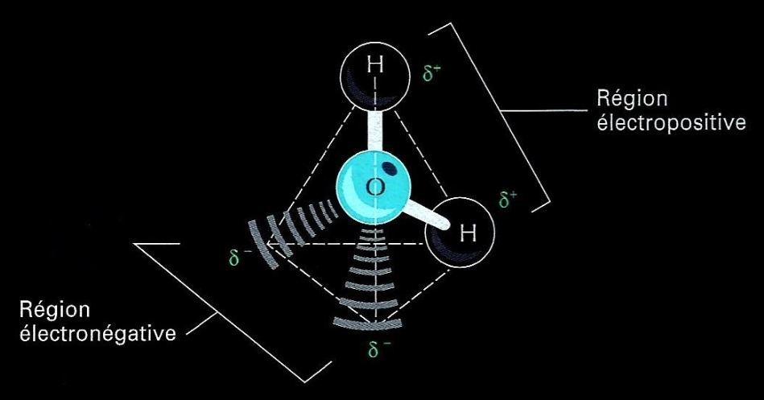
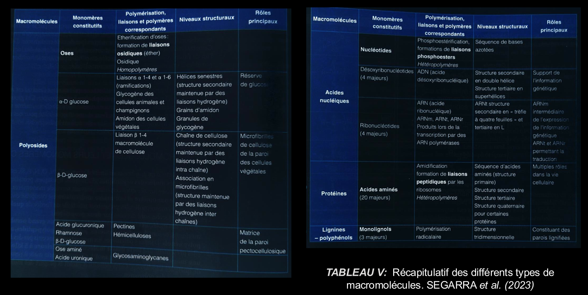

# Organisation atomique et moléculaire du vivant

## La composition atomique du vivant

Les éléments chimiques sont l'ensemble des atomes ou d'autres entités qui présente un nombre $Z$ de protons dans leur noyau.. Nous en connaissons actuellement 118, dont 94 existant à l'état naturel sur terre.
On va distinguer les **macroéléments**, disponibles en grande proportion (par exemple sous forme de molécules d'eau), et les **oligoéléments**, éléments beaucoup moins présents dans la nature mais indispensables pour certaines réactions (tel que DIAPO) *et donc indispensable dans notre corps*. 

> [!EXAMPLE] Cas Concret
> Manquer de vitamines peut être létale : exemple du *Scorbut* pour la vitamine C.

Ces éléments sont souvent à l'état dissout et ionisé. Mais ils peuvent également être sous état **complexés**, par exemple pour le fer.

## Rappels chimie : atomes et molécules

### Atomes et ions monoatomiques

#### *Tableau Periodique*  

| 1   | 2   | 3                  | 4   | 5   | 6   | 7   | 8   | 9   | 10  | 11  | 12  | 13  | 14  | 15  | 16  | 17  | 18  |
| --- | --- | ------------------ | --- | --- | --- | --- | --- | --- | --- | --- | --- | --- | --- | --- | --- | --- | --- |
| H   |     |                    |     |     |     |     |     |     |     |     |     |     |     |     |     |     | He  |
| Li  | Be  |                    |     |     |     |     |     |     |     |     |     | B   | C   | N   | O   | F   | Ne  |
| Na  | Mg  |                    |     |     |     |     |     |     |     |     |     | Al  | Si  | P   | S   | Cl  | Ar  |
| K   | Ca  | Sc                 | Ti  | V   | Cr  | Mn  | Fe  | Co  | Ni  | Cu  | Zn  | Ga  | Ge  | As  | Se  | Br  | Kr  |
| Rb  | Sr  | Y                  | Zr  | Nb  | Mo  | Tc  | Ru  | Rh  | Pd  | Ag  | Cd  | In  | Sn  | Sb  | Te  | I   | Xe  |
| Cs  | Ba  | [*](#Lanthanoïdes) | Hf  | Ta  | W   | Re  | Os  | Ir  | Pt  | Au  | Hg  | Tl  | Pb  | Bi  | Po  | At  | Rn  |
| Fr  | Ra  | [**](#Actinoïdes)  | Rf  | Db  | Sg  | Bh  | Hs  | Mt  | Ds  | Rg  | Cn  | Nh  | Fl  | Mc  | Lv  | Ts  | Og  |

#### *Lanthanoïdes*  

|   1   |   2   |   3   |   4   |   5    |   6   |   7   |    8    |   9  |  10  |  11  |  12  |  13 | 14 |  15  |
|---|---|---|---|----|---|---|----|---|---|---|---|---|---|---|
| La | Ce | Pr | Nd | Pm | Sm | Eu | Gd | Tb | Dy | Ho | Er | Tm | Yb | Lu |

#### *Actinoïdes*  

| 1   | 2   | 3   | 4   | 5   | 6   | 7   | 8   | 9   | 10  | 11  | 12  | 13  | 14  | 15  |
| --- | --- | --- | --- | --- | --- | --- | --- | --- | --- | --- | --- | --- | --- | --- |
| Ac  | Th  | Pa  | U   | Np  | Pu  | Am  | Cm  | Bk  | Cf  | Es  | Fm  | Md  | No  | Lr  |

- Les **Gaz Parfaits** qui possèdent des chouches complètes d'éléctrons, 
- Les **éléctro-positifs**, tout à gauche, possède une dernière couche avec uniquement un éléctron.
- Les **Métaux**
- Les **éléctro-négatifs**

### Notion de molécules

Les ions sont divisés en deux catégories : les cation (positifs) et les anion (négatifs). Ils sont censé être monoatomiques.

> [!TIP] Moyen Mémotechnique
> Les chats c'est cool. Donc les cations sont positifs. Les oignons font pleurer. Donc c'est négatif :)

Les **molécules** sont les agencement de plusieurs atomes. Ils peuvent être liés de manière différentes :

- Liaisons **covalentes** où des électrons sont partagés entre plusieurs atomes. Elle peuvent être **simple** ou **doubles**. La répartition des electrons  rendent les molécules **polaires** (une charge partielle est sur un/des atomes qui la compose, tel que l'*Eau* voir poly). Alors, les molécules vont s'orientés dans certains sens en fonction de leurs polarités et créer des *liaisons faibles*.Dans l'autre cas, elle est **apolaire** et ces interactions avec les autres molécules sont limités.
- Liaisons **faibles** que la prof a complètement oublié.

Les chimistes parlent également d'ions **polyatomiques** quand les charges ne sont pas réparties que sur un seul atome. 

Certaines molécules sont **acides**, et il existe des acides *forts*  (comme $HCl$, Ph peu acide) et *faibles*  (comme $X_{404}$, Ph très acide).

Il existe également des **polymères**, composés de petites molécules appelés **monomères** et qui sont répétés suivant un pattern. On l'écrit entre crochets, avec un indice n pour la répétition. Exemple : $⹕C_6 H_12 O_6⹖_n$. Si ils sont constitués d'un seul type de monomères, ils sont appelés **monopolymères**. Sinon, c'est des **hétéropolymère**. Les monomères sont agglomérés en polymères grâce à la **condensation**.

Les polymères peuvent êtres plus ou moins grands. On peut partir des dizaines de monomères au centaines de milers.

> [!NOTE]
> Le terme de macromolécules est utilisés dans le monde anglo-saxon pour les polymères de très grandes taille. En France, on utilise ce terme uniquement pour les polymère dont le poids moléculaire est supérieur à 10 000 daltons. 

## La composition moléculaire du vivant

### L’eau, molécule indispensable à la vie

La constitution du vivant est principalement fondé sur le milieu aqueux réactionnel. *Toutes les réactions sont donc optimisés pour ne perdre qu'un minimum d'eau*. Certaines matières contiennent plus ou moins d'eau, comme la laitue à 80%. **Il faut maintenir cette quantité d'eau.**

Sur ce schéma, on voit la polarité de la molécule $H_2O$ qui permet les liaisons hydrogènes qui rendent l'eau *liquide*. 

Il s'en suit que l'eau est un **solvant du vivant**. L'eau est capable de dissoudre les molécules <u class="red-underline">polaires</u>.

#### Propriétés physiques biologiquement importantes

Les composés **hydrophiles** peuvent êtres dissolues dans l'eau, car capables de faire des relations hydrogènes avec l'eau, contrairement aux composés **hydrophobes**. Il y a également les molécules **amphiphiles**, à la fois hydrophiles et hydrophobes, à la fois polaires et apolaires. Un exemple est les *phospholipides*.

##### Quelques propriétés importantes

| Nom de la propriété           | Définition                             | Conséquences biologiques |
| ----------------------------- | -------------------------------------- | ------------------------ |
| Tension superfcielle          | Force développée à l'interieur eau-air |                          |
| Forte chaleur de vaporisation |                                        |                          |
| Chaleur spécifique élevée     |                                        |                          |
#### Propriétés chimiques biologiquement importantes

L'eau a un PH neutre, permettant dont son utilisation dans nos organismes.

Il va falloir distinguer hydratation et hydrolyse. L'hydrolyse est l'inverse de la [condensation](#Notion de molécules), elle **sépare les monomères**.

##### Quelques propriétés importantes

| Propriété métabolique                               | Mécanisme et réaction impliqués                       | Conséquences biologiques                         |
| --------------------------------------------------- | ----------------------------------------------------- | ------------------------------------------------ |
| L'eau est ionisable                                 |                                                       | L'eau est autour du **ph neutre** (7,38 à 7,42). |
| L'eau est un réactif                                |                                                       |                                                  |
| L'eau est un produit de réaction                    | L'eau est produite lors de réactions de biosynthèses. |                                                  |

### Molécules organiques

> [!NOTE]
> Les glucides **ne sont pas** des sucres, mais un grand groupe qui *contient* les sucres.

> [!WARNING]
> Ce tableau sera réécrit après le cours.
> 
> 
> Note pour le moi du futur : on ne fait pas la dernière ligne

Les **Polyosides** sont équivalents aux **Glucides**. Ce tableau nous permet de comprendre la diversité des glucides, qui ne sont plus dans le sucre pur.

Les différents groupes sont importants car ils possèdent chacun des propriétés qui influencent ensuite les polymères. Dans certain cas, la polarité est aussi influencé.
## L’importance biologique des liaisons et les interactions entre atomes et molécules

## Les principales fonctions biologiques et leurs propriétés
