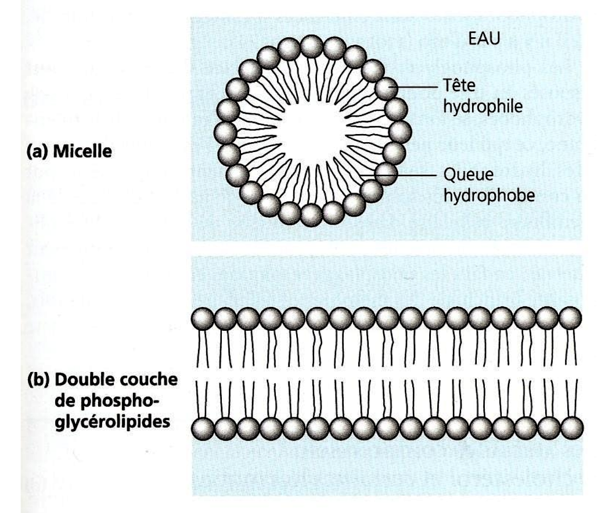

# Les lipides

> [!DÉFINITION]
> Ensemble hétérogène de molécules organiques à caractère hydrophobe (ou amphiphile) et à faible masse moléculaire. Ce ne sont pas des polymères au sens strict (pas de répétition d'un motif monomère identique).

Les lipides possèdent quelques propriétés intéressantes :
- Insolubles dans l'eau mais solubles dans les solvants organiques apolaires (éther, benzène, chloroforme).
- Propriétés chimiques résultant de leur caractère apolaire ou amphiphile.
- 10 à 15% de la masse sèche des organismes.

Ils servent les missions suivantes :
1. **Réserve énergétique** (Triglycérides).
2. **Constituant des cellules** (Phospholipides membranaires).
3. **Isolant thermique et électrique** (Myéline).
4. **Protection mécanique** (contre les chocs, compression).
5. **Source d'informations** (Hormones stéroïdes).

Un acide gras est dit **saturé** s'il ne possède pas de double liaison carbone-carbone. S'il en possède, il est **insaturé**, ce qui crée un **coude** (pli dans sa forme).

## Les lipides au sens strict (ss) : des esters ou amides d’acides gras

### Les acides gras, constituants des lipides au sens strict

Les acides gras sont dits **insaturés** s'ils possèdent une ou plusieurs doubles liaisons (coudes). La présence de coudes empêche l'agencement compact et donc la formation de liaisons hydrophobes fortes (Van der Waals), ce qui abaisse le point de fusion. Les acides gras liquides (huiles) sont donc souvent insaturés.

### Les triglycérides, molécules de réserve légères et stables

Le glycérol permet de former (par estérification) des molécules de réserve pour les acides gras. C'est une réserve énergétique très avantageuse, car très légère. Cette réserve de graisse permet de survivre à un jeûne de 2 à 3 mois. Par contradiction, le glycogène ([Glucides](g3.md)) ne peut être stocké qu'en quantité limitée (environ 500g, pour tenir une journée seulement).

Ces molécules sont aussi **anhydres** (elles n'enferment pas d'eau en elles-mêmes). La pression de cette eau rendrait la molécule moins stable. Les triglycérides sont également apolaires, très réduits, et libèrent donc plus d'énergie que les glucides lors de l'oxydation.

> [!EXAMPLE] Comparaison énergétique
> Acide palmitique : ~130 ATP
> Glucose : ~38 ATP

Ces molécules sont également inertes chimiquement. Elles ne réalisent pas de réactions avec leur environnement et n'attirent pas d'eau dans la cellule (pas d'effet osmotique). **Cet avantage est aussi un désavantage :** ces molécules sont plus lentes à mobiliser que le glucose. Elles sont également beaucoup moins polyvalentes. Il y a également une étape en plus, puisqu'il faut séparer les acides gras (hydrolyse) et les oxyder ensuite.

Sur le court terme, **on va donc privilégier les réserves de glucoses** (glycogène).

Les lipides seront stockés dans les adipocytes ou les hépatocytes (foie). Sur une coupe histologique, toute la partie en blanc correspond à une gouttelette lipidique. On a donc un cytoplasme très fin.

Ces lipides forment également **une barrière thermique** sous la peau, dans l'hypoderme. Il y a plus de gras autour des organes vitaux qu'autour des muscles. Il existe également sous la forme de **tissu adipeux brun**, qui est un véritable producteur de chaleur (thermogenèse).

### Les phospholipides et glycolipides membranaires

Les phospholipides sont des lipides qui possèdent un groupe phosphate. Ils sont formés par une phospho-estérification. Des molécules polaires peuvent s'accrocher à ce phosphate.

Ces molécules sont **amphiphiles** (voir [Atomes & Molécules](g1.md)). Elles possèdent une tête hydrophile (polaire) et une queue hydrophobe (apolaire).

Les glycolipides, aussi appelés coating, cell-coat, ou glycocalyx, permettent de protéger et d'identifier les cellules. Ils sont uniques à chacun. Certains récepteurs de toxines bactériennes s'y accrochent.

## Les lipides au sens large (sl) englobent toutes les molécules insolubles dans l’eau

### Comportement des lipides vis à vis de l’eau selon leur polarité et leur encombrement

Les molécules de lipides amphiphiles forment des structures comme des micelles ou des bicouches, dues aux interactions hydrophobes.

Avec un peu d’énergie, il est possible de former un Liposome, une vésicule sphérique avec une bicouche lipidique.

> [!TIP] Pour aller plus loin...
> On utilise souvent cette forme (liposome) pour vectoriser des médicaments. On peut alors étudier le fonctionnement des membranes plasmiques.

### Un ensemble chimiquement hétérogène de molécules hydrophobes de faible poids moléculaire

#### Le cholestérol et ses dérivés, les stéroïdes

Le cholestérol représente jusqu'à 25% des lipides membranaires chez les animaux.

Il possède un noyau stéroïde hydrophobe rigide et une petite tête polaire (-OH). Le cholestérol permet de moduler la fluidité de la membrane (tampon de fluidité).

Comme ce sont des molécules très hydrophobes, elles doivent être déplacées dans le sang via des **lipoprotéines** (LDL, HDL). Si on a trop de cholestérol (LDL), il peut s'accumuler dans les vaisseaux sanguins.

Le cholestérol est un précurseur de la fabrication de certaines hormones (Androgènes, Œstrogènes, Progestérone, Cortisol, qu'on appelle **hormones stéroïdes**). Elles peuvent traverser la membrane plasmique et se fixer sur des récepteurs intracellulaires pour agir sur l'expression des gènes (ADN).

## Résumé

| Fonction                         | Familles de lipides                                                     |
| -------------------------------- | ----------------------------------------------------------------------- |
| **Constituants membranaires** | Phosphoglycérolipides Glycolipides Cholestérol                    |
| **Protection**                   | Cérides *Subérines Cutine*                                        |
| **Métabolisme**                  | *Terpènes, Caroténoïdes* (vision) Quinones                           |
| **Réserve**                      | Triglycérides                                                           |
| **Information**                  | Stéroïdes Éicosanoïdes IP3 et DAG                                 |

C'est un groupe de molécules **rassemblé par les propriétés physico-chimiques** :
- Insolubles dans l'eau.
- Faible poids moléculaire.

Ils ont 2 rôles principaux :
- **Réserve** : légère, lentement mobilisable mais beaucoup d'énergie car très réduite.
- **Structure** : membrane plasmique (association en bicouches), barrière **semi-perméable**.

Ils servent également d'**identificateurs**.
