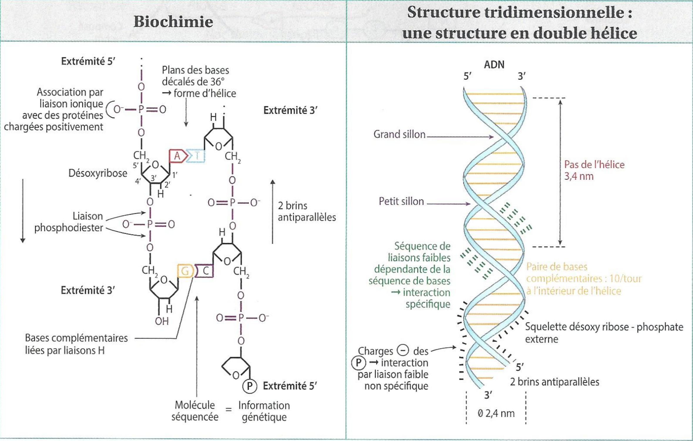

# ☣️ Nucléotides et acides nucléiques
## Les nucléotides, monomères réactifs des acides nucléiques
### Les constituants des nucléotides
Un nucléotide est constitué d'un Phosphate, d'une base azoté et un ose.
Il y a 5 types de nucléotides possibles :

1. **T** pour *thymine*
2. **G** pour *guanine*
3. **A** pour *adénine*
4. **C** pour *cytosine*
5. **U** pour *uridine*

Il est possible d'avoir 1, 2 ou 3 phosphates, qui entraîne donc un monophosphates, diphosphates et triphosphate. Les liaisons entre ces phosphates sont des liaisons covalentes, et à haut potentiel énergétique. L'APT est donc utilisé comme source d'énergie dans le corps (car possède le plus grand nombre de liaisons énergétiques à rompre). 

Les nucléotides sont des molecules planes car doubles liaisons. Elles absorbent les UV (ce qui permet de les détecter & quantifier) mais ce qui provoque, en contrepartie, des mutations. 
### Les rôles des nucléotides
C'est une molécule **diffusible**, qui fait <u class="red-underline">des aller retour entre les différents endroit de la cellule</u>. Elle charge et décharge (prendre) des groupement chimiques. *Cette molécule n'est jamais à l’arrêt*. Elle n'est pas une réserve, elle est constamment utilisé. Le pool de molécule (pas de def sadly) est toujours à flux tendu. La molécule d'ATP est utilisé dans la minute après sa synthèse. 

Tout les types nucléotides vont participer à la synthèse de l'ADN et l'ARN. Elles sont également des coenzymes (intermédiaires métaboliques), donc des molécules necessaries à une réaction mais qui n'est pas modifié et source de produit. Elle va également servir de second messager dans la cellule. Dernière fonction : certain nucléotides permettent la synthèse de polyosides, tel que les UDP-glucose, ADP-glucose et UDP-galactose.
#### Molécules énergétiques
L'ATP est une **molécule véhicule**. Il nous faut une petite molécule que je peux utiliser et transformer pour ne pas perdre trop d'énergie. Comme c'est une petite molécule, hydrophile, elle se diffuse facilement au sein des compartiments cellulaires et dans le corps. 

> [!ATTENTION]
> L'ATP n'est **JAMAIS** stocké. C'est une molécule extrêmement motrice qui est utilisé à l'instanté

La dissociation de la liaison covalente entre les phosphate crée de l'énergie (*hydrolyse*). Catalysé par les enzymes **kinase**. Le phosphate perdu par l'ATP permet un travail sur les molécules de manière suivante :

Le manque d'ATP peux donc briser des chaines de réactions. Pour un organisme pluricellulaire, il est possible de trouver des solutions temporaires. Par contre, le manque de réactifs est fatal aux micro-organismes. D'autres reactions oxido-réductions avec ATP sont dans le poly.

#### Coenzymes
Les acides gras doivent êtres activés pour être estérifiés. On peut former des coenzymes avec des groupes ATP et ainsi pouvoir faire de la condensation sur ces acides gras.

#### Informatique
Une enzyme cyclisante (finit par -ase) transforme l'ATP en AMPc (et un diphosphate), second messager qui va activer des protéines permettant une rétroaction (ex: synthèse de glycogène). 
## Les acides nucléiques, des molécules informatives
### Les polynucléotides porteurs de l’information
Chaque nucléotide est un monomère. Ils forment des hétéropolymères **séqencés** et **orientés**.Ils sont composés de xx phosphates. 

L'ADN est composé de désoxyribonucléotides et l'ARN de ribonucléotides. 

Leur taille est toujours exprimé en nombre  de paires de bases  
nucléotides (pb). Pour les ARN qui ne possèdent qu'un seul brun, on compte juste le nombre. *La qunatitié ne signifie pas que l'organisme est complexe*.

L'orientation de l'adn permet la lecture par des enzymes polymérases.

Les molécules d'ADN peuvent avoir une taille variable. 

#### ADN
Comme c'est une molécule stable, c'est une molécule **réparable**. Elle est également **peu réactive**. L'ADN est avantageuse car l'information est contenu en **2 exemplaires** (car 2 bruns).

> [!EXAMPLE] Histoire
> La structure en double hélice de l’ADN a été "découverte" en 1953 par James Watson et Francis Crick, grâce notamment aux travaux de Rosalind Franklin. Les premières études reposaient sur l’hydrolyse de l’ADN, qui révélait systématiquement les mêmes types de monomères.
> 
> Erwin Chargaff a ensuite montré que la quantité de cytosine est toujours égale à celle de guanine, et que la quantité d’adénine est toujours égale à celle de thymine : ces bases fonctionnent donc par complémentarité.
> 
> Enfin, Rosalind Franklin a cristallisé l’ADN et obtenu la célèbre photographie en « croix », qui a permis à Watson et Crick de déduire que la molécule adopte une structure d’hélice tournée vers la droite. Ils ont aussi pu mesurer que cette double hélice possède un diamètre d’environ 2 nm et un pas d’environ 3,4 nm entre chaque spire.

L'ose de l'ADN est un désoxyribose. L’ordre des nucléotides (monomères) dans l'ADN est important car il définit l'information.

L'information de l'ADN reste accessible même si elle est chimiquement  inerte car elle est facilement reconnaissable.

Les liaisons hydrogènes des couples C-G et A-T permettent la dislocation locale de bruns de l'ADN, et donc la lecture précise de l'ADN. On dit que l'ADN est **dynamique**. 

L'ADN est normalement stable de génération en générations. Il arrive que des mutations se forment et soient transmises. Certaines ne sont pas importantes, mais d'autres sont avantageuses. 
#### Transgenèse

> [!DÉFINITION]
> Utilisation d'une gêne avantageuse à une espèce et insertion dans un autre organisme

On récupère le fragment d'ADN qui nous intéresse. On l'insère ensuite dans un plasmide (morceau circulaire d'adn) d'une bactérie et dans un milieu favorable à la bactérie pour se *reproduire*. On intègre également un gène de sélection, car la transgenèse est un processus  très peu rentable. *Souvent, ce gène est un gène de resistance à certains antibiotiques* **L'utilisation de bactéries permet la multiplication de plasmines de manières naturelles, de manière naturelle et moins coûteuse.** On isole ensuite les bactéries, on éclate les cellules, puis utiliser un vecteur (type virus) pour infecter les cellules hôtes (cellule oeuf). 

Cette experience prouve que l'ADN est **universelle**. Elle peut être décodé par **n'importe que être vivant**. 

La première transgenèse est celle du **Maïs BT**, une espèce de Mais résistant à la pyrale de maïs. 
#### ARN
L'ARN ussi hétéroploymères composés de nucléotides. à la place de la désoxyribose, on a de la ribose. Elle est plus petite, formé d'une seul brun, mais peut prendre des formes tri-dimensionnelles dans l’espace. Elle sont **5 à 10 fois plus abondantes que l'ADN** dans la cellule.Elle sont **toujours** formés par la transcription d'ADN, permise par l'ARN polymérase qui détecte un promoteur qui précede le gene. 

*Souvent, un gène correspond à un ARNm*. Il est ensuite traduit en une séquence d'acides aminés, en **peptides**. Selon la formation et l'activité de cette "protéine", le gène se prononcera *ou non*. 

Les transcriptome sont l'ensembles des ARN qui sont issue de l'ensemble des transcriptions d'un génome. **Deux cellules spécialisés n'ont donc pas le même transcriptome**. Le transcriptome varie donc dans le temps & l'espace. 

L'ARNm est traduit presque instantanément, elle a donc une durée de vie très courte.

L'ARNt (reconaisable à sa forme de trèfle 🍀) s'associe avec les protéines pour former des particules ribonucléoprotéiques (les ribosomes). 

Les petits ARN peuvent se fixer sur l'ARNm pour empêcher l'approche de ces ribosomes (bloquant la traduction) ou recruter des enzymes pour permettre le clivage de l'ARNm.

Aucun nucléotide n'est perdu, ils sont réutilisés pour synthétiser d'autres polymères. 

|              | ARNm | ARNt | ARNr | Petits ARN |
| ------------ | ---- | ---- | ---- | ---------- |
| Proportion   | 5%   | 15%  | 80%  | <1%        |
| Durée de vie |      |      |      |            |
| Taille       |      |      |      |            |
| Structure    |      |      |      |            |
| Fonctions    |      |      |      |            |
Seule l'ARNm possède un message provenant de l'ADN. **La proportion d'ARN informative est donc très faible.**