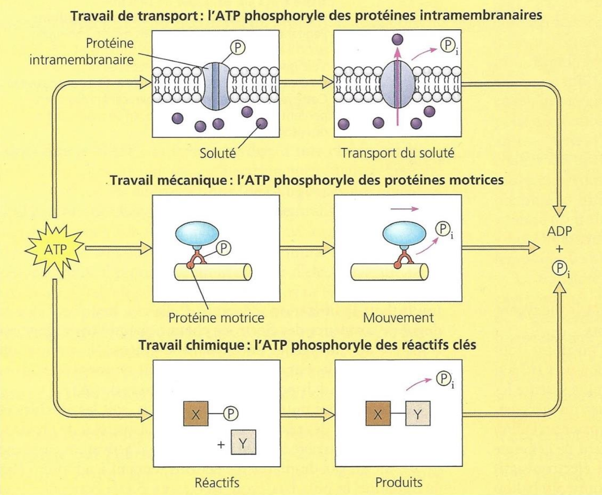

# ☣️ Nucléotides et acides nucléiques
## Les nucléotides, monomères réactifs des acides nucléiques
### Les constituants des nucléotides
Un nucléotide est constitué d'un Phosphate, d'une base azoté et un ose.
Il y a 5 types de nucleotides possibles avec deux bases : les bases pyrimidiques

1. T
2. G
3. A
4. C
5. U

Il est possible d'avoir 1, 2 ou 3 phosphates, qui entraîne donc un monophosphates, diphosphates et triphosphate. Les liaisons entre ces phosphates sont des liaisons covalentes, et à haut potentiel énergétique. L'APT est donc utilisé comme source d'énergie dans le corps (car possède le plus grand nombre de liaisons énergétiques à rompre). 

`Papier`
### Les rôles des nucléotides
C'est une molécule **diffusible**, qui fait <u class="red-underline">des aller retour entre les différents endroit de la cellule</u>. Elle charge et décharge (prendre) des groupement chimiques. *Cette molécule n'est jamais à l’arrêt*. Elle n'est pas une réserve, elle est constamment utilisé. Le pool de molécule (pas de def sadly) est toujours à flux tendu. La molécule d'ATP est utilisé dans la minute après sa synthèse. 

Tout les types nucléotides vont participer à la synthèse de l'ADN et l'ARN. Elles sont également des coenzymes (intermédiaires métaboliques), donc des molécules necessaries à une réaction mais qui n'est pas modifié et source de produit. Elle va également servir de second messager dans la cellule. Dernière fonction : certain nucléotides permettent la synthèse de polyosides, tel que les UDP-glucose, ADP-glucose et UDP-galactose.
#### Molécules énergétiques
L'ATP est une **molécule véhicule**. Il nous faut une petite molécule que je peux utiliser et transformer pour ne pas perdre trop d'énergie. Comme c'est une petite molécule, hydrophile, elle se diffuse facilement au sein des compartiments cellulaires et dans le corps. 

> [!ATTENTION]
> L'ATP n'est **JAMAIS** stocké. C'est une molécule extrêmement motrice qui est utilisé à l'instanté

La dissociation de la liaison covalente entre les phosphate crée de l'énergie (*hydrolyse*). Catalysé par les enzymes **kinase**. Le phosphate perdu par l'ATP permet un travail sur les molécules de manière suivante :

Le manque d'ATP peux donc briser des chaines de réactions. Pour un organisme pluricellulaire, il est possible de trouver des solutions temporaires. Par contre, le manque de réactifs est fatal aux micro-organismes. D'autres reactions oxido-réductions avec ATP sont dans le poly.

#### Coenzymes
Les acides gras doivent êtres activés pour être estérifiés. On peut former des coenzymes avec des groupes ATP et ainsi pouvoir faire de la condensation sur ces acides gras.

#### Informatique
Une enzyme cyclisante (finit par -ase) transforme l'ATP en AMPc (et un diphosphate), second messager qui va activer des protéines permettant une rétroaction (ex: synthèse de glycogène). 
## Les acides nucléiques, des molécules informatives
### Les polynucléotides porteurs de l’information
Chaque nucléotide est un monomère. Ils forment des hétéropolymères **séqencés** et **orientés**.Ils sont composés de xx phosphates. 

L'ADN est composé de désoxyribonucléotides et l'ARN de ribonucléotides.  