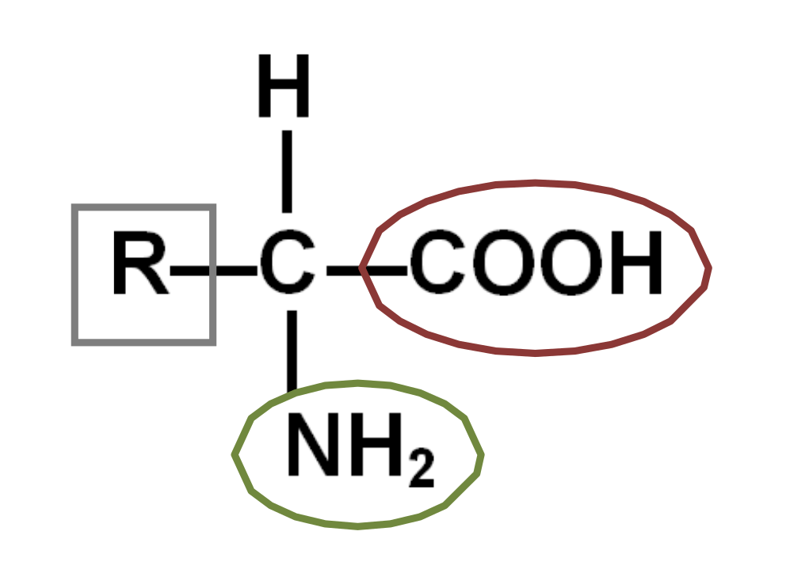

# 🍗 Acides aminés et les protéines

Les protéines sont quantitativement importantes chez les animaux et les végétaux (surtout graines et légumineuses). Elles sont présentes dans différents compartiments cellulaires, et possèdent plusieurs rôles distincts :

- **Structure** (ex: cytosquelette, collagène).
- **Enzymes** (catalyseurs biologiques).
- **Transport** (ex: hémoglobine).
- **Mouvement** (ex: actine, myosine).
- **Défense** (ex: anticorps).
- **Communication** (ex: hormones peptidiques, récepteurs).

Au niveau des membranes, les protéines permettent l'adhérence, le transport de molécules et la communication entre cellules.

Ce sont des **molécules outils** qui assurent la majorité des fonctions cellulaires.

Les protéines sont des polymères de plus de 50 acides aminés. Ce sont des hétéropolymères linéaires et séquencés.

Les protéines forment avec les acides aminés le groupe des **protides**.

## Les acides aminés, des monomères polymérisables

Les acides aminés sont des monomères où un carbone $C_\alpha$ (Carbone chiral) porte :
1. Un groupe **acide carboxylique** (-COOH).
2. Un groupe **amine** (-NH2).
3. Un atome d'hydrogène.
4. Un **radical** (chaîne latérale R) variable qui détermine l'identité de l'acide aminé.

Il existe des formes L et D (énantiomères), mais seules les formes **L** sont présentes dans les protéines.

Les acides aminés qui nous intéressent sont les **20 acides aminés protéinogènes** codés par le code génétique.

L'acide aminé peut exister sous forme de **Zwitterion** (ion dipolaire) à pH neutre : le groupe acide est déprotoné ($COO^-$) et le groupe amine est protoné ($NH_3^+$). Le pH auquel la charge nette est nulle est appelé **pHi** (point isoélectrique).

Les acides aminés peuvent se lier (**polymériser**) par une **liaison peptidique** résultant de la condensation (déshydratation) entre le groupe acide d'un AA et le groupe amine du suivant. La réaction inverse est l'hydrolyse. *Dans le corps humain, l'hydrolyse spontanée est très lente, nécessitant des enzymes (protéases).* La liaison peptidique est donc très stable.

La chaîne polypeptidique est toujours orientée du **N-terminal** (amine libre) vers le **C-terminal** (acide libre). La structure du squelette peptidique est plane et rigide (caractère partiel de double liaison), mais les radicaux peuvent s'orienter dans l'espace.

## Propriétés physico-chimiques et repliement

La séquence des acides aminés (structure primaire) dicte le repliement de la protéine. Ce repliement est guidé par les propriétés des chaînes latérales (R) :

1. **Acides aminés hydrophobes (non-polaires)** : Ils fuient l'eau et se regroupent spontanément au centre de la protéine pour former un **cœur hydrophobe compact et anhydre**. C'est l'effet hydrophobe, moteur principal du repliement.
2. **Acides aminés polaires (hydrophiles)** : Ils se placent généralement en surface, en contact avec l'eau, et peuvent former des **liaisons hydrogènes** avec le solvant ou d'autres molécules.
3. **Acides aminés chargés** : Ils peuvent former des **liaisons ioniques** (ponts salins) entre charges opposées (+/-), stabilisant la structure 3D. Ils agissent comme des acides ou bases faibles.
4. **Cystéines** : Deux cystéines peuvent former une liaison covalente forte appelée **pont disulfure** ($S-S$), qui verrouille la structure tertiaire ou quaternaire.

D'autres interactions faibles stabilisent l'édifice : les **liaisons de Van der Waals** (entre atomes très proches) et les liaisons hydrogènes entre radicaux.

Voir aussi : [Atomes & Molécules](g1.md) pour les liaisons chimiques.

## Les différents niveaux structuraux des protéines

La fonction d'une protéine dépend intimement de sa structure tridimensionnelle. On distingue 4 niveaux d'organisation :

### Structure Primaire

C'est la **séquence linéaire** des acides aminés, déterminée par le gène (ADN). C'est un hétéropolymère séquencé. Une simple mutation (changement d'un AA) peut altérer toute la structure et la fonction (ex: anémie falciforme). **Polymère séquencé**

### Structure Secondaire

Ce sont des repliements locaux réguliers stabilisés par des **liaisons hydrogènes** entre les atomes du **squelette peptidique** ($C=O$ et $N-H$), sans intervention des chaînes latérales.
- **Hélice $\alpha$** : Enroulement en spirale.
- **Feuillet $\beta$** : Repliement en accordéon (plissé).

Le squelette carboné impose la forme, les radicaux s'orientent vers l'extérieur (hélice) ou alternent de part et d'autre (feuillet). En fonction du sens où les liaisons Azote - Carbone chiral tourne, la structure est plane ou en spirale. 

### Structure Tertiaire

C'est le repliement global de la chaîne dans l'espace (structure 3D finale d'un polypeptide). Elle est stabilisée par les interactions entre les **chaînes latérales (R)** :
- Interactions hydrophobes (cœur).
- Liaisons hydrogènes.
- Liaisons ioniques.
- Ponts disulfures (covalents).

> En jaune, les liaisons S-S (ponts disulfures).

Cette structure crée des sites spécifiques (poches) permettant la fixation d'un **ligand** par complémentarité de forme (clé-serrure).

### Structure Quaternaire

C'est l'association de plusieurs chaînes polypeptidiques (appelées **sous-unités** ou **protomères**) pour former une protéine fonctionnelle complexe. Les sous-unités sont liées par des liaisons faibles (H, ioniques, hydrophobes) ou parfois des ponts disulfures.
*Exemple : L'hémoglobine (4 sous-unités).*

Une protéine n'est fonctionnelle que si elle a acquis sa conformation native correcte. La perte de cette structure est la **dénaturation**.

## Protéines membranaires et Hydropathie

Comment une protéine s'insère-t-elle dans la membrane plasmique (hydrophobe) ?
Elle possède des domaines transmembranaires, souvent des **hélices $\alpha$** composées d'acides aminés **hydrophobes**.

On utilise l'**hydropathie** pour prédire ces domaines : on mesure l'hydrophobicité de chaque segment de la séquence. Un pic d'hydrophobicité sur une longueur d'environ **20 acides aminés** suggère une hélice transmembranaire (épaisseur de la membrane).

## Exemples de relations Structure-Fonction

### Collagène

### Protéines fibreuses : Structure et Résistance

Certaines protéines ont un rôle purement structural.
- **Collagène** : Forme une triple hélice très serrée. Très résistant à la traction, il assure la cohésion des tissus (peau, os, tendons).
- **Kératine** (cheveux, ongles) ou **Fibroïne** (soie) : Riches en feuillets $\beta$, offrant résistance et souplesse.

### Hémoglobine : Transport et Coopérativité

L'hémoglobine (Hb) transporte le dioxygène ($O_2$) dans les globules rouges (érythrocytes).
- **Structure** : 4 sous-unités (2 $\alpha$, 2 $\beta$), chacune contenant un hème (avec un atome de Fer) qui fixe $O_2$.
- **Coopérativité** : La fixation d'un $O_2$ sur une sous-unité modifie la conformation des autres, facilitant la fixation des suivants (courbe sigmoïde). C'est un effet **allostérique**.
- **Adaptation** : L'affinité pour $O_2$ varie selon l'environnement (Effet Bohr). L'acidité ($H^+$), le $CO_2$ et la température (conditions d'effort musculaire) diminuent l'affinité, favorisant la libération de l'oxygène là où il est nécessaire.

### Anticorps : Reconnaissance et Défense

Les anticorps (Immunoglobulines) sont des protéines de défense.
- **Structure** : Forme en "Y" constituée de 4 chaînes (2 lourdes H, 2 légères L) liées par des ponts disulfures.
- **Fonction** : Les extrémités des bras du Y sont des **régions variables** très spécifiques. Elles forment le **paratope** qui reconnaît et fixe l'**antigène** (épitope) par complémentarité spatiale et chimique.
- **Bivalence** : Chaque anticorps peut fixer 2 antigènes, permettant la formation de **complexes immuns** (réseau) qui neutralisent les pathogènes (agglutination/précipitation).

On peut utiliser des anticorps couplés à des marqueurs (fluorescents, radioactifs) pour localiser des protéines spécifiques dans une cellule (Immunofluorescence).

---

**Conclusion** : Il y a un lien fondamental entre la **séquence** (structure primaire), la **structure 3D** et la **fonction** biologique. La structure permet la fonction grâce aux propriétés physico-chimiques des acides aminés positionnés précisément dans l'espace.

<!-- Fin de la relecture -->

## Technique(s) d'étude des protéines

### Chromatographie d'affinité

*Utilisation d'un papier spécifique*

### Éléctrophorèse non dénaturante

Je prend les protéines tels quels et je les sépare dans les champs électroniques. Si elles sont non dénaturés, alors on peut "confondre" plusieurs protéines.

### Éléctrophorèse dénaturante

On chauffe la protéine avant l'Éléctrophorèse, pour la dénaturer, la déplier, briser la structure teritiaire. On peut alors séparer les protéines et utiliser les poids des mollécules

### Chromatographie par échange d'ions

Utilisation de cations/anions pour sélectionner les protéines en fonction de leurs charges. 

### Western blot

Utilisé pour des dépistages, pour valider le résultat. Le résultat de l'Éléctrophorèse est placé sur un western blot, qui sera marqué si il y a une correspondance avec des anticorps.

Lorsque nous sommes sur que le précipité continent uniquement les protéines qui nous intéresse, il est possible d'utiliser la Cristalographie/Difraction à rayon X pour la décomposer. On peux chercher ensuite l'ARN, puis faire une PCR pour chercher l'emplacement de ce gène. 

## Conclusion

Mémo: TASERS :
- T pour transport (solubles, transport de lipides, ou transmembranaires, canaux)
- A pour anticorps (voir [Anticorps : Reconnaissance et Défense](#Anticorps%20Reconnaissance%20et%20Défense))
- S pour structure (voir [Collagène](#Collagène))
- E pour enzymes (voir [Kinases: Coenzymes](g4.md#Coenzymes), phosphorylation, glycolysation)
- R pour régulation (modulation/régulation d'autres protéines, voir également voir [Kinases: Coenzymes](g4.md#Coenzymes))
- S pour signalisation (hormones polypeptides comme [Glucagon et Insuline](../../A4/ch3/g3.md#Mécanismes%20de%20régulation))