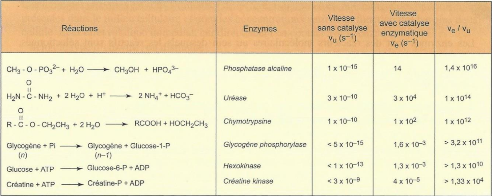
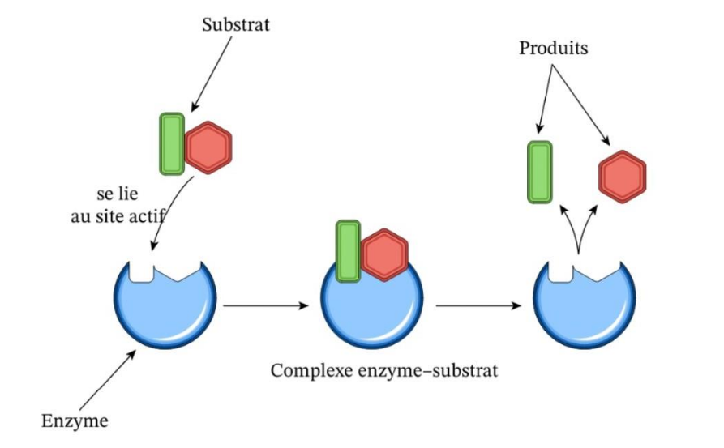

# 🧪 Les enzymes et la catalyse des réactions

## Catalyseurs protéiques indispensable à des réactions biochimiques

Quelques règles :

1. Un catalyseur ne peut assister une réaction **que si la réaction peut se dérouler dans les conditions thermodynamique du corps humain**.
2. L'état d'équilibre de la réaction n'est pas modifié. Elle s’arrêtera au même moment qu'une réaction normale, juste plus rapidement. *Idem pour la spontanéité de la réaction*
3. Le catalyseur est **régénéré à la fin de la réaction chimique** et il **en sort intact**. Ce n'est **pas un réactif**.
4. Il y a une existence d'un état intermédiaire avec **intéraction entre catalyseur et produit** qui permet la réalisation de la réaction, car permet d'abaisser le niveau d'activation d'énergie nécessaire.

Certaines enzymes nécessitent un cofacteur : une substance non protéique qui se lie à une protéine et qui sont indispensable à son activité biologique. Elles sont appelés **substrat** si elles sont utilisés en partie ou entièrement dans le produit.

Elle peut aussi nécessiter une **Coenzymes** : molécules organiques dérivées des vitamines (ex. NAD+/NADH, FAD/FADH2, coenzyme A). Elles peuvent transférer des groupements (électrons, acyles...). *Certaines réactions peuvent être dépendantes, comme NADH + H+ et NAD+.* Souvent, c'est la disponibilité des coenzymes qui arrête une réaction.

Quelques spécificités :
1. Les enzymes sont toujours spécifiques de leur substrat : leur forme est complémentaire à celle du substrat. Saccharase : saccharose -> Glucose et Fructose par hydrolyse, c'est la seule à pouvoir hydrolyser le saccharose.
2. Chaque enzyme est spécifique d'une transformation chimique. On parle alors de spécificité d'action ou de réaction. Pour la Saccharase, elle ne fait uniquement que de l'hydrolyse. 
3. Chaque enzyme possède un optimum de fonctionnement. Il est, très souvent, guidé par la température. C'est le point de rupture entre l’agitation croissante des atomes & molécules, contré par la dénaturation thermique décroissante. Le pH modifie également la structure.

**site actif**

| Enzymes              | Réactions Catalysées                                                   |
| -------------------- | ---------------------------------------------------------------------- |
| **Hydrolases**       | Hydrolyse "générale"                                                   |
| **Nucléases**        | Hydrolyse des acides nucléiques                                        |
| **Protéases**        | Hydrolyse des protéines                                                |
| **Synthases**        | Catalyses la synthétisation de molécules par condensation (anabolique) |
| **Kinases**          | Catalyses l'addition de groupement phosphate                           |
| **Phosphatases**     | Retrait par hydrolyse d'un groupement phosphate                        |
| **Oxydo-réductases** | Catalyse une oxydo-réduction                                           |
| **ATPases**          | Hydrolyse de l'ATP                                                     |

Presque toute les réactions enzymatiques sont réversibles. Il y a donc une idée d'équilibre. Cependant, il est souvent le cas que les enzymes/substrats soient différents selon le sens de la réaction.

Grâce à l'interaction des substrats, les enzymes peuvent baisser le niveau d'activation des molécules. C'est le principe de clef-serrure, un principe général de correspondance entre différentes molécules. Ce site actif a deux parties : un site de fixation et un site catalityque. Les acides aminés précis du site d'activation ne sont pas les même du site catalytique. Le site de fixation permet de retenir le substrat pour permettre la réalisation de la réaction. Il peut aussi être aidé par un léger changement de conformation. 

La réaction enzymatique passe toujours par la transition réversible et temporaire d'un complexe enzyme substrat

On écrit les réactions enzymatiques sous la forme

$$E + S \xrightleftharpoons[k_1]{k_1} [ES] \xrightarrow{k_2} E + P$$

Avec $k_i$ les constantes de vitesses, $E$ l'enzyme, $S$ le substrat, $P$ le produit et $[ES]$ le complexe.

Une fois libéré de son substrat, l'enzyme peut de nouveau interagir avec un autre substrat.

Raisonnance magnétique nucléaire (why not).

---

Comment les enzymes participent à la spécialisation [spatiale] cellulaire ? [Les lysosomes](../../A2/ch1/g1.md#Les%20lysosomes%20recyclage%20cellulaire) en sont un exemple phare, mais le noyaux contient des enzymes spécialisés (ARN-polymérase, ADN-polymérase) ATP-synthase pour les mitochondries... Les enzymes spécifiques de l'organite sont incluses dans le cytosol : hydrolase pour les entérocytes, 

Toutes les cellules possèdent les enzymes glucokinase pour réaliser des réserves privées de glucose en cas d'effort bref et intense. 

| Enzyme                  | Cellules Hépatiques | Cellules Musculaires | Cellules Adipeuses | Cellules Nerveuses |
| ----------------------- | ------------------- | -------------------- | ------------------ | ------------------ |
| Glycogène synthase      | ✅                   | ✅                    | ❌                  | ❌                  |
| Glycogène phosphorylase | ✅                   | ✅                    | ❌                  | ❌                  |
| Phosphoglucomutase      | ✅                   | ✅                    | ❌                  | ❌                  |
| Glucokinase             | ✅                   | ✅                    | ✅                  | ✅                  |
| Glucose-6-phosphate     | ✅                   | ❌                    | ❌                  | ❌                  |
