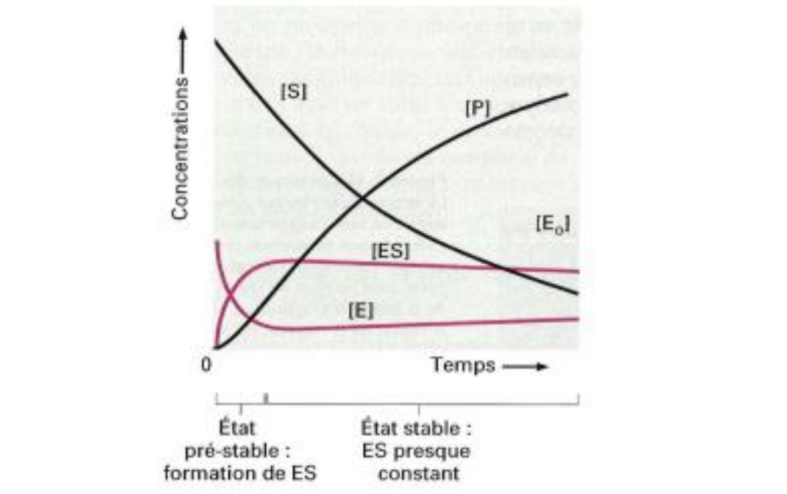

# 🎡 La Cynétique Enzymatique

## Calcul de la constante d'affinitée

Nous allons, à notre niveau, différencier deux types d'enzymes : les enzymes **michaeliennes** et les enzymes **x**

> [!DÉFINITION]
> Les **enzymes michaeliennes** sont toutes les enzymes dont la cinétique a une saturation hyperbolique

*On notera initial avec un exposant $_i$.* Les **enzymes michaeliennes** ont une vitesse initiale (d'apparition du produit) maximale au début, et qui décroit. Idem dans le sens opposé pour la disparition des substrats. *Note : on pourrait relativement dire logarithmique.*

Quelques point important :
- Le flux de substrat est constant. On ne peux donc pas vraiment utiliser la quantité de substrat. À la place, on utilisera la concentration et la vitesse **en fonction de la valeur initiale**.
- On dose alors, la quantité de substrat ou de produit. On arrête la réaction à différents moments et on le reporte sur un graphe. 

La courbe de la *Figure 19* s'appelle **Courbe de Michaelis-Menten**. La **Constante de Michaelis-Menten ($\color{red} K_M$)** est la valeur de concentration à laquelle la vitesse absorption de la réaction vaux la vitesse max divisée par deux ($\frac {V_{max}}{2}$). Plus elle est petite, plus l'enzyme possède une affinité forte pour le substrat. Avec les k que nous avions dans l'équation de la [page précédente](g1.md), on obtient $K_M = \frac{k_{2} + k_{-1}}{k_1}$

On peut également calculer la **vitesse initiale** avec $V_i = \frac{V_{max} [S]_i}{K_M + [S]_i}$ avec $V_i$ la vitesse initiale, $[S]_i$ la concentration initiale de substrat et $V_{max}$ la vitesse max.

À une basse concentration de substrat, $K_M$ est bien plus supérieur que $[S]_i$, $V_i$ se rapproche d'une équation $k \times [S]_i$. On a alors une sorte de droite, ou de TANGENTE elle est de retour.  Pour une très forte concentration de substrat, $V_i$ tend vers $V_{max}$, il y a donc UNE LIMITE car $V$ est une suite croissante et non bornée (c'est une suite, c.f. le [tout début](#🎡%20La%20Cynétique%20Enzymatique)). Avec ces deux conditions, on effectue un double inverse pour linéariser cette droite. La **Linéarisation de Lineweaver Burk** permet de lire $K_M$ et $V_{max}$ **à partir de points expérimentaux**.

$$\frac 1V = \frac{K_M}{V_{max}} \times \frac{1}{[S]_i} + \frac{1}{V_{max}}$$

À partir de cette double inverse, on peut définir une **constante d’affinités** $K_M$. *Mais maintenant, que peut-on en faire ?*

## Interprétation des résultats

Les enzymes glucokinéses et hexokinases sont ... . Le glucokinase a une plus faible affinité pour le glucose que l'hexokinase. 

**Conséquences : l’inhibition du glucokinase arrive beaucoup plus tard que celle de l'hexokinase.** Elle est donc lié à la concentration de glucose. La glucokinase travaille peu importe la concentration de glucose dans le plasma, alors que l'hexokinase sera très vite saturée. Cet équilibre permet de **protégée l'organisme** à **l'intoxication de glucose**. *Lorsque les cellules sont exposés à une exposition du glucose, les cellules peuvent nécroser.* 

---

Plus la constante de catalise est élevé, plus kcat est faible, donc la katalyse de la réaction est fréquente 

La plupart des enzymes michaeliennes sont **monomériques**, elles possèdent une seule sous unitée.

Complexes enzymatiques avec adn polymérases.

---

Un autre type d'enzyme sont alors les enzymes **allostériques**, qui elles possèdent plusieurs sous unités. Au même titre que les [hémoglobines](../ch1/g5.md#Hémoglobine%20Transport%20et%20Coopérativité), créent une inertie lors de la fixation d'un ligand sur ses sous unités.

À partir de certains graphiques étudiés au dessus, on peut comparer les enzymes michaeliennes et allostériques, via une constante $K_{0.5}$ : et il ce trouve que les allostériques ont une affinitée plus faible que les michaeliennes.

On peut également étudier le nombre/coefficient de Hill. Il permet de définir si la fixation du substrat est indépendante *si n = 1* (coopération des sous unités) On peut également voir un **effet/réponse hétérotrope positives** en presence d'activateur/inhibiteur qui permet d'augmenter (ou diminuer) encore plus l’affinité des enzymes. Cette évolution se voit dans une diminution (ou augementation) de la constante $K_{0.5}$.