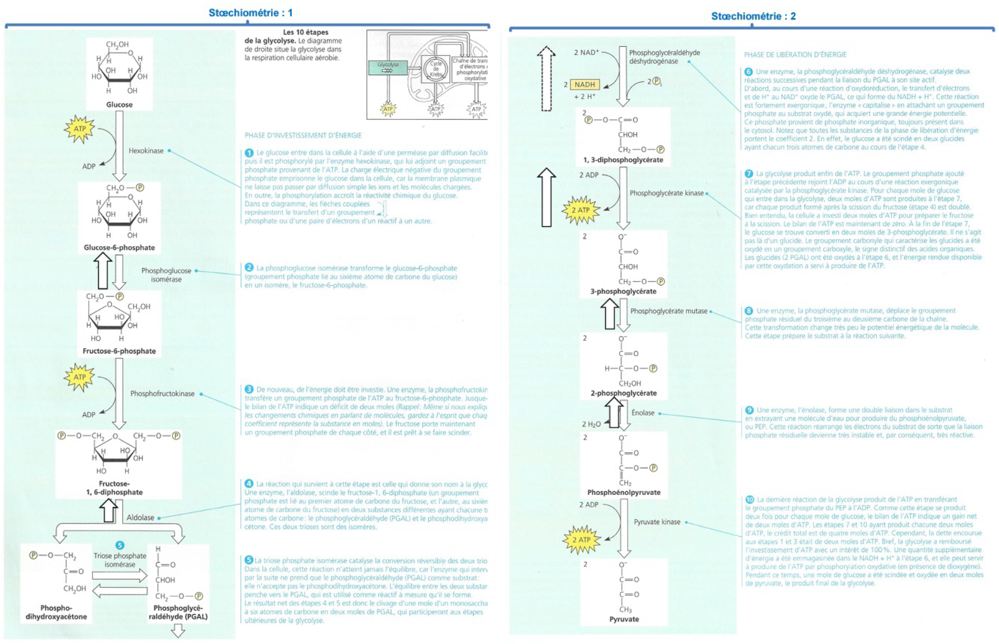
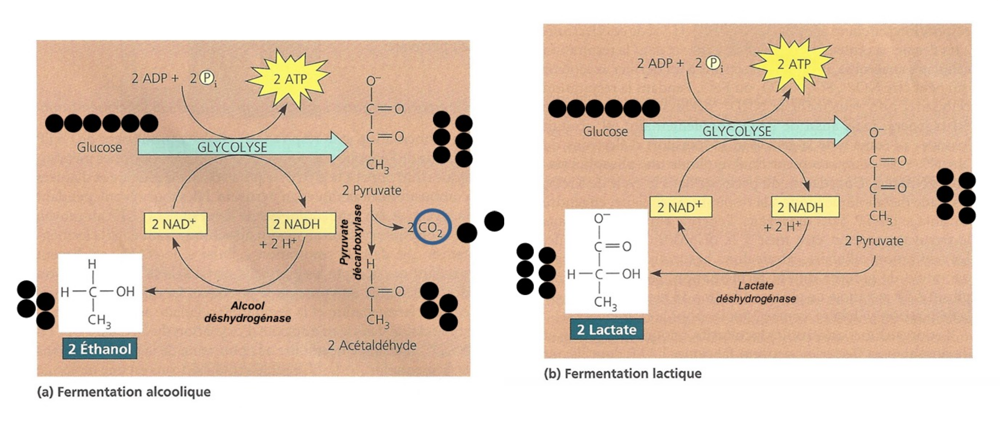

# Le catabolisme oxydatif des biomolécules et la synthèse d'ATP

## Objectifs

- Comprendre les étapes cellulaires de production d'ATP.
- Différencier phosphorylation au niveau du substrat et phosphorylation oxydative.
- Connaitre les bilans énergétiques (glucose, acides gras) et les points de régulation principaux.

## Vue d'ensemble

La production d'ATP repose sur deux grands mécanismes :
- La phosphorylation au niveau du substrat (glycolyse, cycle de Krebs) — formation directe d'ATP ou GTP.
- La phosphorylation oxydative (chaîne respiratoire + ATP-synthase) — utilisation d'un gradient de protons généré par le transfert d'électrons vers l'oxygène.

Compartimentation importante : la glycolyse a lieu dans le cytosol ; le pyruvate, la ß‑oxydation, le complexe PDH, et le cycle de Krebs se déroulent en matrice mitochondriale ; la chaîne respiratoire et l'ATP-synthase sont ancrées dans la membrane interne mitochondriale.

---

## 1. Glycolyse (cytosol)

Résumé : transformation du glucose en pyruvate en 10 étapes organisées en 3 phases (investissement, clivage, rendement).

- Bilan net : $\mathrm{Glucose} + 2\;\mathrm{NAD}^+ + 2\;\mathrm{ADP} + 2\;\mathrm{Pi} \rightarrow 2\;\mathrm{pyruvate} + 2\;\mathrm{NADH} + 2\;\mathrm{ATP} + 2\;\mathrm{H_2O}$. 
- ATP produit par phosphorylation au niveau du substrat : 2 ATP net.
- NADH produit : 2 NADH (cytosolique) — destin variable selon navettes.

Points de contrôle et régulation :
- Hexokinase / Glucokinase (1ère étape).
- Phosphofructokinase‑1 (PFK‑1) : étape engagée et principale régulatrice — activée par AMP, F2,6BP ; inhibée par ATP, citrate.
- Pyruvate kinase : régulation allostérique (ATP inhibe) et covalente (phosphorylation selon le tissu).

Destins du pyruvate : fermentation lactique (muscle, anaérobiose), fermentation alcoolique (levures), ou entrée en mitochondrie via PDH (aérobiose) pour former l'acétyl‑CoA.

---

## 2. Fermentations (recyclage du NADH)

- Fermentation lactique : $\mathrm{pyruvate} + \mathrm{NADH} \rightarrow \mathrm{lactate} + \mathrm{NAD}^+$ (permet la régénération du NAD+ pour la glycolyse).
- Fermentation alcoolique (levure) : $\mathrm{pyruvate} \rightarrow \mathrm{acetaldehyde} + CO_2;\; \mathrm{acetaldehyde} + \mathrm{NADH} \rightarrow \mathrm{ethanol} + \mathrm{NAD}^+$. 
- Cycle de Cori : le lactate produit par muscle est repris par le foie pour la néoglucogenèse.

---

## 3. Oxydation du pyruvate — complexe pyruvate déshydrogénase (PDH)

- Réaction : $\mathrm{pyruvate} + \mathrm{CoA} + \mathrm{NAD}^+ \rightarrow \mathrm{acetyl\text{-}CoA} + CO_2 + \mathrm{NADH}$.
- Complexe multienzymatique (E1, E2, E3) nécessitant TPP, lipoate, FAD, NAD+, CoA, Mg2+.
- Régulation : inhibé par NADH et acetyl‑CoA ; activité contrôlée par PDH‑kinase (inactive PDH par phosphorylation) et PDH‑phosphatase (active PDH par déphosphorylation). Insuline favorise l'activation dans certains tissus.

---

## 4. Cycle de Krebs (ou cycle de l'acide citrique) — matrice mitochondriale

- Par 1 acétyl‑CoA : 2 CO2, 3 NADH, 1 FADH2, 1 GTP (ou ATP).
- Réactions anaplérotiques : pyruvate carboxylase (pyruvate → oxaloacétate) permet de reconstituer les intermédiaires du cycle utilisés pour la biosynthèse.

Tableau synthétique (par acétyl‑CoA) :
- Entrée : acétyl‑CoA (2 C)
- Sorties : 2 CO2 ; 3 NADH ; 1 FADH2 ; 1 GTP

Remarque : par molécule de glucose (2 acétyl‑CoA) le cycle fournit 6 NADH, 2 FADH2 et 2 GTP.

---

## 5. Chaîne respiratoire (membrane interne) et shuttles

- Complexes majeurs : I (NADH déshydrogénase), II (succinate déshydrogénase), III (complexe bc1), IV (cytochrome c oxydase).
- Transport d'électrons : NADH → Complexe I → Q → Complexe III → cytochrome c → Complexe IV → O2 (réduit en H2O).
- Pompage de protons (par paire d'électrons provenant de NADH) : Complexe I = 4 H+ ; Complexe III = 4 H+ (cycle Q) ; Complexe IV = 2 H+ → total ≈ 10 H+ par paire d'électrons (NADH).
- Si les électrons entrent via FADH2 (Complexe II), on obtient environ 6 H+ pompés (FADH2 donne moins d'énergie). 

Navettes pour le NADH cytosolique :
- Malate‑aspartate (hépatique, cardiaque) : transfert d'électrons au NAD+ mitochondrial (rendement maximal).
- Glycérol‑3‑phosphate (muscle, cerveau) : transfère les équivalents au FAD (rendement moindre).

Conséquence : la navette utilisée explique la variabilité du rendement ATP par glucose.

---

## 6. ATP‑synthase (F0F1)

- Structure : F0 (canal à protons dans la membrane) + F1 (site catalytique, tourne lors du flux de protons).
- Mécanisme : flux de protons → rotation du rotor → changements conformationnels dans F1 → synthèse ATP.
- Stoichiométrie : le nombre de sous‑unités c détermine le nombre de protons par rotation → H+/ATP variable ; valeurs modernes conduisent à P/O approximatif : NADH → 2.5 ATP ; FADH2 → 1.5 ATP.

Exemple simplifié : $\mathrm{ADP} + \mathrm{Pi} + \text{(protons)} \rightarrow \mathrm{ATP}$ (le nombre exact de protons nécessaires varie selon l'espèce).

---

## 7. ß‑oxydation des acides gras

- Localisation : matrice mitochondriale (ou peroxysomes pour certaines voies).
- À chaque cycle (élongement réduit de 2 C) : 1 FADH2 + 1 NADH + 1 Acétyl‑CoA produit.
- Exemple palmitate (C16) : 7 cycles de ß‑oxydation → 7 FADH2 + 7 NADH + 8 Acétyl‑CoA.
- Bilan palmitate (net après coût activation de 2 ATP) : ≈ 106 ATP (valeur moderne fondée sur P/O = 2.5/1.5).

---

## 8. Bilan énergétique (valeurs modernes)

---

## 9. Régulation intégrée

- Hormones : insuline favorise glycolyse/stockage ; glucagon active néoglucogenèse et lipolyse.
- Énergie cellulaire : rapport AMP/ATP active AMPK (favorise voies productrices d'ATP).
- Allostérie : citrate inhibe PFK‑1 ; ATP inhibe ; AMP active.
- Réglages covalents : phosphorylation de pyruvate kinase, PDH (kinase/phosphatase).