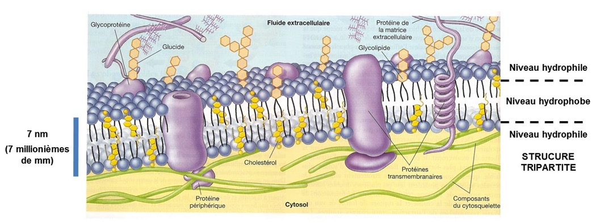
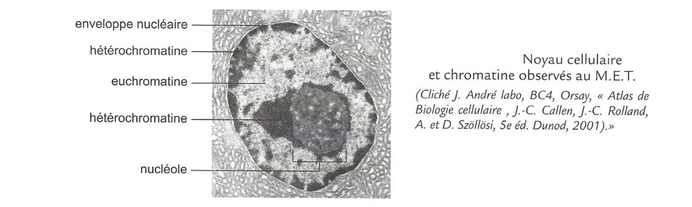
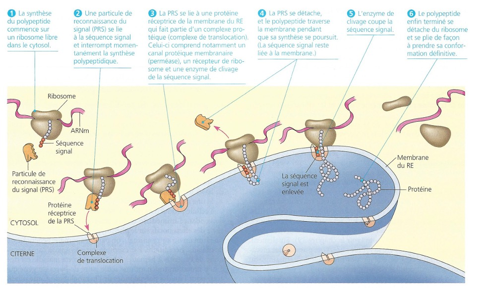
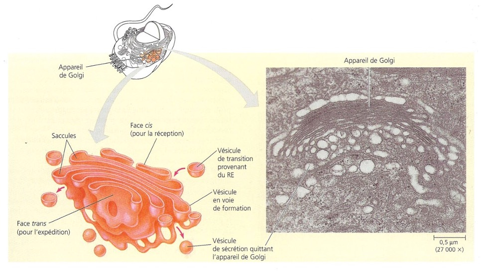
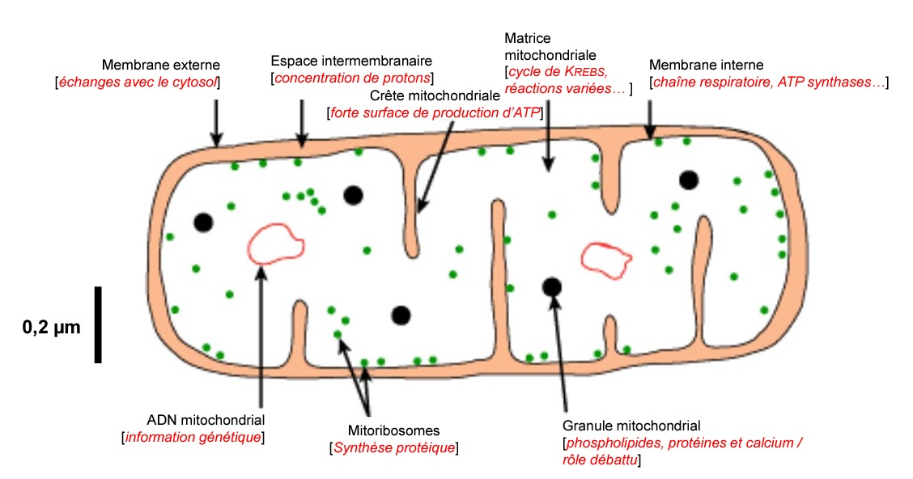
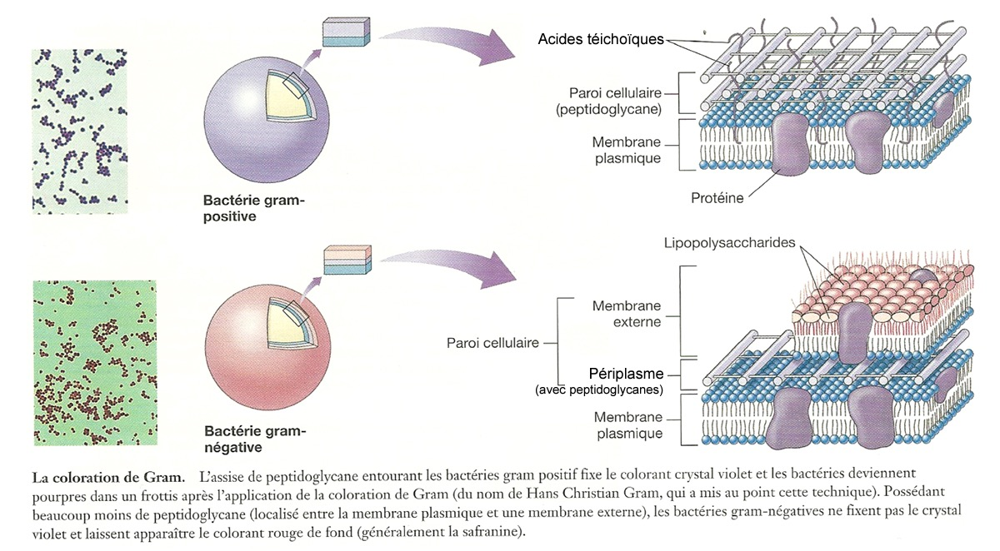
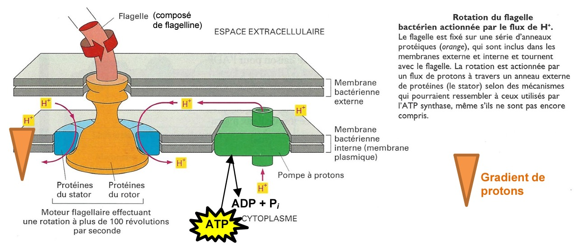
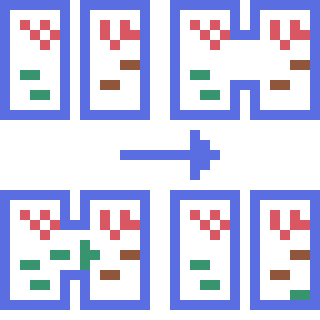

# Des cellules plus ou moins compartimentées traversées par des flux

## Des cellules eucaryotes compartimentées : un partage des tâches

Un **compartiment** est un volume délimité par une membrane au sein de la cellule eucaryote. Chaque compartiment possède une **composition chimique spécifique** et assure une **fonction précise**. L’ensemble de ces compartiments fonctionne de manière coordonnée : la cellule eucaryote peut être comparée à un **organisme pluricellulaire miniature**. La rupture d’une membrane compromet le fonctionnement de la cellule.

> Il faut imaginer la cellule en **trois dimensions** : elle n’est pas plate, mais ressemble plutôt à une **sphère imparfaite**.

### Mise en évidence des compartiments

Différents colorants permettent d’identifier des structures cellulaires :

| **Espace**   | **Colorant**   | **Résultat**                |
| ------------ | -------------- | --------------------------- |
| Noyau        | Vert de méthyl | ADN coloré en vert          |
| ⁑            | Pyronine       | ARN coloré en rose          |
| ⁑            | Bleu de méthyl | Cellule colorée en bleu     |
| Vacuole      | Rouge neutre   | Contenu vacuolaire en rouge |
| Amyloplastes | Lugol          | Amidon en bleu nuit         |

Au **microscope électronique en transmission (MET)**, on observe le **cytosol** (cytoplasme sans organites), lieu des réactions métaboliques et des échanges intracellulaires.

- **Catabolisme** : dégradation de molécules (libération d’énergie)
- **Anabolisme** : synthèse de molécules complexes (ex. protéines)

Chez les cellules végétales, on observe un espace entre la **paroi**, la **membrane plasmique** et la **vacuole**.

### Le noyau : centre de l’information génétique

Le noyau n’est pas homogène. Il est entouré d’une **enveloppe nucléaire** constituée de **deux membranes**. Il contient le **nucléoplasme**, équivalent du cytoplasme pour le noyau.

Fonctions du nucléoplasme :

- Stockage de l’ADN (46 molécules d’ADN correspondant aux 46 chromosomes chez l’humain)
- Réplication de l’ADN
- Transcription des gènes en ARN

La majorité du temps, l’ADN est sous forme condensée : **hétérochromatine**.

Le **nucléole**, observable uniquement en MET, est le lieu de fabrication des **sous-unités ribosomales**. Plus une cellule synthétise de protéines, plus le nucléole est volumineux.

### Les échanges noyau–cytosol

Le **cryodécapage** permet d’observer les **pores nucléaires** (~5 000 par noyau), assurant des flux bidirectionnels :

- Entrée des nucléotides et enzymes
- Entrée des ADN et ARN polymérases
- Sortie des ARN (ARNm, ARNt, ARNr)
- Sortie des sous-unités ribosomales

➡️ Il s’agit de **flux d’informations**.

Le **lamina nucléaire**, réseau de filaments, maintient la forme du noyau et empêche sa déformation.

### Le réticulum endoplasmique (RE)

Le **réticulum endoplasmique** est un réseau de membranes formé de tubules et de citernes :

- **RE rugueux (RER)** : porte des ribosomes, synthèse des protéines
- **RE lisse (REL)** : synthèse des lipides et détoxification

Les citernes offrent un milieu contrôlé (pH spécifique, absence de protéases).

### L’appareil de Golgi

L’**appareil de Golgi** est constitué de sacs aplatis empilés. Il assure :

- La maturation des protéines
- La synthèse de glucides
- Le tri et l’adressage des protéines

Les vésicules issues du Golgi sont **polarisées** et transportées vers leur destination grâce au cytosquelette.

Toute les modifications post-traditionnels (modifications des radicaux autre que am) sur les protéines membranaires y ont lieux. Les enzymes dans l'appareil de Golgi permettent l'addition d'oses informatifs (par exemple) sur ces protéines. Elles sont ensuite directement envoyé dans la membrane. 

### Les lysosomes : recyclage cellulaire

Les **lysosomes** contiennent des enzymes hydrolytiques (ADNase, ARNase, protéases), oxydases et peroxydases. Ils permettent :

- La digestion de macromolécules
- Le recyclage des organites défectueux

Ils possèdent une **pompe à protons** maintenant un pH acide, nécessitant de l’ATP. Leur forte isolation protège la cellule des réactions destructrices.

### Les mitochondries : production d’énergie

Les **mitochondries** sont les centrales énergétiques de la cellule eucaryote.

Structure :

- Membrane externe
- Membrane interne très repliée (crêtes mitochondriales)

Fonction :

- Respiration cellulaire
- Production d’ATP

Elles possèdent leur propre ADN et ribosomes.

---

La membrane interne possède des **crêtes** - la présence de crêtes augmente la surface donc la présence d'ATP-synthase. 

> [!EXAMPLE] Histoire
> Il est possible que, dans un passé très lointain, une cellule eucaryote ai avalé une bactérie, lui fournissant ainsi sa deuxième membrane et explique les similarités des mitochondries avec les bactéries. *Ceci n'est qu'une hypothèse !*

Glycolyse (glucose -> pyruvate)
Cycle de Kreps

### Avantages & Inconvénients

Les cellules eucaryotes possèdent donc un certain nombre de compartiments qui coopèrent ensembles.
1. Chaque compartiment contient des enzymes spécialisé, isolés par des bi-couches lipidiques. On peut donc trouver des caractéristiques physico-chimiques différentes entre les parties, permettant à ces dites enzymes de fonctionner. 
2. Les compartiments permettent de protéger les molécules (comme l'ADN dans le noyau). Ils isolent les molécules dangereuses pour la cellule (lysosome).
3. Flux d'énergie et de matière au sein de la cellule. L'utilisation de compartiments permet de controller la quantité d'ATP  (par **gradient de concentration**). Une parte de cette énergie est perdu sous forme de chaleur mais minimisé grâce à la compartimentation. 
4. Flux de matières. Si tout se dérouler dans le cytoplasme, le dioxygène serait manquant et l'ATP ne pourrait pas être produite. La séparation des fonctions métabolismes permet un fonctionnement optimal (idée : formule de Klark)
5. La distribution des molécules est également simplifié lors de la présence de compartiments. 

Cependant, cette structure de cellule possède aussi un désavantage : **le coût en énergie de  production est très élevé**. Mais tout les avantages précédents primes sur ce désavantage.

## Des cellules procaryotes peu ou pas compartimentées : l’exemple d’*Escherichia coli*

Contrairement aux cellules eucaryotes, les cellules procaryotes sont **pas** ou **peu compartimentés**. Les bactéries en sont un example phare : sans noyaux, avec une membrane plasmique qui entoure un cytosol. **Toutes les fonctions sont exécutés dans ces deux espaces, puis qu'il n'y a pas de parties spécialisés**. On distingue deux grand types de bactéries : les gram-positives et gram-négatives. Les gram-positives conservent une coloration même après lavage grâce à leur parroi peptidoglycanes (30nm, plusieurs couche). Les gram-négatives ne possède qu'une couche de  peptidoglycanes, qui explique le lavage des colorants. 

xxx

Les procaryotes possèdent des ribosomes associés à la membrane plasmique pour synthétiser les protéines membranaires. 

Transport de matière :
Les bactéries sont toutes en compétitions les unes aux autres. Certaines peuvent relâcher des enzymes, toxines pour combattre d'autres bactéries. C'est le taux de cette toxine qui crée les maux.

Chain d'oxydoréduction
Elle se situe dans la membrane des bactéries, qui permet la production d'ATP (similaire aux [mitochondries](#Les%20mitochondries%20production%20d’énergie)). 

Les flagelles permettent à la bactérie de se mouvoir dans un milieu donné. Il est souvent orienté vers le gradient de concentration des molécules qui l’intéresse.

 

Enrichissement en protons puis mouvement naturel : mouvement enclenché par le rotor/stator

Le cytosol de la bactérie contient plusieurs structures : 
- l'information génétique contenu dans un seul chromosome
- une petite portion de cette information est contenu dans le plasmide
- les ribosomes bactériens

Puisque le chromosome bactérien est proche du chromosome, la traduction est presque instantané (la multiplication est donc bien plus rapide que les cellules eucaryotes).

Les bactéries peuvent faire des échanges entres elles via **conjugaison bactériennes** (sexes de bactéries, + et -). Elle font un "*bisous*" et forment un **pont bactérien** qui permet aux plasmides d'être répliqués d'une bactérie à une autre. 

Il y a énormément d'enzymes dans le cytosol bactérien. Certains sont sur la membrane, mais d'autres sont libres dans le cytoplasme (Catabolisme et Anabolisme comme les cellules eucaryotes). Le flux se fait de manière très simple car il n'y a plus de barrières. L'information est la même mais plus rapide.

**Pourquoi peu compartimentés ?** Certaines cyanobactéries (capables de photosynthèses) contiennent des semblants de compartiments. Elle a "avalé" deux bactéries, d'où les compartiments.  C'est une exception. 