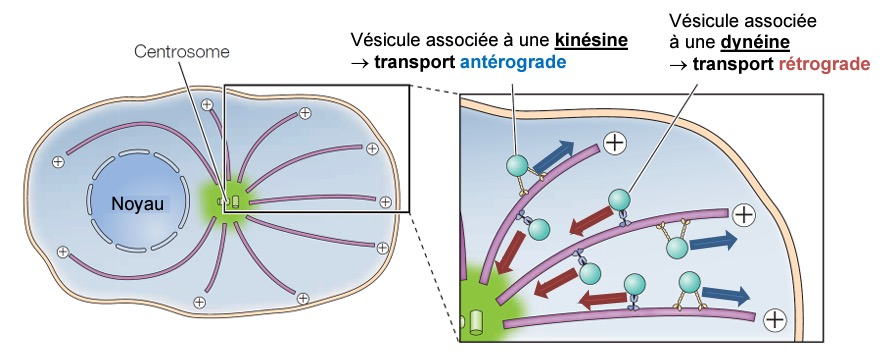
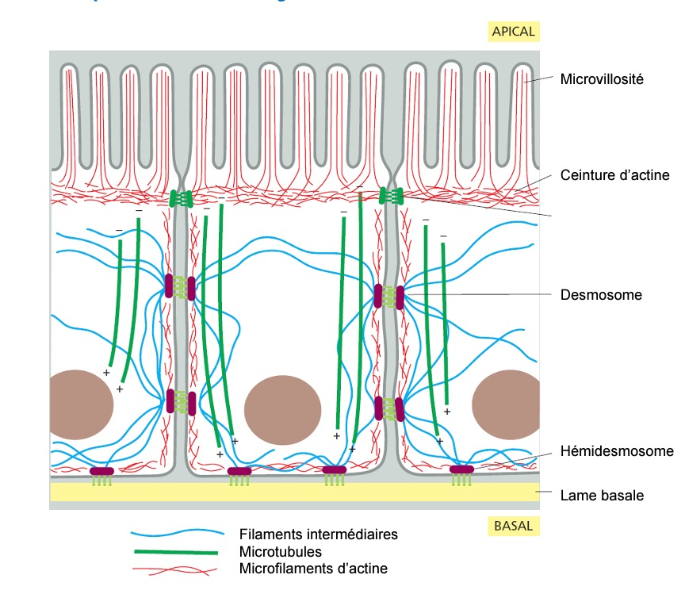

# Un cytosquelette apportant soutien et dynamisme aux cellules
## L’intérieur des cellules est organisé par le cytosquelette

> [!DÉFINITION]
> Le cytosquelette est l'ensemble de protéines polymérisés en fibres de différent diamètres qui sont associées à des moteurs moléculaires et à des protéines de pontage reliés à la membrane plasmique. **Ce sont donc les fibres qui assurent la structure (forme) de la cellule.**

Il permet de maintenir **la forme de la cellule** [animale] (Vacuole pour les plantes) et qui permet leur intégration à l'environnement. Le cytosquelette permet également une organisation spatiale. Il permet également un **dynamisme cellulaire** en permettant le mouvement des cellules. Le prolongement du cytoplasme est uniquement permis par le cytosquelette. 

On va distinguer 3 types de fibres qui constituent les cytosquelette :
1. **Microtubules** : composés de tubuline
2. **Micro-filaments** : composés d'actine 
3. **Filaments intermédiaires** : remplissent le reste, permettent l'adhésion à une surface
Il sont différents par leurs diamètres, leurs composants et leurs propriétés. Ils forment cependant trois réseaux **complémentaires**.

On a deux chaines d'actine (polymères d'actines G, protéines) enroulés les unes aux autres. Cette molécule est orienté du + au -. La structure est dynamique car on trouve une polymérisation au coté + et - au dépolymérisation. Elles sont situés dans la cellule. Le mouvement lancé par leurs (dé)Polymérisation permet le mouvement de la cellule. Elle permettent également certaines formes (villosités) et liens entres d'autres cellules (idem, cellules de l'intestin). 

Le fonctionnement est similaire pour les microtubule, mais il est creux et constitué de 13 protofilaments, assemblage de tubuline $\alpha$ et $\beta$. 
Réarrangement chromosomique, déplacement.

Dans les filament intermédiaires, il n'y a pas de polarité. **Ils forment donc une structure extrêmement solide & stable** (exemple : peaux). Créé à partir de protéine fibreux. Utilisation du GTP donc déphosphorylation 

L’espérance de vie des microtubules est d'environ 10 minutes, ils sont dépolymérisés ensuites. Si on bloque la polymérisation, on bloque le déplacement de chromosome et donc la division de la cellule (*utile pour les traitements cancérigènes*).

Le centre organisateur des microtubules contient un pull de microtubulines (protéines $\alpha$ et $\beta$) pour polymérisation. Il contient également des protéines stabilisatrices *? et un centrosole ?*

Des protéines (dynéines) permettent également **le transport de molécules** de la membrane vers le centre de la cellule : c'est du **traffic cellulaire**. 

## Un cytosquelette présent aussi chez les bactéries

On peut trouver des protéines "homologues" au cellules eucaryotes au niveau du cytosquelette des bactéries (séparation et structure).

On observe également des filaments intermédiaires, des actines et des tubulines. On trouve également des protéines uniques au bactéries, les protéines **Waka**. 
