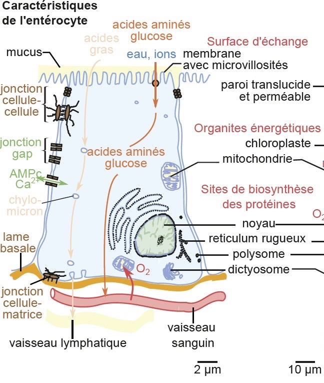
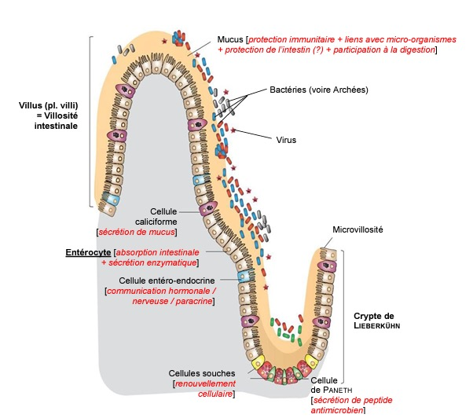

# Spécialisation et intégration cellulaire

Chaque **cellule spécialisée** possède une **structure unique** indispensable à sa fonction. Sa **forme**, sa **taille**, la présence d'**organites** spécifiques et la **répartition spatiale** de ces organites sont déterminantes. Certaines molécules sont aussi présentes à la surface de la membrane (récepteurs, marqueurs) ou liées au réseau interne (**cytosquelette**, **protéines de structure**). 

**Elle possède des caractéristiques structurales et fonctionnelles qui lui permettent de réaliser une ou des fonctions précises dans l'organisme** que les autres cellules n'assurent pas.

*Nous allons prendre l'exemple des **entérocytes** pour décrire ces différences.*

Cette cellule possède des **microvillosités** (bordure en brosse) qui permettent d'augmenter *par 600* la **surface d'absorption**. Elles sont maintenues par des [microfilaments d'actine](../ch1/g2.md#L’intérieur%20des%20cellules%20est%20organisé%20par%20le%20cytosquelette). De l'autre côté (vers les **vaisseaux sanguins**), la cellule est plate (pôle basal) pour là aussi adhérer au maximum et faciliter le passage des nutriments.

On observe également des **jonctions intercellulaires** :
- La première, au niveau **apical** (**jonction serrée**), permet la cohésion via le cytosquelette et assure l'étanchéité.
- Les autres (**jonctions communicantes** ou *gap junctions*) permettent des **échanges de molécules signaux** (AMPc, $Ca^{2+}$) pour coordonner les cellules entre elles.

Les **protéines** (transporteurs, enzymes) sont également placées aux endroits stratégiques de la membrane.

L'absorption des nutriments est **trans-cellulaire** : l'absorption est donc **contrôlée** par la cellule. Tout se déroule suivant un **gradient de concentration** (ou via un transport actif). 

Une partie de **cellules souches** (situées dans les cryptes de Lieberkühn) maintiennent l'**épithélium intestinal**. (Leur devenir est contrôlé par la présence de **facteurs de transcription** (positifs ou négatifs), la position de la cellule souche et les interactions avec les **cellules à proximité**).

## Intégration des cellules dans les tissus, les organes, les systèmes ou les organismes

Les entérocytes ne sont pas directement vascularisés. Certains **épithéliums** permettent la **protection** (peaux, épiderme) et d'autres permettent les **échanges** (intestin grêle, alvéoles pulmonaires). En cas de présence de **cils**, ceux-ci permettent le mouvement de substances (ex: mucus dans les voies respiratoires). 

On distingue également les tissus : 
1. Le tissu **épithélial** (cellules jointives, barrière).
2. Le tissu **conjonctif** (cellules non jointives et entourées d'une **matrice extracellulaire** abondante).
3. Le **tissu musculaire** (excitable donc **contractile** et conducteur) :
    - **Myocytes striés squelettiques** : commande volontaire.
    - **Myocytes striés cardiaques** & **Lisses** : commande involontaire.
    - *Exemple :* Pour l'intestin grêle, on trouve une série de **muscles lisses** (permettant le péristaltisme ou contraction de l'intestin).
4. Dernier type de tissu : **tissu nerveux**, aussi excitable et composé de cellules nerveuses (**neurones**) et de cellules gliales.

> [!NOTE]
> Tous les organes sont entourés ou soutenus par un tissu conjonctif.

*Dans la plupart des organes, l'ensemble de ces tissus sont présents.* Dans l'intestin grêle, la majorité des cellules sont des entérocytes. Cependant, 10% des cellules sont des **cellules caliciformes** qui sécrètent un **mucus protecteur** sur les entérocytes, ce qui évite que les **enzymes** de l'intestin grêle ne digèrent les propres cellules de l'organisme.

