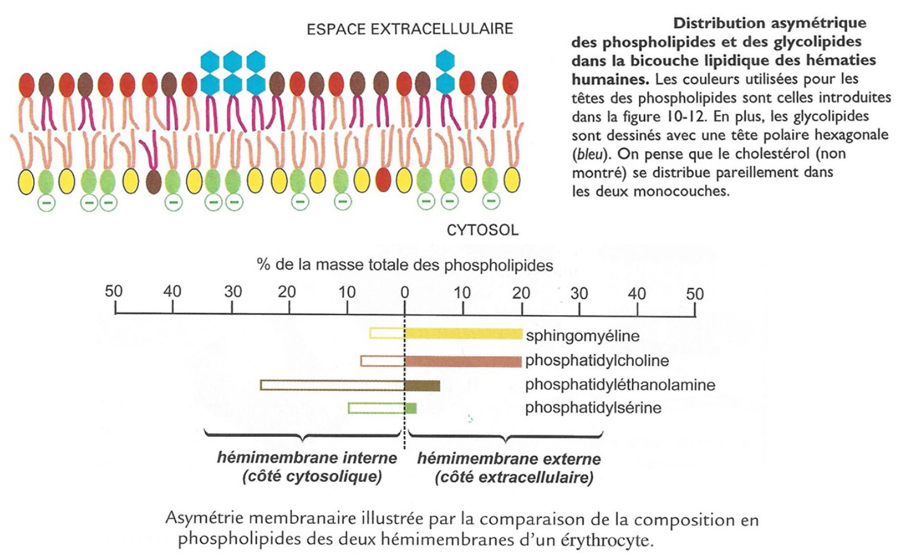

# Les membranes biologiques, des mosaïques fluides délimitant les cellules et les compartiments cellulaires

## La structure en mosaïque des membranes

Après des observations en 1972, des chercheurs ont découvert que la membrane possède une sorte de bicouche (qui sont effectivement dus aux [lipides](../../A1/ch1/g2.md#Comportement%20des%20lipides%20vis%20à%20vis%20de%20l’eau%20selon%20leur%20polarité%20et%20leur%20encombrement)) On pensait que cette bicouche était en "sandwich" entre deux couches de protéines. Cependant, après analyse (congélation), les chercheurs ont découvert que les protéines ne sont pas réparties sur l'ensemble de la membrane mais uniquement présentes de part et d'autres *dans* la bicouche lipidique (vu aussi, voir [Protéines membranaires](../../A1/ch1/g5.md#Protéines%20membranaires%20et%20Hydropathie), qui sont donc des Protéines Hélices $\alpha$).

Ces protéines permettent diverses fonctions :
1. **Transport** de substances (ions/molécules). Certaines nécessitent de l'ATP
2. **Enzymes**
3. **Protéines Réceptrices** pour les hormones (toujours [Glucagon et Insuline](../../A4/ch3/g3.md#Mécanismes%20de%20régulation))
4. **Adhérence intercellulaire** ([Cadhérines](../ch2/g2.md#Tableau%20récapitulatif%20des%20Jonctions))
5. **Reconnaissance intercellulaire**
6. **Fixation au cytosquelette**

## La fluidité et l’asymétrie membranaires

### Mise en évidence de la fluidité membranaire

Première expérience (fusion d'hétérocaryons) : deux cellules marquées par des anticorps fluorescents sont fusionnées. Après ~40 minutes, les marqueurs se mélangent sur la membrane, démontrant la mobilité latérale des composés membranaires.

### Extinction de la fluorenscence

Deuxième expérience (FRAP / photoblanchiment) : on marque une région membranaire puis on l'éclaircit (photo-blanchiment) à l'aide d'un laser. Au fil du temps la fluorescence revient dans la zone blanchie, confirmant la diffusion latérale des molécules membranaires. Le flip‑flop (basculement entre feuillets) est beaucoup plus rare que le déplacement latéral.

Le **cholestérol** module la fluidité : à basse température il empêche la rigidification excessive, à haute température il limite l'excès de fluidité. Dans les membranes animales, le cholestérol constitue une part importante des lipides membranaires (ordre de grandeur : plusieurs dizaines de pourcents selon les tissus). *Voir les quelques schéma sur les [lipides](../../A1/ch1/g2.md) dans le chapitre dédié.*

Certaines microdomaines appelés **radeaux lipidiques** sont enrichis en cholestérol et en sphingolipides ; ils présentent une organisation plus ordonnée et peuvent concentrer des protéines spécifiques. Leur taille est typiquement comprise entre quelques dizaines et quelques centaines de nanomètres, et ils facilitent la mise en contact de partenaires protéiques.

Les feuillets externe et interne de la bicouche présentent une composition lipidique différente (asymétrie des lipides). Cette asymétrie concerne aussi certaines protéines : les domaines extracellulaires et cytosoliques ont des séquences et des conformations distinctes.
