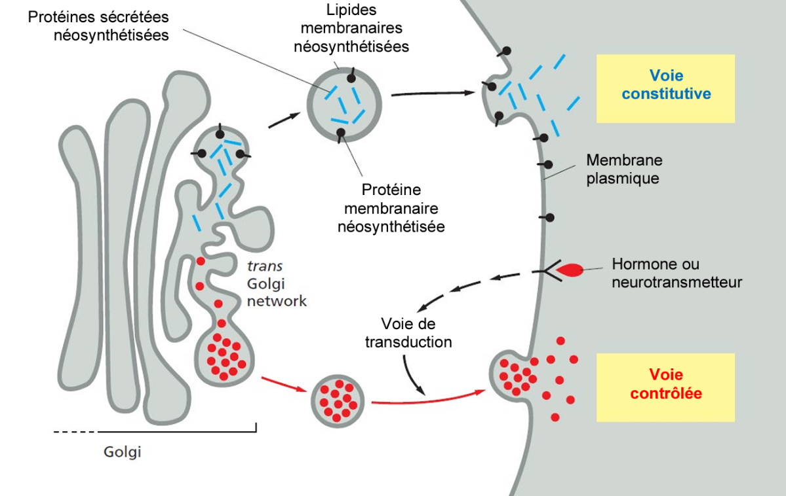
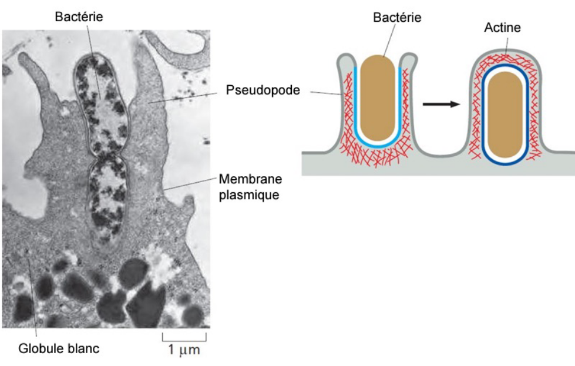
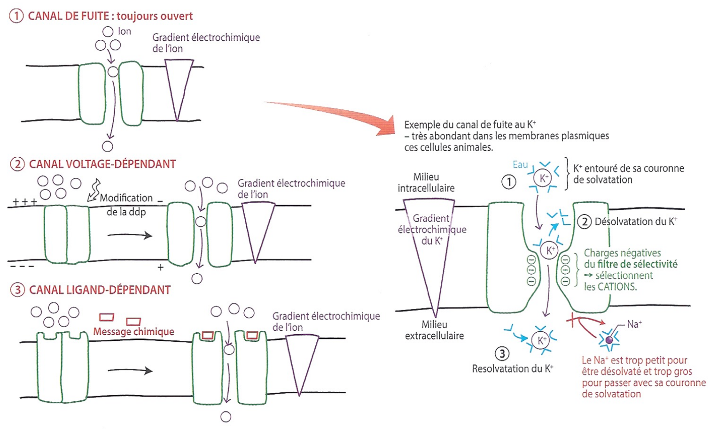
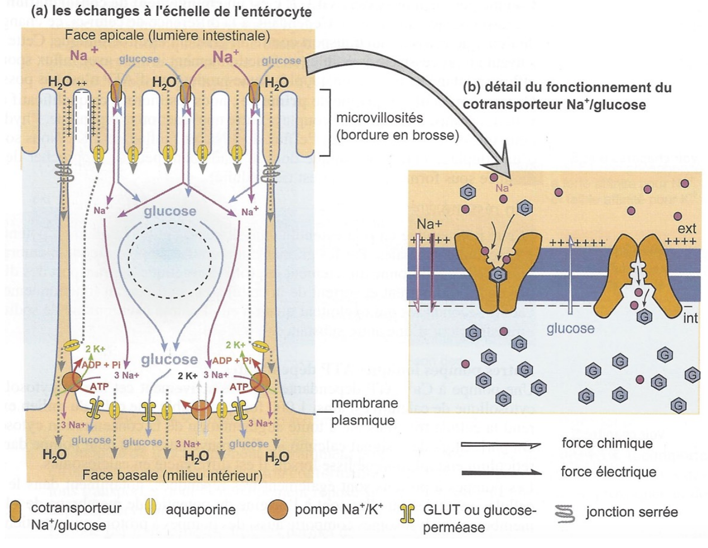
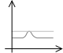
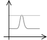
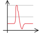
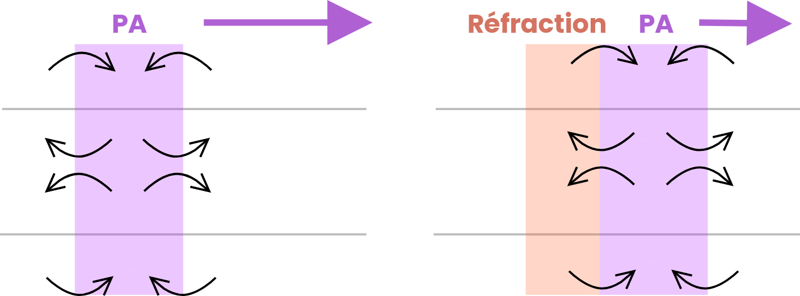
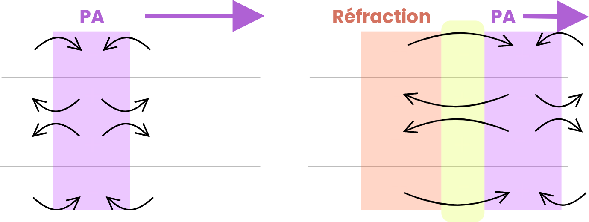

# Des membranes impliquées dans les flux de matière

## Des membranes qui permettent le déplacement de compartiments : le trafic vésiculaire

> [!DÉFINITION]
> Tout déplacement de vésicules. Un compartiment est donc une vésicule ‒ compartiment isolé d'une membrane. 

Les déplacements de vésicules sont **ATP-dépendants** : l'hydrolyse d'ATP fournit l'énergie nécessaire. Des protéines motrices déplacent les vésicules le long des microtubules : les **kinésines** vont généralement vers le bout «+» (périphérie) et les **dynéines** vers le bout «‑» (vers le centre cellulaire). On les appelle des **moteurs moléculaires**.

L'exocytose est la fusion d'une vésicule avec la membrane plasmique pour libérer son contenu à l'extérieur. Les vésicules proviennent souvent de [l’appareil de Golgi](../ch1/g1.md#L’appareil%20de%20Golgi).

Ce phénomène (l'exocytose) est **fortement contrôlé** : un signal extérieur/potentiel d'action et une libération de CA$^{2+}$ comme second messager sont nécessaires.

*Le renouvellement de protéines membranaires (qui restent dans la membrane) n'est lui pas contrôlé par extérieur.*

Les vésicules utilisent des **récepteurs** pour  fusionner avec des **endosomes** avant de fusionner avec les lysosomes (dans le cas des **LDL**. Ces récepteurs peuvent êtres dégradés par du pH acide. 

Phagocytose : reconnaissance du particule, enrobement par la membrane avec remodelage du cytosquelette (actine), formation d'un phagosome, fusion avec un lysosome et digestion.

Une vésicule est formé par **bourgeonnement** quand elle est formé par invagination (intérieur)/évagination (extérieur) de la membrane.

Protéines enveloppe (clathrine)

Les lipides et certaines protéines peuvent subir une transcytose (transport à travers une cellule) ; ce processus est souvent régulé, impliquant des signaux et des adaptateurs.

> [!HINT]
> À savoir :
> - Transfert de matière entre les compartiments et les cellules par l'intermédiaire des vésicules
> - Bourgeonnement des vésicules, qui reposent sur les propriétés des protéines
> - Transport & guidage des vésicules possible grâce au cytosquelette et aux [Moteurs Moléculaires](#Des%20membranes%20qui%20permettent%20le%20déplacement%20de%20compartiments%20le%20trafic%20vésiculaire)

Des molécules hydrophobes, chimiquement instables ou trop volumineuses pour traverser la membrane ou les canaux passent souvent par des vésicules.

## Des membranes qui autorisent des flux traversants de matière : les échanges transmembranaires

### Différent types de transports

> [!DÉFINITION]
> **Échanges transmembranaires** : Ensemble de flux de matière qui s'effectue à travers une membrane plasmique.

Selon le gradient de concentration ou les gradients de charge, les molécules peuvent se déplacer dans les deux sens. Ces transports sont passifs, car il ne nécessitent aucune énergie. On résume cela  à un gradient **électrochimique**.  Ce gradient est le résultat de l'addition d'un potentiel chimique et électrique. L'équation est $µ_A = µ_A^° + R.T.ln(C) + z.F.V$ (où $R.T.ln(C)$ est la *composante chimique* et $z.F.V$ est la *composante électrique*) .

> [!HINT] Idée
> Même si une molécule est peu présente dans un compartiment, elle ne pourra pas/peu se déplacer si elle est de même polarité. Il y a donc deux contraintes "différentes".

> [!NOTE]
> Toutes les molécules nécessitant une aide implique un passage contrôlé. 

Le transport actif nécessite de l'énergie (souvent fournie par l'hydrolyse d'ATP) pour déplacer des molécules contre leur gradient électrochimique. La variation d'énergie libre de Gibbs ($\Delta G$) quantifie la spontanéité d'un processus : si $\Delta G<0$, le processus est spontané ; si $\Delta G>0$, il nécessite un apport d'énergie. 

Si un transfert d'énergie libère de l'énergie, il est **spontanné** donc *passif*. *On dit aussi qu'elle est facilitée*. Si il en consomme (de l'ATP), il est **énergétique** donc *actif*.

Tant qu'un canal est ouvert, il est toujours possible que des molécules se déplacent. On appel l'équilibre d'une substance le **flux net**, quand, *dans l'idéale*, aucunes molécules ne devrait se déplacer ($µ_1 = µ_2$)

**Exemples de diffusion facilitée :**

- Les canaux sont principalement utilisés par les ions
- La perméase pour les petites molécules organiques (les canals seraient trop petits).

Il n'y a pas de changement de conformations au sein de la molécule, mais plutôt spatial (ex: ouverture de l'hélice).

Pour les perméases, il y a un **véritable changement de conformation**. Il y a une notion de **flux maximum** puisque ce changement de conformation prend du temps.

### Cas particulier : Osmose

> Osmose : déplacement transitoirement d'eau

Chaque solution aqueuse possède un **potentiel osmotique** : une force attraction envers l'eau qui l'empêche de quitter la solution. Dans l'idée, il y a plus ou moins de molécules H$_2$O. Pour équilibrer la concentration des solutés d'un coté et de l'autre de la membrane, il en résulte d'un déplacement d'eau.

### Transports Actifs

 On va distinguer deux types de transports actifs :
 1. Transports actifs **primaires** qui utilisent l'énergie fournie par l'hydrolise ATP. 
 2. Transports actifs **secondaires** qui utilisent l'énergie fournie par le [transport passif](#Différent%20types%20de%20transports) d'une autre soluté *antiport* pour déplacer un soluté *symport*.
Dans le cas d'un transport actif secondaire, le transport passif suit le gradient de concentration et l'autre est contre celui ci.

Les **pompes** permettent le transport des ions quand ils sont de même charge que la molécule.

Exemple de transport actif primaire : **pompe à proton**. On peut aussi maintenir un gradient éléctrochimique d'une molécule pour déplacer de façon active une autre.

**On a donc également une spécialisation des transporteurs, qui eu aussi, sont placés  à des endroits stratégiques pour leurs fonctions.** Les cellules sont donc polarisé en termes de structure, de protéines mais aussi de transporteurs.

Certaines pompes/échangeurs ne s'active que en cas de besoin (comme les cotransporteurs Na$^+$/Glucose, SGLT1).

Les bactéries possèdent aussi des transporteurs actifs, et certains sont groupés et coopèrent (transports d’électrons & ATP synthase)

ddp = différence de potentiel membranaire

### Analyse

Les neurones possèdent un potentiel de repos. On peut la mesurer. Elle vaux environ xx au repos (sans message) et xx quand elle est excitée. Il peut avoir une inversion des charges : sur une petite portion de la membrane, la charge devient positive à l’extérieur et négative à l’intérieur : cela permet l’exécution de certaines fonctions. 

On peut également fixer, de manière différente, une cellule à une micropipette, permettant ainsi de pouvoir modifier le contenu de la cellule. 

Les cellules possèdent un potentiels de repos stable. C'est la concentration des substances qui charge les milieux. Elle peut dépendre de l'année, la journée, le tissue ou l'espèce considéré. Aussi valable pour les structures végétales. 

Pour les cellules nerveuses, un canal "de fuite" CA$^+$ est toujours ouvert pour compenser les cotransporteurs. Modélisons une modification du potentiel d'action (voir une inversion)

| Observation          | Explicaiton                                                                                                                                                                                                                                                                                                                                                                                                                                                                                                                                                                                                             |
| -------------------- | ----------------------------------------------------------------------------------------------------------------------------------------------------------------------------------------------------------------------------------------------------------------------------------------------------------------------------------------------------------------------------------------------------------------------------------------------------------------------------------------------------------------------------------------------------------------------------------------------------------------------- |
|  | Situation $\text{I}_1$.                                                                                                                                                                                                                                                                                                                                                                                                                                                                                                                                                                                                 |
|  | Situation $\text{I}_2$. $\text{I}_1 > \text{I}_2$                                                                                                                                                                                                                                                                                                                                                                                                                                                                                                                                                                       |
|  | Situation $\text{I}_3$. $\text{I}_3 >>>> \text{I}_1$ 1. Dépolarisation ➡️ **inversion** monmentanée du ddp     - ouverture massive des cannaux voltage-dépendants NA+     - influx important de NA+ dans la cellule     - ~ 23V, proche de la valeur d'équilibre du NA+         ➡️ inactivation des cannaux voltage dépéndants 2. Ouverture des cannaux K+ voltage dépendants     - Influx massif des ions K+ vers milieu extracellulaire 3. Proche du potentiel d'équilibre de K+, fermeture des canaux K+ 4. Repolarisation grâce à la pompe ATP-ase => Retour au potentiel de repos |

> [!WARNING] Les pompes Na$^+$/K$^+$ ATP-ase sont toujours active

Pendant les étapes 2, 3 et 4, les canaux voltage-dépendants sont inactifs. Cette période s'appelle période réfractaire, et il n'est pas possible de modifier le potentiel durant cette période (k.o. reload). *Loi de tout ou rien. PA de même durée, avec même amplitude ↔️ modulation de même potentiel par fréquence de PA.*

Pour déclencher un potentiel d'action, l'intensité 

*Sans gap, un message peu atteindre une vitesse de 3m/s*

*Avec gap, le message peu atteindre jusqu'à 100m/s !*

#### Concusion Potentiels

Il existe donc deux grand types de potentiels :

|                         | **Potentiels éléctroniques**                                                   | **Potentiels d'action**                                        |
| ----------------------- | ------------------------------------------------------------------------------ | -------------------------------------------------------------- |
| **Exemples**            | PPSE, PPSI, potentiels miniatures, potentiels récepteurs, potentiels pacemaker | potentiels d'actions (neuroniques, cardiaques, musculaires...) |
| **Amplitude**           | Variable                                                                       | Nulle ou Maximale (tout ou rien)                               |
| **Durée**               | Variable                                                                       |                                                                |
| **Sens de la ddp**      | Dépolarisation/Hyperpolarisation                                               | Dépolarisation                                                 |
| **Additivité**          | Possble                                                                        | Impossible                                                     |
| **Période réfractaire** | Absente                                                                        | Présente                                                       |
| **Propagation**         |                                                                                |                                                                |
| **Conduction**          |                                                                                |                                                                |
| **Déclenchement**       |                                                                                |                                                                |
| **Obtention**           | Pas de seuil                                                                   | Seuil                                                          |

Les potentiels électroniques sont moins puissants, mais sont plus versatiles (pas de période réfractaire, hyperpolariastion possible, propagation dans les deux sens, pas de seuil)

> [!DÉFINITION]
> PPSE : **Potentiel post synaptique** ***exitateur***, reconduction du message nerveuse dans une cellule post-synaptique.

> [!DÉFINITION]
> PPSI : **Potentiel post synaptique** ***inhibiteur***, inhibition du message nerveuse dans une cellule post-synaptique.

Prenons un neurone avec 3 connexions (donc trois autres neurones)

Si on stimule A, B , puis deux fois A, on observe les stimulations suivantes : 

**Ici, on observe une sommation temporelle de la dépolarisation**. Cette sommation peut aussi avoir lieu si A. Si elle a lieu entre A et C (donc polarisant/dépolarisant), alors elles se somme aussi, mais vont s'annuler. Ce sont deux exemples de PPSE et PPSI.

Il est possible 
