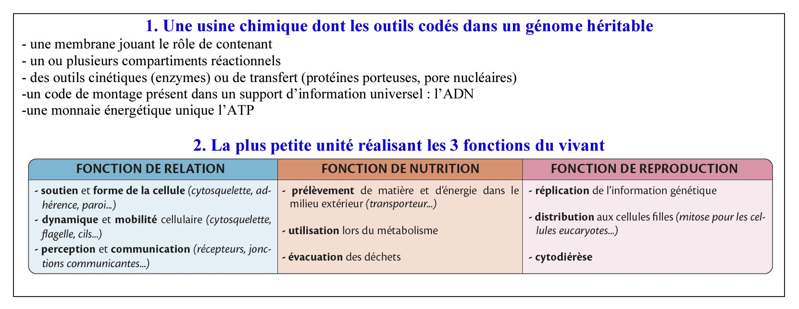

## 🗺️ Organisation fonctionnelle de la cellule — synthèse

### Compartimentage

- Cellules eucaryotes : compartiments membranaires spécialisés (noyau/nucléole, RER/REL, appareil de Golgi, lysosomes, mitochondries) assurant des fonctions biochimiques distinctes.
- Cellules procaryotes (ex. Escherichia coli) : peu ou pas de compartiment interne ; ADN dans le nucléoïde, membrane plasmique et paroi.

### Cytosquelette — rôle et composants

Trois réseaux complémentaires :
- Microtubules (tubuline) : maintien de la forme, transport intracellulaire (moteurs dyneine/kinésine), formation du fuseau mitotique, mobilité des cils/flagelles.
- Microfilaments (actine) : soutien de la membrane, mobilité (migration cellulaire), contraction (myosine), cytocinèse.
- Filaments intermédiaires (kératines, vimentine, neurofilaments...) : résistance mécanique, ancrage des jonctions et stabilité tissulaire.

## 🪐 Cellules dans l'organisme — spécialisation et intégration

- Chaque cellule spécialisée adapte forme, organites et protéines de surface à sa fonction (ex : entérocytes, cellules caliciformes, cellules de Paneth, cellules endocrine et souches intestinales).
- Tissus principaux : épithélial (barrière/échanges), conjonctif (MEC abondante), musculaire (contractilité), nerveux (neurones + glie).

### Cohésion tissulaire

Voir le tableau récapitulatif des jonctions :

| Jonctions | Protéines transmembranaires | Interaction | Liaison au cytosquelette | Rôle |
| :--- | :--- | :--- | :--- | :--- |
| Jonctions serrées | Occludines / Claudines | Homophilique | Actine | Étanchéité, maintien de la polarité |
| Jonctions adhérentes | Cadhérines | Homophilique (dépend de Ca2+) | Actine | Cohésion et transmission des forces |
| Desmosomes | Desmogléines | Homophilique | Filaments intermédiaires | Résistance mécanique |
| Jonctions communicantes (GAP) | Connexines | Canaux | — | Échange de petites molécules (AMPc, Ca2+) |
| Hémidesmosomes | Intégrines | Matrice (laminine) | Filaments intermédiaires | Ancrage sur la lame basale |

### Communication cellulaire (résumé)

- Juxtacrine : contact direct (jonctions, récepteurs membrane-membrane).
- Paracrine : facteurs diffusifs locaux.
- Synaptique : libération de neurotransmetteurs à la synapse (signal électrique → chimique).
- Hormonale : transport via le sang pour signaux à distance.
- Électrique : propagation de potentiels d'action dans les neurones/axones.

### Interactions avec le microbiote intestinal

- Symbiose : digestion, modulation immunitaire, production de métabolites.
- Dysbiose : prolifération de souches pathogènes → inflammation, perte de fonctions barrières.

## 🚪 Membranes et échanges — résumé détaillé

Toute membrane est une bicouche lipidique semi‑perméable dans laquelle sont insérées des protéines : c'est la « mosaïque fluide ». Les lipides (phospholipides, cholestérol, sphingolipides) assurent l'étanchéité et la fluidité ; les protéines membranaires réalisent transport, signalisation, adhérence et ancrage cytosquelettique.

Fluidité et asymétrie
- Mobilité latérale des lipides/protéines démontrée par fusion d'hétérocaryons et FRAP (photoblanchiment). Le flip‑flop lipidique entre feuillets est rare sans enzymes (flippases/floppases).
- Le cholestérol module la fluidité : il empêche la rigidification à basse température et limite l'excès de fluidité à haute température. Des microdomaines (radeaux lipidiques, quelques dizaines à centaines de nm) concentrent protéines et lipides spécifiques.
- Les feuillets externes et internes sont chimiquement distincts (asymétrie lipidique), importante pour la signalisation et le ciblage des protéines.

Transports transmembranaires (principes)
- Diffusion simple : molécules petites et non polaires (O2, CO2) traversent selon leur gradient de concentration.
- Diffusion facilitée : canaux (ions) et perméases/carriers (glucose, acides aminés). Les canaux offrent un passage rapide et contrôlable (gated), les transporteurs subissent des changements conformationnels et présentent une saturation (Vmax).
- Osmose : déplacement d'eau selon les différences de concentration de solutés ; le potentiel osmotique gouverne le flux d'eau.
- Transports actifs :
	- Primaires : utilisation directe d'ATP (ex. pompe Na+/K+ ATPase) pour déplacer ions contre leur gradient.
	- Secondaires : couplage d'un transport favorisé (ex. Na+ entrant) pour faire monter un autre soluté (symport/antiport, ex. SGLT1 Na+/glucose).

Trafic vésiculaire et échanges de compartiments
- Le trafic vésiculaire (bourgeonnement et fusion) transporte protéines et lipides entre organites (RE → Golgi → endosomes → lysosomes) et vers l'extérieur (exocytose).
- L'exocytose est souvent déclenchée par une élévation du Ca2+ cytosolique ; l'endocytose (clathrine‑dépendante, caveolae) permet l'entrée sélective de ligands/recepteurs. La phagocytose implique un remodelage actine‑dépendant et fusion avec les lysosomes pour dégrader le contenu.
- Les vésicules sont dirigées le long des microtubules par des moteurs moléculaires : kinésines (vers le +, périphérie) et dynéines (vers le −, centre).
- La transcytose transporte des molécules d'un pôle cellulaire à l'autre (ex. franchissement épithélial).

Régulation et spécificité
- Les protéines membranaires (récepteurs, enzymes, transporteurs) sont distribuées de façon polarée selon la fonction cellulaire : neurones, entérocytes et cellules épithéliales montrent des localisations apicales/basales distinctes.
- Les signaux (phosphorylation, pH, Ca2+, interaction ligand‑récepteur) contrôlent l'ouverture de canaux, l'activité des transporteurs et la formation de vésicules.

Potentiel membranaire et excitabilité
- Les gradients ioniques (Na+, K+, Cl−, Ca2+) créent un gradient électrochimique : le potentiel de repos d'une cellule excitable vaut typiquement ≈ −70 mV (intérieur négatif). Un potentiel d'action atteint typiquement +30 à +40 mV durant la phase de dépolarisation.
- Les canaux ioniques voltage‑dépendants (Na+ puis K+) génèrent la dépolarisation, repolarisation et période réfractaire ; la pompe Na+/K+ restaure les gradients à plus long terme.

Points clés
- Les membranes sont à la fois barrières et interfaces actives, combinant propriétés physico‑chimiques des lipides et fonctions enzymatiques/protéiques.
- Les échanges se font par diffusion, transport facilité, pompes et vésicules, tous finement régulés pour maintenir l'homéostasie cellulaire.
