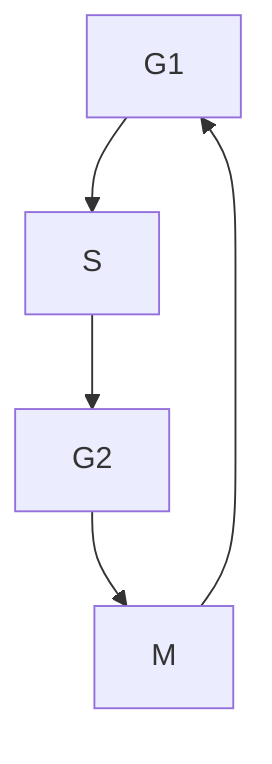
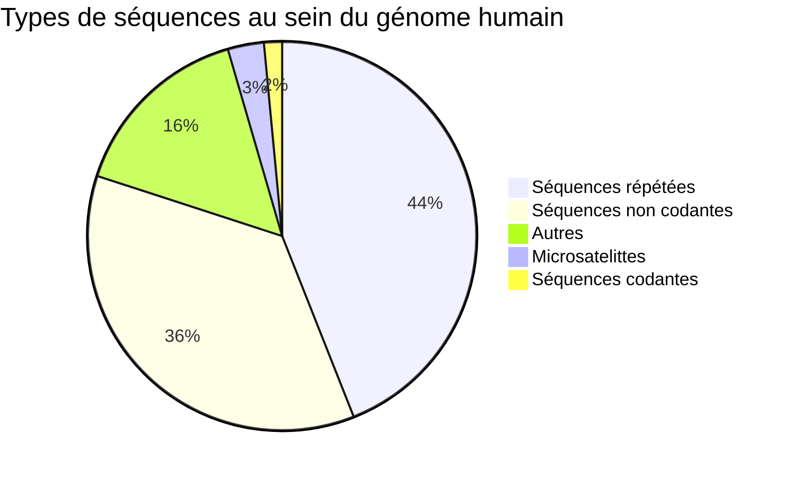

# Le contenu informatif des génomes

Les génomes ont pour but de transmettre des informations à une cellule fille (division cellulaire **mitose** d'une cellule pair en deux cellules filles) ou à un nouvel organisme avec les gametes. 

Pour pouvoir former à partir de la *mitose*, il faut répliquer l'ADN avant de diviser la cellule. Comme vu précédemment, l'ADN se transmet de façon **semi-conservative**, un brun actuel et un brun nouvellement formée par cellule fille.

On peut observer sur cette observation des oeils de réplications, où l'ADN est répliqué en deux bruns.

Chez l'homme, il y a **plusieurs origines de réplications**. C'est ce qui permet de répliquer l'ensemble du génome en **7 à 15 heures** dans les cellules eucaryotes humaines. 

> [!TIP] Erreurs de divisions
> Une erreur peu arriver toutes les $10^9$ paires de bases. Avec les $3.2\times10^{9}$ paires de bases du génome (voir [intro](intro.md)), on a 3.2 erreurs en moyenne par division)

Les chromosomes possèdent également (en plus du centromère) des **télomères**,  qui agissent comme des bornes et protège l'ADN de la digestion par  certaines enzymes dans le cytoplasme (car le noyau va se dissoudre pendant la mitose pour permettre aux nouveaux chromosomes de se rendre dans les nouveaux noyaux).
Ces télomères possèdent des protéines (shelterine ?) et une boucle d'acides aminées `TTAGGG`.

Lorsque le télomère est trop court, l'ARN polymérase n'arrivera plus à répliquer le chromosome et donc la division n'aboutie pas. La **télomérase** peut re-synthétiser (remettre) des acides aminées  

> [!HINT] Cycle de réplication de la cellule
> La division cellulaire se fait en 4 étapes :

> [!HINT] Cycle de réplication de la cellule
> S correspond à la synthèse de l'ADN et M à la division de cellules. G1 et G2 sont des périodes de repos.
> Si la division n'est pas possible alors la cellule va se spécialiser (ce qui entraîne donc un vieillissement des cellules .
> Les cellules cancéreuses par exemple se diviser 

## Composition des gènes

Comme dit [juste avant](g1.md), les gènes sont une suite d'acide aminés dans l'ADN. Chaque est délimité par un promoteur, qui "recrute" l'ARN polymérase et donc indiquer dans quel sens transcrire, et par un terminateur, site qui va indiquer à l'ARN polymérase quand se détacher (et donc à l'ARN de se détacher).

Certains gènes vont avoir leurs propres promoteurs (unités de transports monocistroniques). Sinon, elles partagent un promoteur avec deux gènes (unités polycistoniques, donc obligatoirement par 3). Chaque gène a un début et une fin qui encadre la molécule qui sera formée. 
*Pour différencier les 3 gènes, des codons START et STOP entours les partie codantes des gènes.*

Les variants d'un gène (les **allèles**) existent forcément en deux versions (car deux chromosomes). 

> Homosigote/étérosigotes

Un gène peut être codé par plus que deux allèles (ex: groupes sanguins). C'est ce qu'on appelle **polymorphisme génique**.

Ces allèles peuvent être **dominantes** ou **récesifs**. Comme les êtres humains sont étérosigotes, le phénotype dépend **d'un jeu entre les deux allèles**. Dans certain cas, les allèles peuvent êtres **co-dominantes**, *former une gène* à deux.

Les gènes peuvent êtres :
- **Protéiques** pour créer des protéines : délimités par des codons START et STOP, et contiennent des ORF (Open Reading Frame), suite de codons pour faire une correspondance avec les protéines physiques
- **ARNt/ARNr** (avec également des ORF)
- **Micro ARN** indispensables au fonctionnement des enzymes

Un peu plus de détains pour les ORF : ils permettent de diviser la suite d'acide aminées en partie codantes et non codantes (appelés exon et intro). La maturation de l'ARN dans le noyau permet permet de supprimer les intro.
L'odre (et la presence) des intron/extron peut changer lors de la maturation, donc permet de résulter en plusieurs protéines pour un seul gène. On appelle cela **épissage alternatif**.

Les **opérandes** sont plusieurs genes protéiques opérant la même fonction, sous un même promoteur et soumis à une régulation commune. Par exemple, on peut trouver des enzymes qui remplacerait la glycolyse (par du lactose). Une concentration élevée en lactose entraînerait la création d'enzymes spécifiques pour combler le manque de glycogène. 
Par exemple : protéine perméase + galactosidase + autre pour permettre l'utilisation du lactose. Les bactéries ont souvent beaucoup d'opérandes, comparés aux eucaryotes
La transcription et la traduction se fond en même temps ; donc également plus rapide chez les bactéries.
La régulation est permise par une séquence régulatrice à proximité du promoteur en activant/inhibant le promoteur (on appelle alors cela **opérateur**).

Pour les cellules eucaryotes, il peut y avoir plusieurs promoteurs ou opérateurs, et ou les hormones peuvent lancer l'expression ou non de gènes. 

La complémentarité des bases permet également l'**hybridation d'ADN et d'ARN**. Cette hybridation peut avoir lieu sur une **partie uniquement** de l'ADN, par exemple en passant les exons. Résultat : environ 50% du mono-brin va s'hybrider avec l'ARN ==pour former un ARN mature== (mais replacement des T par des U).

Ces parties codantes sont très conservées (*lors de l’évolution*) mais les intron sont beaucoup mutés. 

- Les séquences non codantes sont les séquences qui ne contient ni arn ni protéines
- les séquences répétées (type télomère)
- les microsatelittes sont des petites portions d'ADN qui permettent à l'ARN de se repérer sur l'ADN (souvent avant un promoteur)
- les séquences codantes qui contiennent le code d'un ARN/Protéine
- les séquences autres sont les séquences intergéniques (entre terminateur et promoteur suivant), les liaisons pour les histones / chromatines, etc

Les séquences répétés sont là où le plus d’erreurs ont lieux, car l'ARN glisse facilement et oublie de mettre/remet un acide aminée. 

Les dénaturations/renaturations pourrait ne pas être parfaites (et à la même vitesse). C'est ce qui permet d'observer la présence de gènes : certaines parties du génomes vont se réhybrider plus vites que d'autres. 50% du génome (celle peu répétée) met plus de temps à se réhybrider.

Pour étudier les génomes, on peut également utiliser des enzymes de restrictions. Les  enzymes de restrictions coupent l'adn en deux parties. Or, si on connait la suite d'aa de notre enzyme de restriction (ou l'adn d'une autre source), alors on peut trouver une séquence. On peut également former des ADN recombinées comme les plasmides des bactéries (mutations/transgenèse). *On peut synthétiser de l'insuline de cette manière.* 

> Plasmide
