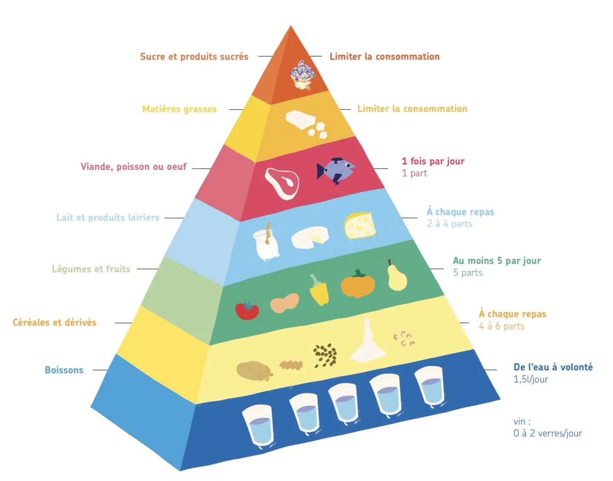

# Prélèvement des nutriments nécessaires à l’organisme par l’appareil digestif

## Régime alimentaire de l’Homme

L'être humain a besoin de 3 principaux nutriments :  
- **Lipides** (≈30%) → énergie de réserve, constitution des membranes, hormones 
- **Glucides** (≈55%) → principale source d’énergie  
- **Protéines** (≈15%) → construction et renouvellement des cellules  

Ces proportions correspondent à une alimentation équilibrée.  

Nous devons respecter une pyramide alimentaire (schéma ci-dessous) :  

## L’anatomie de l’appareil digestif de l’Homme

### Adaptation de la dentition et de la mâchoire à un régime omnivore

L’être humain possède une dentition adaptée à un régime omnivore :  
- **Incisives (8)** : couper les aliments  
- **Canines (4)** : déchirer  
- **Prémolaires (8)** : broyer  
- **Molaires (12, dont 4 dents de sagesse)** : écraser et mastiquer  

→ Cette dentition variée traduit un régime **omnivore**.

### L'anatomie du système gastro-intestinal

Le système digestif fait partie de l’appareil digestif.  
Il mesure, de la bouche au côlon, environ **7 à 8 mètres**.  

Il est composé de :  
- **La bouche** : mastication, mélange avec la salive (enzymes comme l’amylase salivaire)  
- **L’œsophage** : transport des aliments par mouvements péristaltiques  
- **L’estomac** : brassage, sécrétion d’acide chlorhydrique et de pepsine (début de la digestion des protéines)  
- **L’intestin grêle (≈6 m)** : lieu principal de digestion et d’absorption  
  - **Foie** : produit la bile (digestion des lipides)  
  - **Vésicule biliaire** : stocke la bile  
  - **Pancréas** : sécrète les sucs pancréatiques (enzymes qui digèrent lipides, glucides et protéines)  
- **Le gros intestin (≈1,5 m)** : réabsorption de l’eau, fermentation bactérienne, formation des matières fécales  

> [!ATTENTION]
> Les longueurs suivantes ne correspondent pas à celles dans le cours, mais elles sont pourtant exactes 🤔

### Digestion des aliments et absorption des nutriments

- La digestion humaine réabsorbe une grande quantité d’eau (**≈7 L**). Même si ce chiffre paraît élevé, il permet d’éviter la déshydratation, puisque nous n’absorbons en moyenne que **1 à 2 L d’eau** par la boisson et l’alimentation.  
- Le rôle du **microbiote intestinal** est essentiel : il participe à la digestion de certaines fibres, produit des vitamines (K, B12), et protège contre les microbes pathogènes.  Il permet 99% de la digestion !
- Les **villosités intestinales** et les **microvillosités** de l’intestin grêle permettent d’augmenter considérablement la surface d’absorption (surface équivalente à un terrain de tennis !).  

> [!INFO]
> Le macrobiote intestinal permet 99,97% de la digestion !

Elles assurent le passage des nutriments (glucose, acides aminés, acides gras, eau, vitamines, sels minéraux) dans le sang et la lymphe.
