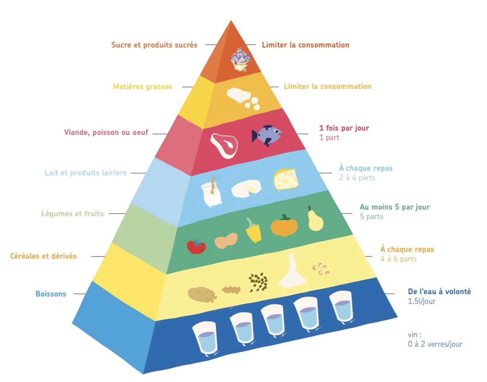

# Prélèvement des nutriments nécessaires à l’organisme par l’appareil digestif
## Régime alimentaire de l’Homme
L'Être humain a besoin de 3 nutriment principaux : les **lipides** (30%), **glucides** (55%) et les **protéines** (15%).  Nous devons respecter une pyramide alimentaire que j'ai la flemme d'écrire, donc vous allez vous contenter de ce magnifique "copié - collé"

## L’anatomie de l’appareil digestif de l’Homme
### Adaptation de la dentition et de la mâchoire à un régime omnivore

L'Être humain possède une dentition capable de s'adapter à un régime omnivore : canine et incisives pour couper la viande, molaire pour broyer les aliments (type xxx)
### L'anatomie du système gastro-intestinal

Le système digestif fait partie de xxx. Il mesure, de la bouche au colon, xxxm. Il est donc composé de la bouche, de loeusophage, de l'estomac, de l'intestin grèle (avec organes xxx pancréa et foie) puis ke gros intestin.
### Digestion des aliments et absorption des nutriments dans la partie antérieur du tube digestif

La digestion humaine abosrbe une grande partie d'eau (6.7L dans le sang). Même si elle peut paraitre énorme, elle permet d'éviter que l'organisme se déchesse, puisque nous n'absorbons que 1,2L d'eau en moyenne. 

Une grande partie de notre digestion est assuré par le microbiote (99.97%).

Les vilosités

