# Installer Minecraft

Ce guide vous aide à installer Minecraft proprement et à rejoindre le serveur dans de bonnes conditions.

## Avant de commencer

### Comptes officiels/cracks

- **Compte officiel** : vous vous connectez avec Microsoft, puis vous jouez.
- **Compte crack** : possible aussi sur le serveur, avec un launcher compatible et un pseudo propre.
- Dans les deux cas, privilégiez une installation simple avant d'ajouter des mods.

### Pourquoi éviter TLauncher

TLauncher est problématique pour deux raisons :
1. Tout d'abord, ce launcher a quelques origines douteuses, est maintenu par des russes et est connu pour avoir déjà installé des adwares [virus]. 
2. TLauncher modifie également de façon plutôt agressive le code du jeu pour implémenter ses propres comptes. Ces modifications bloquent l'accès à certains serveurs, dont CPES-CRAFT

> [!INFO] Pour plus de détails
> Il existe quelques documentation sur TLauncher, voir plus [ici](#)
> Pour la partie code, TLauncher modifie l'implémentation DNS de minecraft et modifie les résolutions SRV, utilisés par CPES-CRAFT.

### Note pour les utilisateurs de MAC 🍎

Mac possède un écosystème beaucoup plus protégé que sur Windows/Linux. Si vous voulez installer un launcher crack (même open-source/vérifié), il faudra activer les logiciels non vérifié, et donc désactiver certaines sécurités dans vos paramètres. Notez que ces modifications n'auront aucun impact, à moins que vous ne téléchargiez n'importe quoi (dans ce cas t'es cook).

Si vous avez des suggestions de launcher mac crack/un tutoriel pour installer les launcher sur mac, nous sommes preneur !

## Liste des launchers

### Tout-en-un : X Launcher

Site : https://xmcl.app/
Version crack : (Intégré)

#### Guide Complet

L'installation de X Launcher est plutôt simple. Pour commencer, téléchargez exécutable compatible avec votre ordinateur via le lien si dessus, et lancez le. Appuyer ensuite sur suivant jusqu'à arriver à la sélection des comptes 

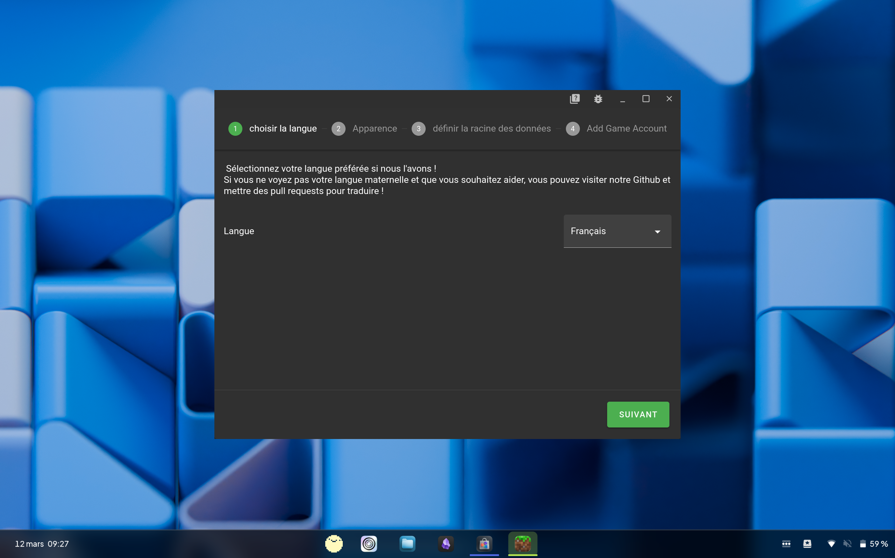

>Choisissez une langue. Par défaut celle de votre ordinateur. 

> Choisissez votre thème, si vous vouez être $fancy$

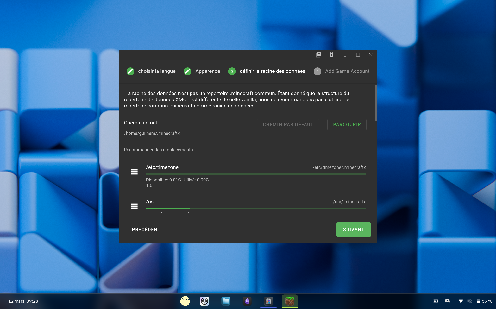

> Choisissez où vous voulez stocker les configurations de votre jeu. Le dossier par défaut est OK.

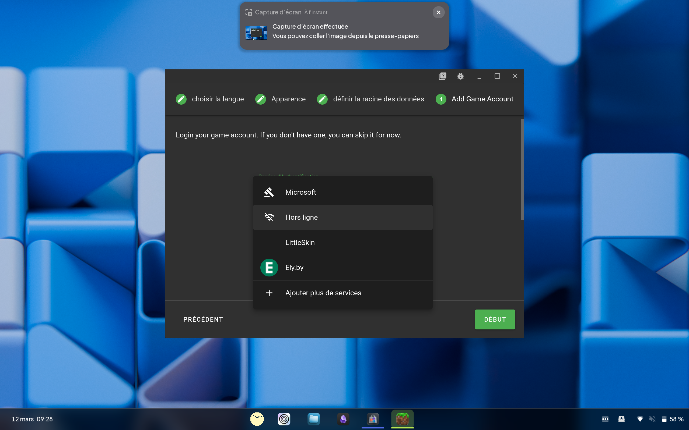

Vous pouvez maintenant choisir un compte. Sélectionnez **Microsoft** si vous avez acheté le jeu. Sinon, sélectionnez  **Hors Ligne**. *Les deux systèmes d’authentification Microsoft son équivalent, choisissez celui que vous voulez.*

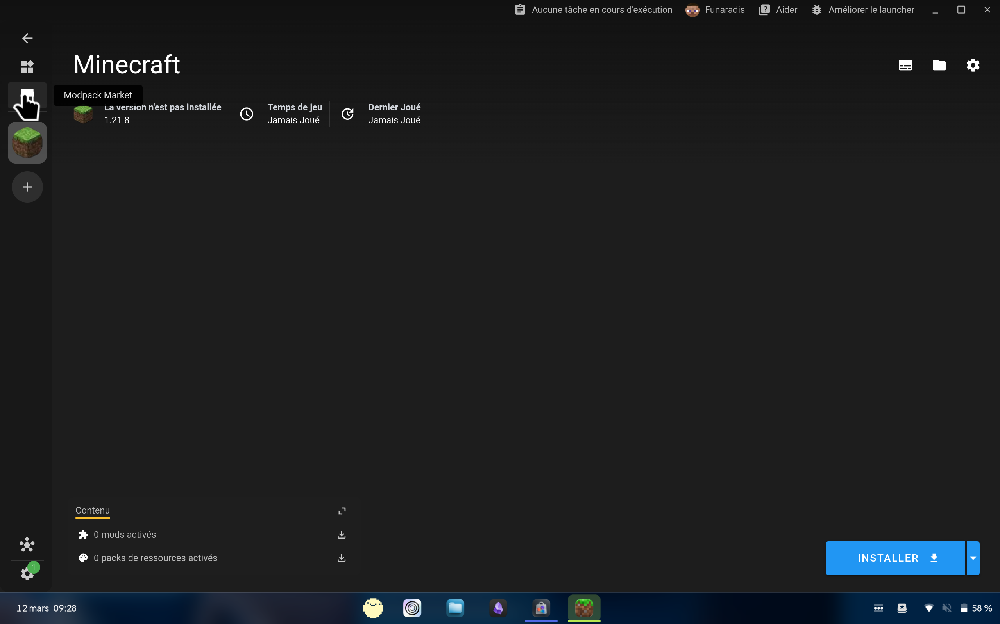

Vous devez maintenant ajouter une instance Minecraft. **Ne cliquez pas sur télécharger**, CPES-CRAFT n'est pas accessible sur la version par défaut de X (ici `1.21.8`)  Nous allons vous faire télécharger une version optimiser pour faire respirer votre ordinateur. Cliquez sur l'icone **Marketplace** pour commencer.

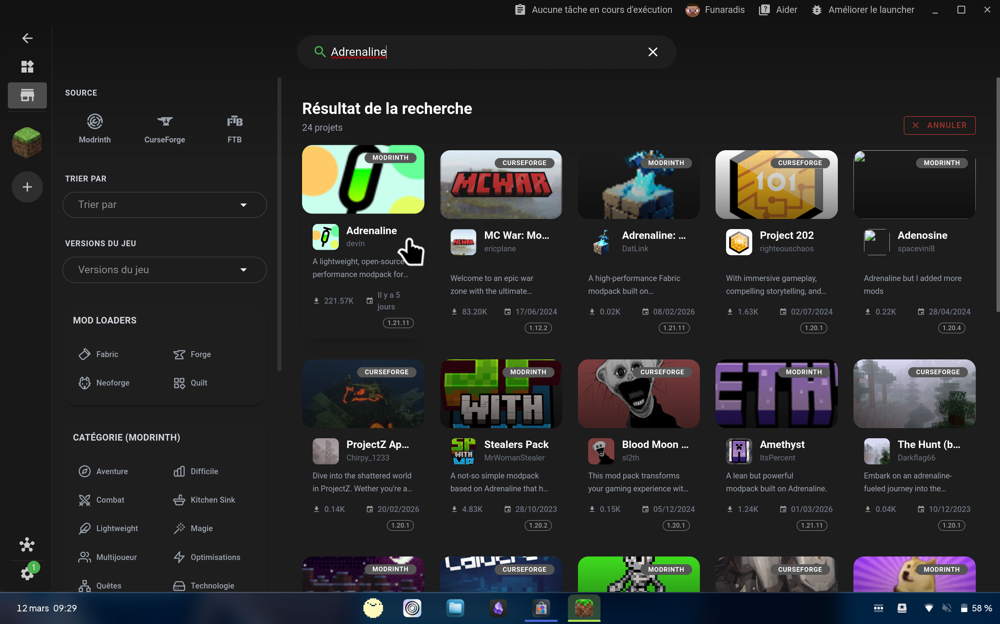

Cherchez ensuite **Adrenaline** dans la barre de recherche. Cliquez sur le premier résultat.

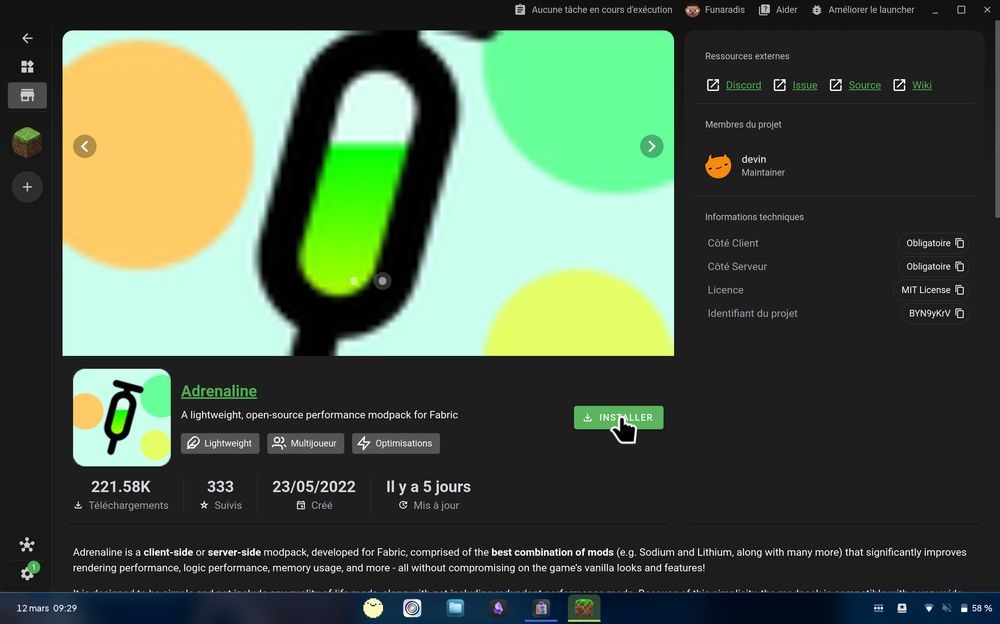

> Cliquez sur le boutton installer.

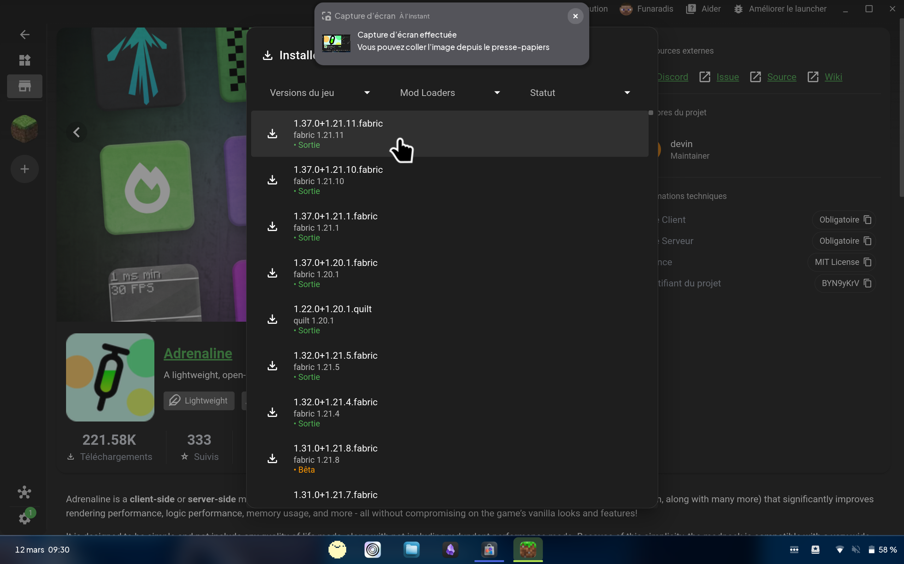

Dans la liste des versions, sélectionnez la dernière version contenant `1.21.11`. Attendez ensuite que X télécharge tout les fichiers

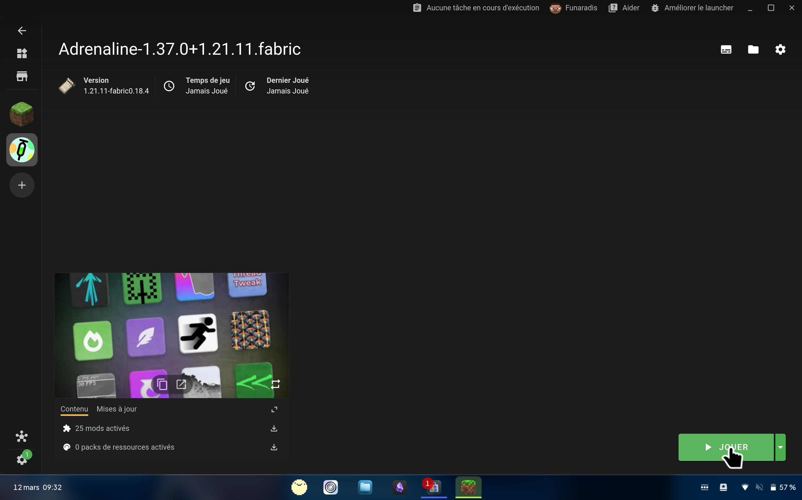

Cliquez sur **Jouer**. **C'est fait 🥳**

### Option légère : PrismLauncher

Site : https://prismlauncher.org/
Version crack : https://github.com/Diegiwg/PrismLauncher-Cracked

#### Guide Complet

L'installation de X Launcher est plutôt simple. Pour commencer, téléchargez exécutable compatible avec votre ordinateur via le lien si dessus. Vous pouvez, sur ce launcher aussi, choisir votre langue. 

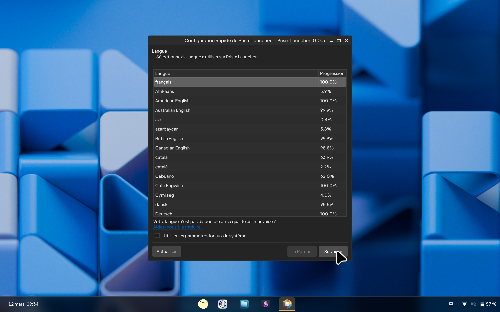

> Sélectionnez la puis cliquer sur "Suivant"

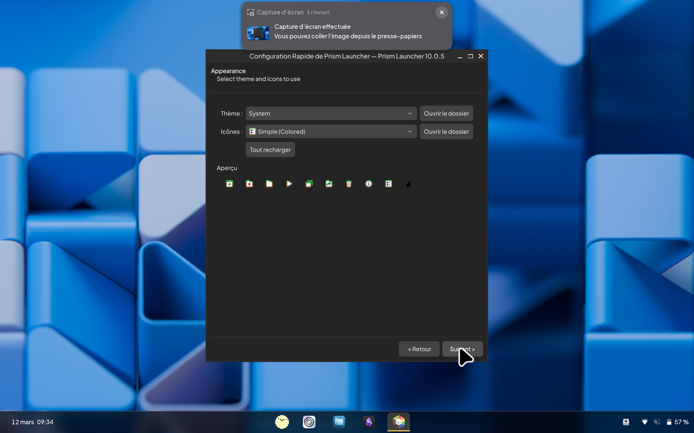

> Idem pour le thème, cliquez sur suivant

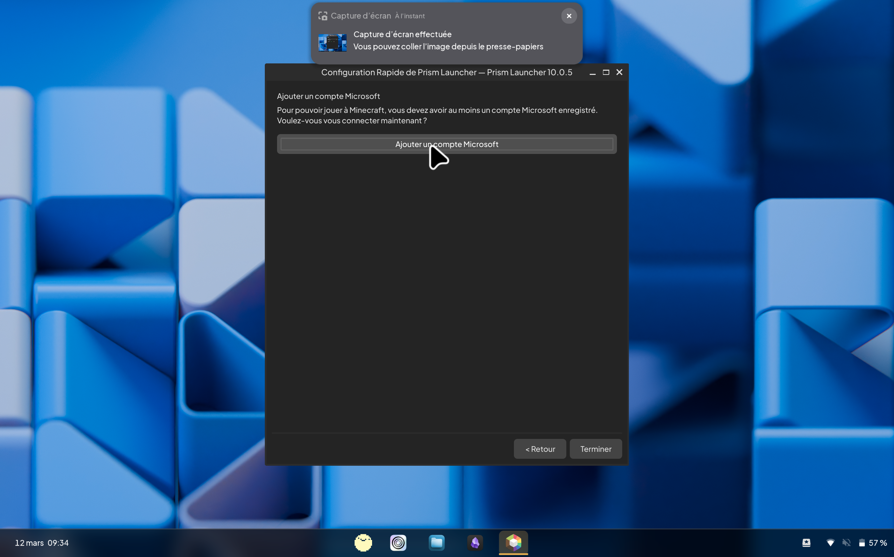

Vous aurez maintenant le choix d'ajouter un **compte Microsoft** (si vous avez la version officiell) ou un **compte hors-ligne** (si vous avez la version crack). Connectez vous avec le compte de votre choix.

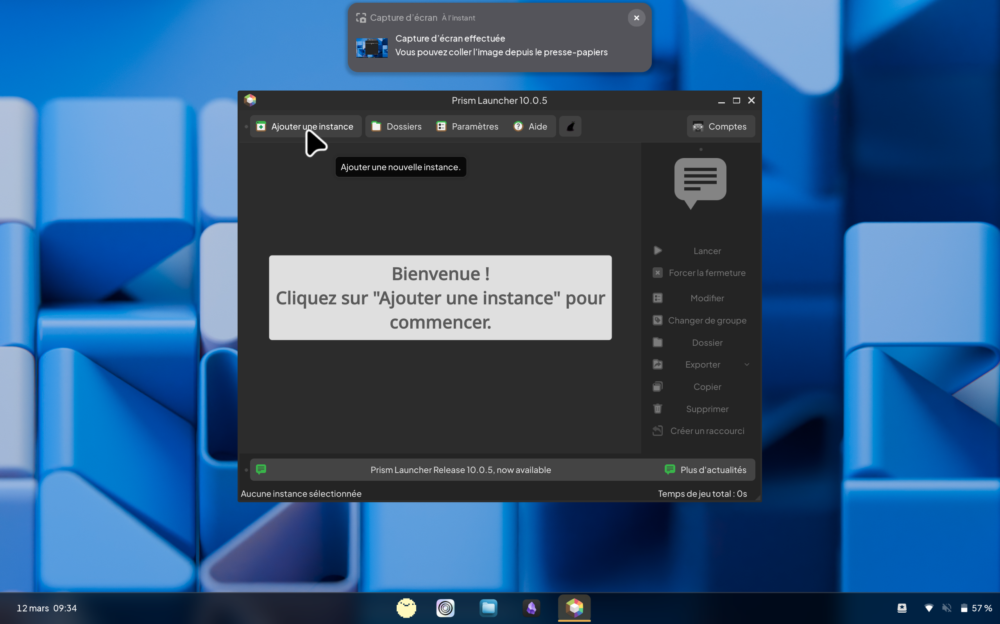

Vous devez maintenant ajouter une instance Minecraft. Nous allons vous faire télécharger une version optimiser pour faire respirer votre ordinateur. Cliquez sur l'icone **Ajouter une Instance** pour commencer.

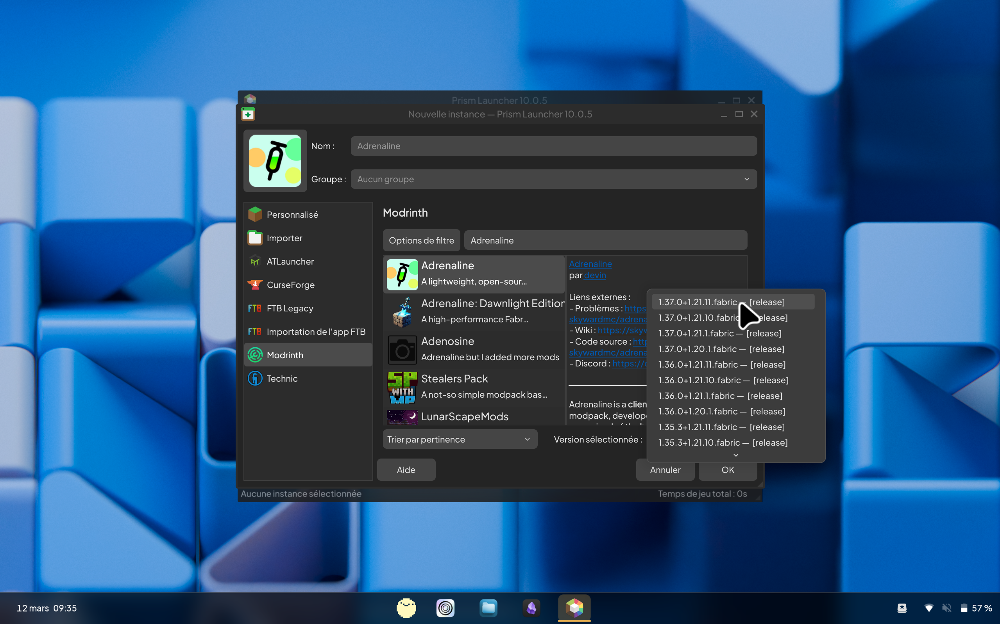

Cliquez sur l'icone verte **Modrinth**. Cherchez ensuite **Adrenaline** dans la barre de recherche. Cliquez sur le premier résultat, cliquez sur le menu déroulant, et sélectionnez la première version qui contient `1.21.11`. Cliquez sur OK, puis attendez que Prism télécharge le jeu.

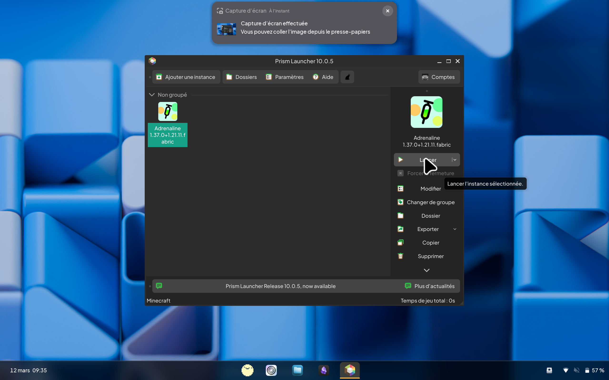

Cliquez sur **Lancer**. **C'est fait 🥳**
