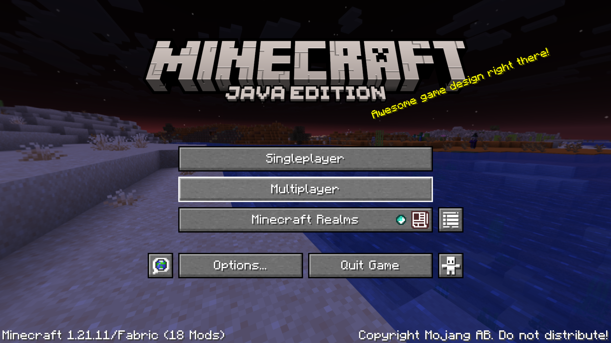
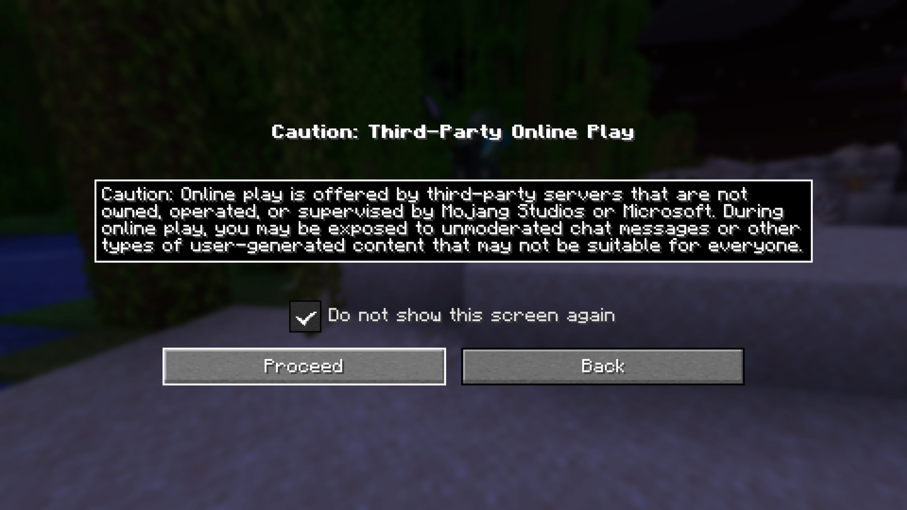
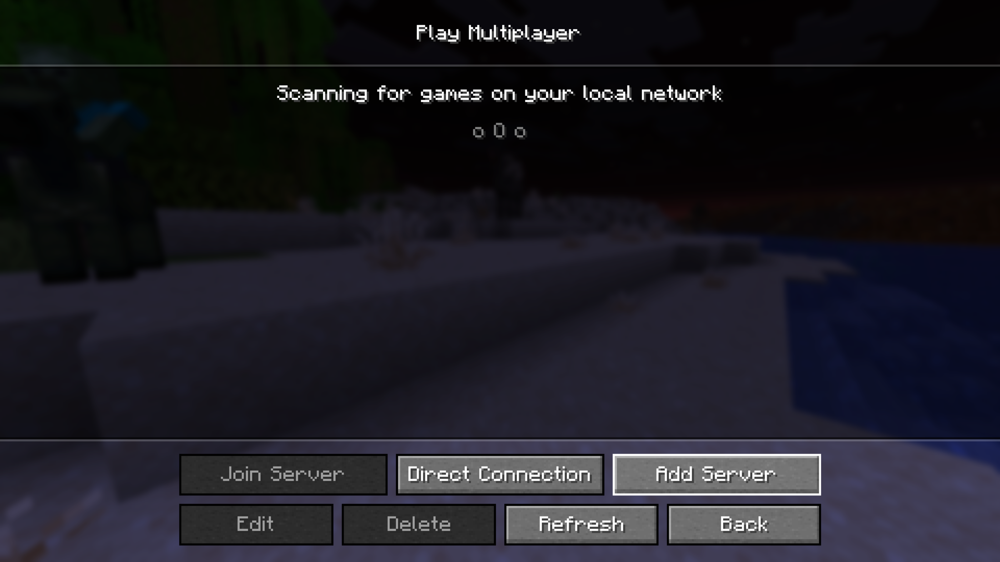
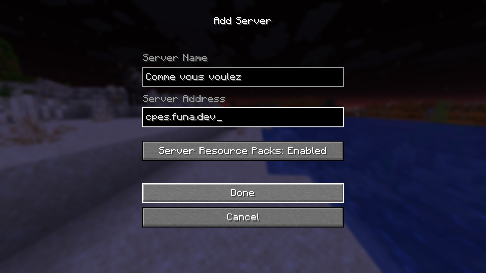
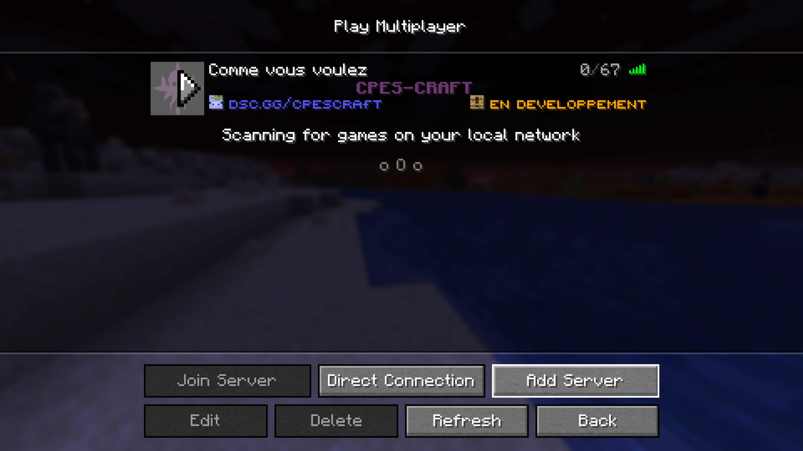

# Ajouter le serveur

Ajouter le serveur à votre Minecraft est **un jeu d'enfant** (ok, j'arrête).  
Pour le faire, **lancez tout d'abord votre jeu**. Vous devriez voir une fenêtre comme celle-ci :

Cliquez ensuite sur le bouton **"Multijoueur"** ou **"Multiplayer"** selon la langue de votre jeu.  
Vous aurez peut-être un **écran d’avertissement** : vous pouvez simplement l’ignorer et passer à l’étape suivante.

Vous devriez maintenant voir un écran comme celui-ci :

Cliquez sur le bouton **"Ajouter un serveur"** / **"Add a Server"**.

- Choisissez **le nom du serveur** que vous voulez.
- Entrez l’adresse : **`cpes.funa.dev`**
- Vérifiez que **les packs de ressources sont activés** (*Enabled* en anglais, voir ci-dessous).

Vous n’êtes maintenant **plus qu’à un clic du jeu !**  
Passez votre souris devant l’icône du serveur et **cliquez dessus**.

**🎉 C'est fait ! Vous êtes maintenant joueur de CPES CRAFT !**

---

### *Que faire après ?*

- Installer les **[mods facultatifs](mods.md)** pour une **meilleure expérience de jeu** (*W le voice chat*).
- Renseignez vous sur les **[commandes utiles](../commandes/utils.md)**.
- Suivre **[ce guide](crack.md)** si vous jouez sur un **compte "crack"**.
- **[Rejoindre le Discord](https://dsc.gg/cpescraft)** pour discuter avec les autres joueurs (et **espionner Marcel** 👀).

**Bon jeu à tous !**
