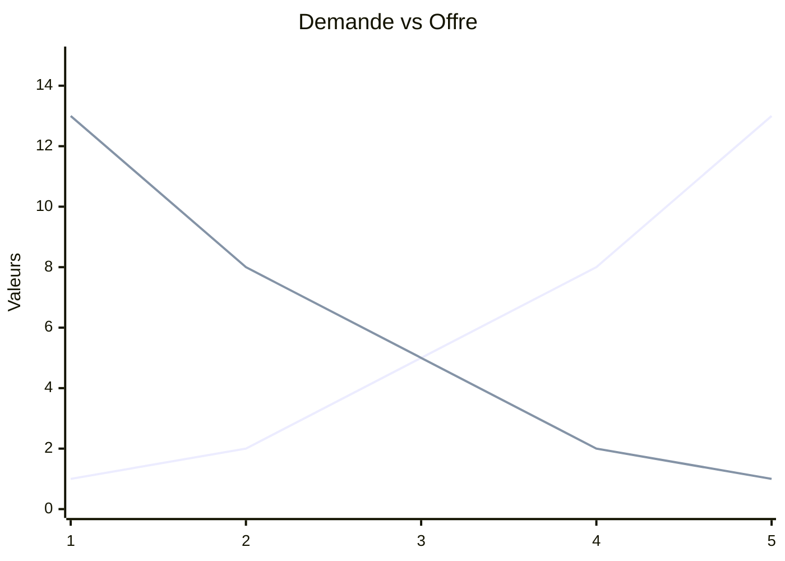

# 🏗 La construction du paradigme classique

> [!DANGER] DRAFT
> Fiche en cours de construction

## Adam Smith et le système de liberté naturelle

### La philosophie morale de Smith

Smith est tout d'abord un **philosophe**. Son premier livre est <u>la théorie des sentiments moraux</u>  où il développe le concept de sympathie.

### La richesse des nations

> Autres noms : **RDN** (abrégé), **The Wealth Of Nations** (anglais)

Smith va voyager en France et rencontrer des physiocrates. Il n'est pas d'accord avec leur vision "pro-agricole", qu'il met en opposition avec la révolution industrielle en Grande Bretagne. 

Il développe l'idée (*politique*) de système de libertés naturelles qui explique comment les prix évoluent au fil du temps. 

### Le système de la liberté naturelle et le rôle de l'État

> La liberté naturelle sert à condition qu'elle ne soit pas utiles à une classe uniquement

Les salaires des travailleurs reste au niveau de subsistance. Hors, la principale crainte à l'époque est la famine. Avec l’augmentation de la population, les terres agricoles deviennent rare, donc le prix de la rente augmente. Les profits diminuent donc, à cause des rentes et de la quantité de capital qui diminue. Smith développe 3 classes assez similaires à celles des physiocrates:

- les **rentiers** : les propriétaires terriens qui reçoivent des rentes
- les **travailleurs** : ils travaillent la terre et perçoivent un salaire
- les **capitalistes** : ils investissent et reçoivent le profit. C'est eux qui calculs les différents coûts (salaires, rentes).

   ➡ Pas de classes stériles

La somme de ces 3 coûts (salaires, rentes, profits) constituent le prix. L'État ne doit pas entraver le marcher, uniquement garantir un contexte propice aux échanges. Il est partisan du "laisser faire". En vertu du principe de sympathie, il n'y a pas de raison d'intervenir sur le marché. Selon lui, le souverain n'a pas la compétence pour intervenir. Beaucoup disent que Smith est le père du libéralisme, mais Ricardo l'est bien plus que lui.

Derrière d'idée de Smith, il y a la métaphore de la main invisible. Les forces du marchés vont finir par s'auto régulés. Ex: si ils produisent trop, par le jeu des prix, l'équilibre vase rétablir, puisque quand le prix va baisser la demande va augmenter.

Certain on interprété cette idée comme du laisser faire. En réalité, la main invisible est un concept plus compliqué : Michel Foucault. Il explicite que la main invisible est un concept qui n'était pas compris, et donc que l'état ne devait pas intervenir car dangereux. Par ailleurs, il parle également de division de travail. Exemple de la manufacture d'épingles : il remarque que dans cette manufacture, il y a eu un changement dans la manière de production. Au début, les ouvriers font 20 épingles par jours, mais chacun fait de tout. Le contremaître va spécialiser chacun des ouvriers, et ensemble, ils devient plus productifs. Cela crée une forme d'inter dépendances entre les individus (si quelqu'un manque, la production est mis à mal). Il considère également une division sociale, en terme de classe et de travail. Mais Smith remarque que les individus deviennet abrutits à force de répéter la même chose tout le temps, et **l'État pourrait intervenir**. L'État ne pourra pas remplacer le marché pour créer des infrastructures, une armée... *Smith n'est pas binaire :)*

## Valeur et répartition chez David Ricardo

### Aux origines historiques de David Ricardo

**Qui est il ?** C'est un économiste anglais, fils d'un financier juif des pays bas. Très jeune, il s'oppose à sa famille et il épouse une protestante (). Il part travailler à la bourse de Londres où il fait fortune (il achète des contrats d'assurances qui parient sur la victoire de l'Angleterre à Waterloo). Son ouvrage le plus important est <u>Des principes de  l'économie politique et de l'impôt</u>.

### L'économie politique de Ricardo

Ricardo est largement politisé et participe à de nombreux débats, dont ceux des corn laws. Le Royaume Unis met en place des mesures protectionnistes où les céréales étrangères sont taxés quand elles sont moins cher que les céréales brittoniques. Il est bien entendu contre car cela va nuire à l'économie. Ricardo se pose la question de la rareté, et donc de la valeur. Il essaye de répondre au paradoxe de l'eau et du diamant.

> L'eau est très peu rare, on en trouve partout en Angleterre. Elle n'est pas chère mais extrêmement utile. Le diamant est rare, inutile, mais pourtant très chère.

Il fait une distinction entre la **valeur d'échange** et la **valeur d'usage**.

|                  | Eau | Diamant |
| ---------------- | --- | ------- |
| Valeur d'usage   | ⬆   | ⬇       |
| Valeur d'échange | ⬇   | ⬆       |

Ricardo se demande *quelle est cette valeur*. Ici, ce sont des ordres de grandeurs et non des chiffres réels. **La valeur des marchandises dépendent du travail.** Une marchandise sera plus chère si beaucoup d'heures de travaille sont nécessaires pour la produire. 

Il défend les capitalistes et les travailleurs, il considère que c'est la rente qui est le résidu. La rente, c'est du travail fictif. Il explicite encore plus les conflits entre les classes. 

$L$ = travail

Il définit également 3 classes (comme Smith)

David & Ricardo s'opposent à leur prédécesseurs. Mais ce n'est pas un paradgime lié pour autant.
