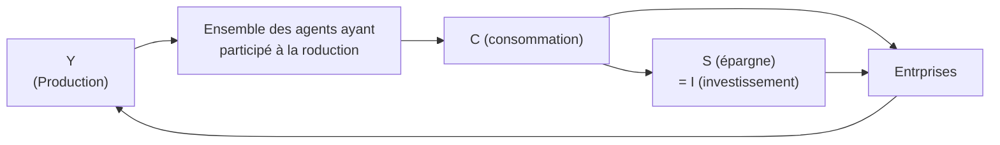

Histoire de la pensée économique - de la loi des débouchés au paradigme néoclassique# La loi des débouchés et sa critique

> [!DANGER] DRAFT
> Fiche en cours de construction

## Qui est Jean-Baptise Say

Économiste français du 19°, il est marqué par le developpement industriel français et les écrits de smith. La révolution inus arrive avec un décalage en france. Es ce qu'on peut retrouver des aspects de la RDN en france ? En tant qu'industriel, il est contre Napoléon, car les dépenses militaires font sortir les richesses du pays à outrance, ce qui lui vaudra d'être censuré. 

## La loi des débouchés

## Le circuit économique de Say

