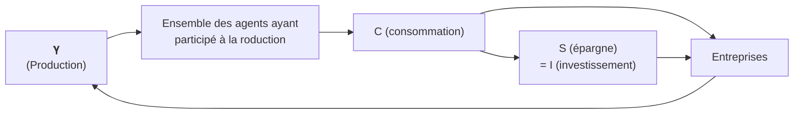

# 🔥 La loi des débouchés et sa critique

## La loi des débouchés : principes et implications

### Qui est Jean-Baptise Say

Économiste français du 19°, il est marqué par le development industriel français et les écrits de smith. La révolution industrielle arrive avec un décalage en France. Es ce qu'on peut retrouver des aspects de la RDN en France ? En tant qu'industriel, il est contre Napoléon, car les dépenses militaires font sortir les richesses du pays à outrance, ce qui lui vaudra d'être censuré. 

### La loi des débouchés

### Le circuit économique de Say

## Une unité toute relative des économistes autour de la loi de Say

### Certains classiques sont très critiques : le cas de Malthus et de Sismondi

Malthus considère l'épargne comme improductive. Il faut forcer les plus fortunés à consommer plus. Il met en lumière les inégalités de patrimoine, mais il ne dira pour autant jamais qu'il faut les réduire.

Comme il  considère que les plus fortunés qui ne dépensent pas assez, il observe que certains individus pourrait obtenir un emploi si les capitalistes consommaient plus. C'est introduction du **chômage**, et il ira même jusqu'à proposer l'idée des **travaux publiques**.

Sismondi est un économiste suisse qui s'inscrit au départ des travaux de Smith, mais il va petit à petit devenir partisan de l'a de l'État. Il va d'abord refuser le principe de sympathie, la main invisible. Si les individus ne sont pas guidés, il ne vont pas tendre vers la sympathie (mécanisation de l'industrie). Il faut donc réguler (par l'État) l'arrivé du progrès technique dans l'emploi. 

Sismondi pense que la consommation est naturellement limitée  et la consommation de produits manufacturés ne croit pas indéfiniment. *Il appelle cela le "besoin des acheteurs"*. La privation d'emploi rend les achats plus compliqués, et les plus riches ne dépensent jamais leur revenus. *C'est le moyen de payer*. La surproduction concerne donc toutes les productions dites "générales".

### La principale critique de l'époque : **Marx**

Marx est farouchement opposé aux écrits de Say. Marx critique le manque d'historicité des économistes classiques. Il faut regarder la réalité matérielle contrairement aux adhérents de la loi de Say. 

Il pense qu'il ne peut pas avoir d'égalité dans la conception de la demande : la monnaie est **active**. L'unité monétaire *brise* la vente et l'achat, ce qui va rendre possible les crises de surproduction.  C'est le premier à parler d'**économie monétaire** qui sera repris ensuite (ex: par Kens). Il invalide l'idée d'échanger des produits contre des produits. Dans <u>Le Capital</u> écrit en 1867, il distingue deux grandes classes sociales : 

1. **Les prolétaires** ne possèdent que la force de travail
2. **Les capitalistes** possèdent le capital, les moyens de production

Les capitalistes mettent du capital à disposition des prolétaires. Le système crée de la marchandise qui utilise une autre marchandise. *Le travail est aussi une marchandise.* Cette marchandise est échangé avec de l'argent. La force de travail est revendu plus chère, qui amène à une exploitation, un appauvrissement, puis une révolution du prolétariat.

Il décrit aussi une baisse tendancielle du taux de profit. Chez Marx, le taux de profit $T = \frac{Pl}{C + V} = \frac{Pl/V}{C/V + 1}$ où $Pl$ est la plus value, $C$ est le capital circulant et  $V$ le variant. Les capitalistes s'enrichissent de moins en moins, les travailleurs sont de plus en plus au chômage (l'**Armée de réserve**) et l'histoire va amener à une révolution.

Marx considère que la production est un rapport historique d'accumulation du capital. C'est également un rapport social, de domination d'un groupe sur un autre. Pourquoi ? Parce que cette accumulation de travail n'est permise que par le **travail**. Le marché ne peut donc pas être généralisé, et beaucoup d'économistes passent à coté de certains aspects : on ne va pas expliquer les écarts qui se creusent entre les classes sociales. Il observe également le capitaliste est un système productif parmi d'autres, et que les lois sont formés sur celui ci et non sur l'ensemble de l'économie. 
