# La loi des débouchés et sa critique

> [!DANGER] DRAFT
> Fiche en cours de construction

## Qui est Jean-Baptise Say

Économiste français du 19°, il est marqué par le development industriel français et les écrits de smith. La révolution industrielle arrive avec un décalage en France. Es ce qu'on peut retrouver des aspects de la RDN en France ? En tant qu'industriel, il est contre Napoléon, car les dépenses militaires font sortir les richesses du pays à outrance, ce qui lui vaudra d'être censuré. 

## La loi des débouchés

## Le circuit économique de Say

```mermaid
flowchart LR
    A["𝛄<br>(Production)"] --> n1["Ensemble des agents ayant<br>participé à la roduction"]
    n1 --> n2["C (consommation)"]
    n2 --> n3["Entreprises"] & n4["S (épargne)<br>= I (investissement)"]
    n3 --> A
    n4 --> n3
```

