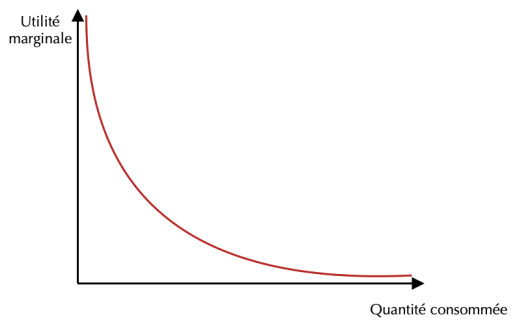
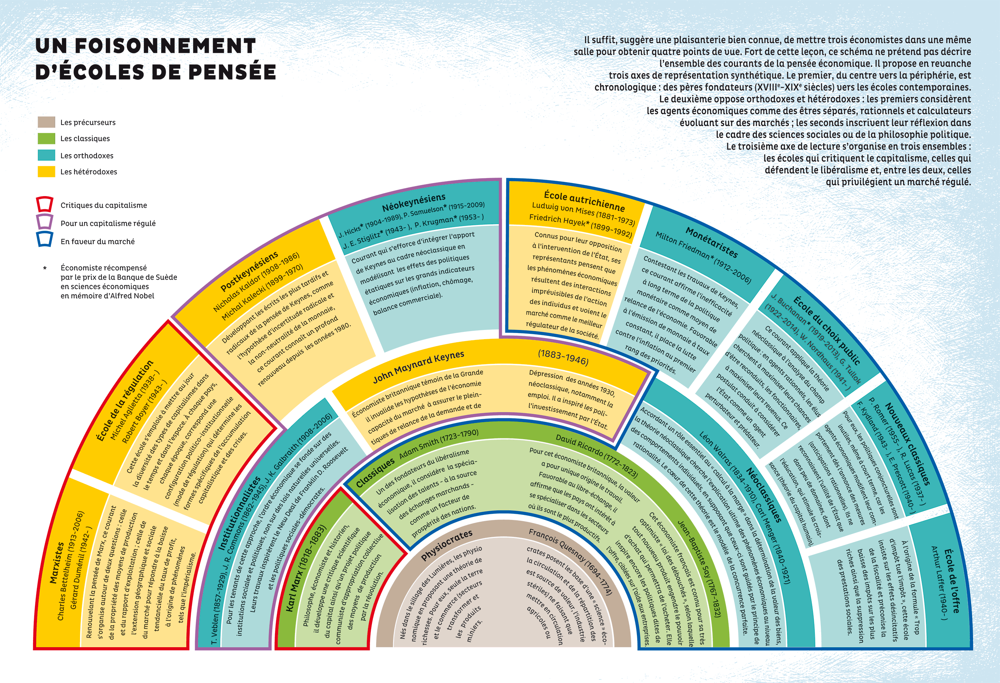

# 🌄 Un nouveau paradigme néoclassique
## Le raisonnement marginaliste et la formalisation mathématique
### La révolution marginaliste

On observe un vrai changement de paradigme. L'idée d'économie politique est progressivement abandonnée vers celle de la science économique, accompagné des outils mathématiques qui la "justifie".  3 écoles importantes accompagne ce changement :

#### <u>Lausanne</u>
Léon Warlos et Vilfredi Pareto proposent la théorie de l'équilibre général
#### <u>Cambridge</u>
Alfred Marshall parle d'équilibre partiel, Stanley Jevos évoque l'effet de bord et Arthur Cecil Pijou est important.
#### <u>Vienne</u>
Carl Menger fait une synthèse de ces différentes propositions et s'oppose franchement à l'école historique allemande.
### Les lois de Gossen

Gossen propose deux lois **mathématiques** qui lient le plaisir utile à l'achat : plus un produit est acheté, moins son utilité "ajouté" sera grande. Sa limite tend donc vers 0 (loi  de prolongation, 1) et que les utilités selon quantité se valent (loi de répétition, 2)

$$(1) : \lim\limits_{x \to +\infty} Um = 0$$

$$(2) : \frac{UmX}{pX} = \frac{UmY}{pY} \Longleftrightarrow \frac{pX}{pY} = \frac{UmX}{UmY}$$

## Un nouveau cadre d’analyse dominant

L'économie essaye de prouver sa valeur face au sciences de la nature (biologie). Les idées sociales (type redistribution de richesses) sont alors détachés de la réflexion économique (comme quoi, la science économique reste politique !). L'organisation de la société est laissé à la sociologie, 

|                              | Classiques                                                                                                              | Néoclassiques                                                                                                                                                     |
| ---------------------------- | ----------------------------------------------------------------------------------------------------------------------- | ----------------------------------------------------------------------------------------------------------------------------------------------------------------- |
| Classes sociales             | Approche en trois classes sociales.                                                                                     | Oubli des classes sociales au pro t de l’étude de l’individu.                                                                                                  |
| Focalisation                 | Vision principalement macroéconomique, avec l’étude de grands agrégats (production, distribution, consommation…). | Fondement microéconomique (quitte à considérer que la macroéconomie n’est qu’une simple agrégation de comportements individuels).                        |
| Analyse du con it            | Opposition des intérêts entre les différentes classes sociales.                                                      | Pas de con it : chacun doit poursuivre son intérêt personnel (vision subjective  de la valeur de Say). On est même dans la théorie de la sympathie de Smith |
| Analyse de la répartition    | Il y a des problèmes dans la répartition des richesses (Smith, Ricardo et surtout Mill).                             | Analyse statique qui n’étudie pas l’évolution de la répartition des richesses. C’est une analyse d’allocation des ressources à un moment donné.          |
| Grand objet d’analyse commun | La croissance (accumulation de richesses).                                                                              | L’échange                                                                                                                                                         |

## Conclusion

L'utilisation de terme science économique **montre le vrais tournant qu'apporte le néoclassicisme** . On passe de l'utilisation de la morale et le l'éthique au subjectif. Certaines idées néoclassiques sont toujours utilisés, les raisonnements marginalistes sont toujours utilisés. L'orthodoxie en sera le successeur.

Aujourd'hui, les NEC (Nouvelle École Classique) lead Robert Lucs et la NEK (Nouvelle École Keynésienne) lead par Gregory Markiw et Joseph Stiglitz continuent le même débat que les classiques/néoclassiques.

