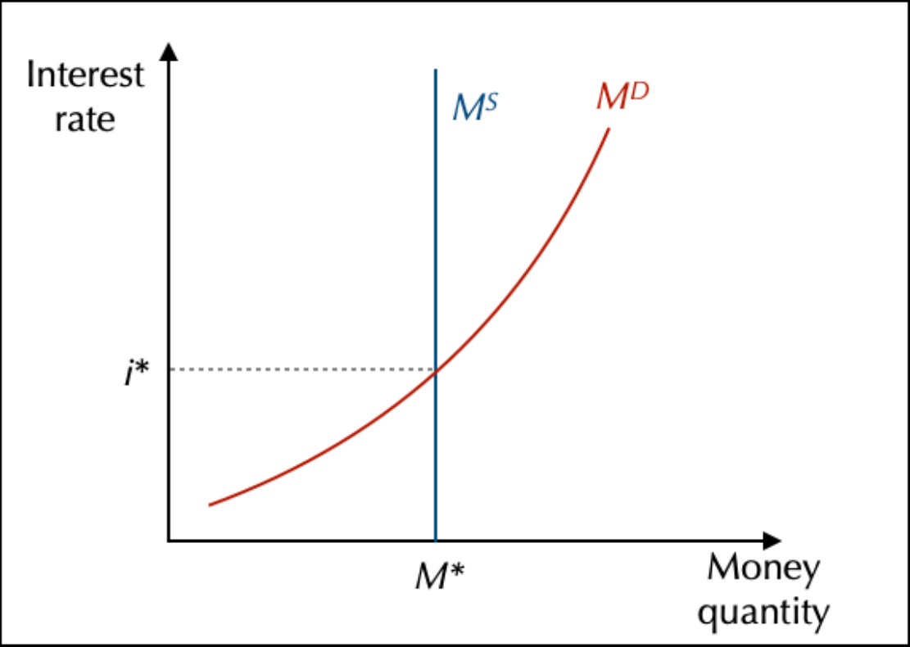
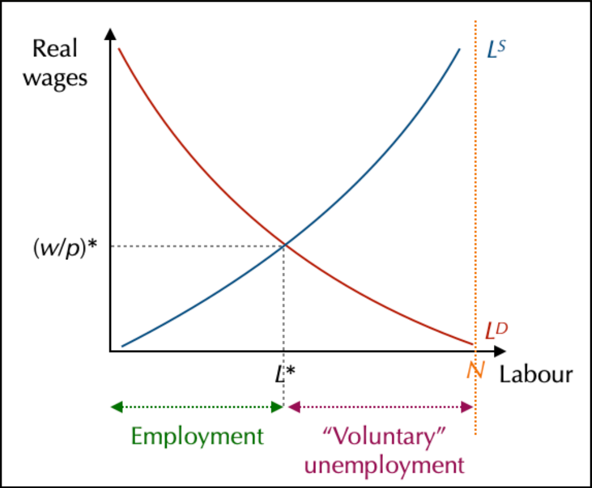

# ♻️ Markets in a closed economy without State

## The Goods and Services Market

### The Composition of GDP

**GDP (Gross Domestic Product)** is a measure of production over a certain period (usually a year or a quarter).
It is noted $Y$ (Yield) or sometimes $\gamma$.

**How is GDP computed?** (Expenditure Approach):
1. **Consumption ($C$)**: Spending by households.
2. **Investment ($I$)**: Spending by firms (capital).
3. **Public Expenses ($G$)**: Spending by the State.
4. **Net Exports ($X - M$)**: Exports minus Imports (Trade Balance).

$$Y = C + I + G + (X - M)$$

*In a closed economy without State, $G=0$, $X=0$, $M=0$, so $Y = C + I$.*

### Production Approach (Value Added)

To produce, firms need capital and labor.
**Value Added (VA)** measures the wealth created by a productive unit. It is the difference between the value of production (Revenue) and the value of intermediate consumption (goods used up in the process).

$$VA = Revenue - Intermediate Consumption$$

$$GDP \approx \sum VA$$

## Financial Markets

### The Loanable Funds Market

> Marchés des fonds traitables

Firms need money to invest. They find it on the **Loanable Funds Market**.
- **Supply**: Households who save money (Savings $S$).
- **Demand**: Firms who want to invest (Investment $I$).
- **Price**: The **Interest Rate** ($r$ or $i$).

### Money Neutrality

In the Neoclassical view, money is **neutral**. It is just a medium of exchange.
The demand for money depends on the level of transactions (which depends on GDP $Y$ and Price level $P$).

$$M^D = f(Y, P)$$

Trust is essential for money to be accepted.

Money supply is exogenous, at a fixed supply. Salary can increase as same as prices, and so change nothing. So state interventions are useless (Say's Law).

### Are cryptocurrencies going to replace money?

Inflation make money not trustable. Crypto isn't a currency, it's an **asset**. It's only created by **mining**. 

To have a currency, you need 3 main options :

1. **Store of value** : 
2. **Accounting unit** : price are defended and stables
3. **Medium of exchange** : you need to be able to use it

So maybe, but they will be not our actual crypto which would be real currencies and not assets.

## The labour market

### Real wage and the construction of supply and demand on the labour market

> *Labor or Labour, both fine*

Most of what is happening is depending of what workers want. In the neoclassical theory, workers are a pillar. They are seeking **purchasing power** coming directly on **salary & prices** ($R = \frac{W}{P}$). Labor supply means that workers offers work to firms (and not the opposite). Some peoples only want to work if the real wages is big enough. Firms want to pay the lowest salaries possible.So, if the real wages is high, then their salary demand will be low. If the price of labor is too high, they will use capital. It's a trade-off between real wages and real interest rates. *Cheaper one wins.*

### The equilibrium on the market and its implications

This shows that, for neoclassical, **unemployment** is **voluntary**.
