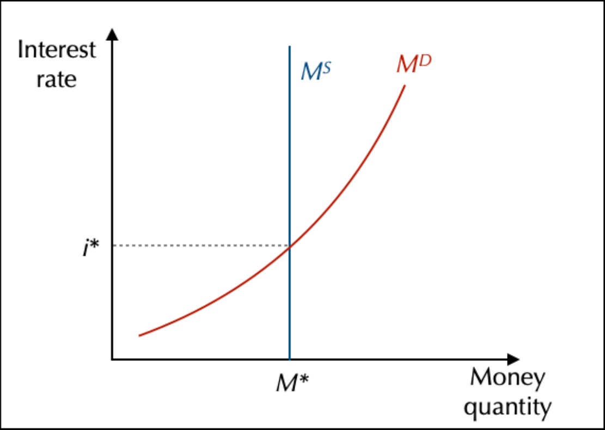

# ♻️ Markets in a closed economy without State

## The goods and services market

### The composition of GDP

GDP is a measure of production in a certain period of time (we usually look at a year, sometimes a trimester/quarter). 

It's not an indicator that existed when neoclassicism wanted to use it, but it's around the same idea of measuring Wealth. GDP is noted $\gamma$ as $P$ means price.

**How is the GDP computed?** 4 elements are took into account:
1. Consumption $C$
	- Largely by households 
2. Investments $I$ 
3. Publiques  expanses $G$
4. Exchanges with the world (Imports $M$/Exports $X$)
5. Stock variations (machine consumption by time)

$$\gamma = C + I + G + (X - M)$$

*With a close economy, no $G$, $X$ and $M$.* This equation is a expenditoipjapz approach of the GDP

### The goods and services market analyses from the perspective of production

**How firms produces ?** First, you need money, as you can't produce without any starting point. In French, we talk about *Marchés des fonds traitables*. Money is one of these markets. Money is a fully certain financial asset that brings no incomes. In this case, it's an exchange between loaners and borrowers including an interest to the loaner ($r$ for the real interest or $i$ for the nominal interest rate). 

Value added is an indicator to mesure Wealth by productive units. Idea that value added I created and not every one participating in the production process. To compute it, you will look for the revenue (P * Q) minus productions units from other companies (also called **intermediate consumption**).  $VA = CA - CI$

As it only mesure the wealth created by the country (and count it one only time), it's broadly a way to compute the GDP

$$GDP ≈ \sum VA$$

## Financial markets

### A simple financial market: money

Money needs to be **neutral** and **confidance**. More money means more transactions and so more money. So, the demand of money depend on the production. $\frac{M^D}{P} = f(\gamma) => M^D = f(\gamma, P)$ 

Trust brings neutrality

Typically, the demand of money is endogenous (because it depends on factors, while exogenous means not depending on the evolution of economy).

Money supply is exogenous, at a fixed supply. Salary can increase as same as prices, and so change nothing. So state interventions are useless (Say's Law).
### Are cryptocurrencies going to replace money?

Inflation make money not trustable. Crypto isn't a currency, it's an **asset**. It's only created by **mining**. 

To have a currency, you need 3 main options :

1. **Store of value** : 
2. **Accounting unit** : price are defended and stables
3. **Medium of exchange** : you need to be able to use it

So maybe, but they will be not our actual crypto which would be real currencies and not assets.
## The labour market

### Real wage and the construction of supply and demand on the labour market
> *Labor or Labour, both fine*

Most of what is happening is depending of what workers want. In the neoclassical theory, workers are a pillar. They are seeking **purchasing power** coming directly on **salary & prices** ($R = \frac{W}{P}$). Labor supply means that workers offers work to firms (and not the opposite). Some peoples only want to work if the real wages is big enough. Firms want to pay the lowest salaries possible.So, if the real wages is high, then their salary demand will be low. If the price of labor is too high, they will use capital. It's a trade-off between real wages and real interest rates. *Cheaper one wins.*
### The equilibrium on the market and its implications

This shows that, for neoclassical, **unemployment** is **voluntary**.