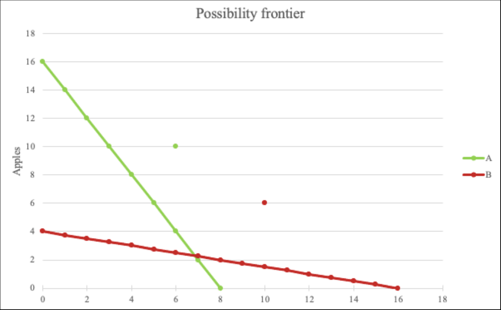

# 🏦 State’s intervention and exchanges with the rest of the world
## The consequences of public intervention on neoclassical markets

### The notion of surplus

> DOC

### The question of intervention on the goods and services market: the example of the tax

> DOC

### On the labour market: the State’s intervention causes unemployment

> DOC

## International trade

### Principles of international trade

We already saw what are exports. Net exports = Value of country's exports − Value of country's imports. We also says that net export is **trade balance**. If net exports are positive, you have a **trade surplus**. Else, you have a **trade deficit**. *Mercantilit's goal is to get a trade surplus*. If it's around 0, it's a **trade balance** (but that would be a perfect scenario my lord). 

### Exchanges with the rest of the world

Ricardo say that you always have an interest to trade internationally. Taking an example with two countries, producing the same products but with a different time : for the same hours of works, you produce more pears/apple and so should look Howard it. If you produce more one thing, the price will be lower, and so other countries have interest into buying it from you. 

Same productivity & same demand lead to same price. Here, exchanges benefits from everywhere and one apple equals one pear.
### The flow of financial resources with the rest of the world

## The circular flow of income

### Building the circular flow of income

### Practicing: exercises