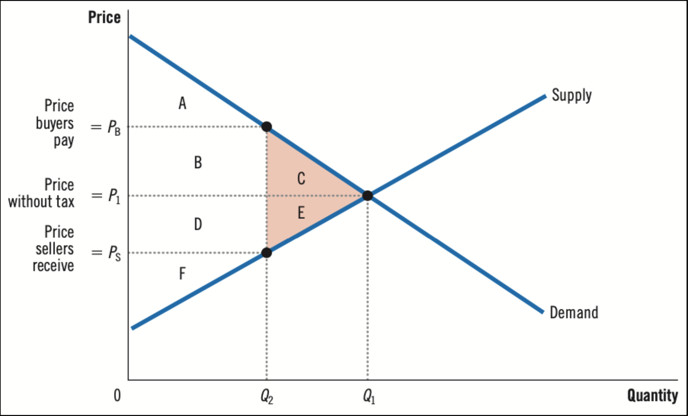
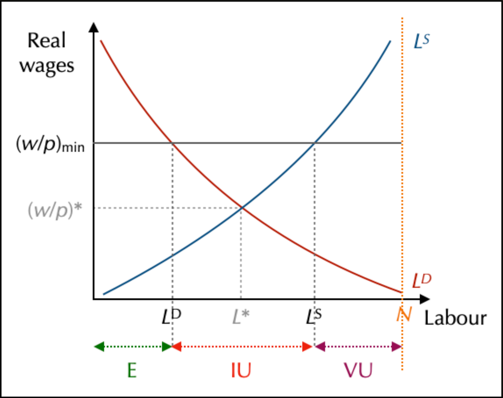
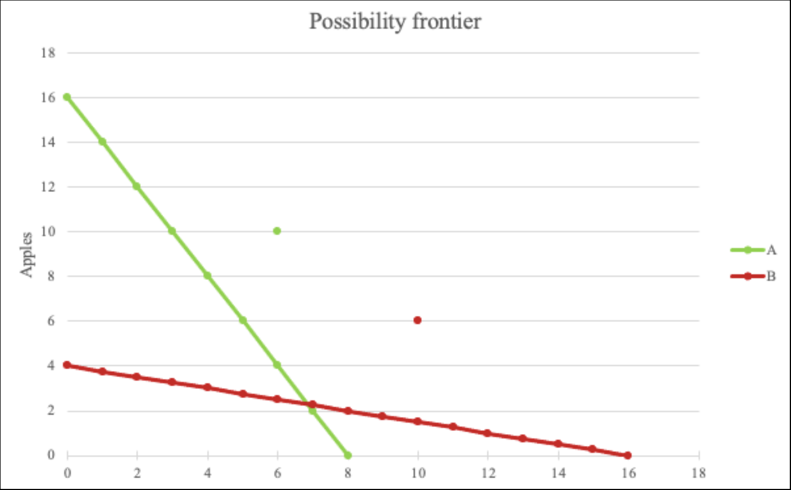
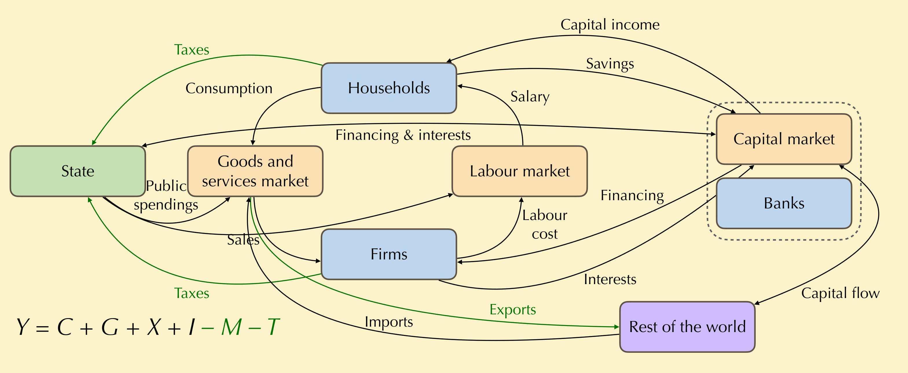

# 🏦 State’s Intervention and International Trade

## Consequences of Public Intervention

### The Notion of Surplus

Alfred Marshall explains that **Surplus** is the difference between what a consumer is willing to pay and the market price (Consumer Surplus), or the difference between the market price and the producer's willingness to sell (Producer Surplus).
Graphically, it is the area between the curves and the equilibrium price. **Surplus is maximized at Equilibrium**.

### Taxes and Deadweight Loss

> Perte Sèche

When the State imposes a tax, it increases the price paid by consumers and decreases the price received by producers. This reduces the quantity exchanged.
Result: A loss of total surplus called **Deadweight Loss**.
Neoclassicals generally oppose such interventions as they reduce market efficiency.



### Minimum Wage and Unemployment

On the labor market, if the State sets a **Minimum Wage** above the equilibrium wage:
-   **Supply of Labor** (Workers) increases.
-   **Demand for Labor** (Firms) decreases.
-   **Result**: Unemployment (Excess supply).



## International Trade

### Trade Balance

**Net Exports ($NX$)** = Exports ($X$) - Imports ($M$).
-   $NX > 0$: **Trade Surplus** (Mercantilist goal).
-   $NX < 0$: **Trade Deficit**.
-   $NX = 0$: **Balanced Trade**.

### Comparative Advantage (Ricardo)

David Ricardo argues that countries should specialize in producing goods where they have a **Comparative Advantage** (lower opportunity cost), even if they are less efficient than others in absolute terms.
By specializing and trading, both countries can consume more than they could in autarky (closed economy).



### Financial Flows

In an open economy, capital also flows across borders.
-   **Foreign Direct Investment (FDI)**: Long-term investment (e.g., building a factory abroad).
-   **Portfolio Investment**: Buying stocks or bonds of foreign companies.

## The circular flow of income

### Building the circular flow of income

We are still following neoclassical ideas. Here, the Financement is the Investment, which are new capital minus existing ones. Without the capital market, you can only improve production by having more population. By collecting the **savings** from the households, more money can be injected in the economy. 


State can exist thanks to theses conditions:
1. It's the one which have the monopoly on taxation : **taxes** on products,**impositions** on salaries and **social cotisations** for social security systems such as assurances.
2. It also have military monopoly, which are needed to not be overtaken (logic)..

Sometimes, States don't have enough money to assure their policies : you can buy state's debt to get interest. 
### Practicing: exercises

> DOC 7

1. **Closed economy:**
	1.  $\gamma = C + I + G + (X - M)$[^1] (but X and M are ignored, as we are in a closed economy)
	  $\gamma = 1,500 + 4,000 + 2,000 = 7,000$
	2. $\gamma = C + S + T \Longrightarrow T = 1,000$[^2] 
	   $? = S - I = 2,500 - 2,000 = 500$ ou   $? = (G - T) = 1,500 - 1,000$ It's the fiscal balance (solde budgétaire). Here, as it's positive, it's a fiscal deficit.
	   (G - T) < 0 = S, (G - T) > 0 = I
	3. $H = \gamma - C$
	   $F = C + I + G - \gamma$
	   $S = T + ? - G$
	4. Here, Households pays for the fiscal deficit (and firms investments). 
2. **Self-financing**
	1. 
	   ```mermaid
	   flowchart LR
	    %% === Nodes ===
	    S[State]
	    H[Households]
	    F[Firms\nSf]
	    B[Banks]
	    
	    %% Basics flows
	    H -- C --> F
	    S -- G --> F
	    B -- I --> F
	    H -- T --> S
	    F -- Y --> H
	    
	    %% Self-financing flows
	    F -- Div --> H
	    H -- Sh --> B
	    F -- W --> H
	   ```
	2. $\gamma = C + I + G = 7,500$ ou $\gamma = W + Div + S_F$ ( donc $S_F = 900$)
	   **Incoming flux are equals to outgoing flux**	   
	3. $\pi = Div + S_f = 2,700$
	4. $S = S_H + S_F \Longleftrightarrow S_H = 1,600$
	5. $\frac{S_F}{I} = \frac{900}{2,000 + 900} = 31$%
	   -> *How much investment is coming from firms?*
1. **Open economy**
	1. $\gamma = C + I + G + (X - M)$ so
	   $M = C + I + G + X - \gamma = 900$
	   $\gamma = C + S + T \Longleftrightarrow S = 3,100$
	   $B_B = G - T = 500$
	   $B_M = X - M = 600$, trade surplus
	2. $S - I - (G - T) - (X - M) = 0$
	   $\Longleftrightarrow S = I + (G - T) + (X - M)$
	   $\Longleftrightarrow 3,100 = 3,100$
	3. Only the Sate is doing sh∗t. $S - I$ > 0 so the whole country is not loosing money
	4. $i$ is too high, there i s too much savings in this economy, central banks (money authorities) needs to lower it.

[^1]: Production approach

[^2]: Expenses Approach
