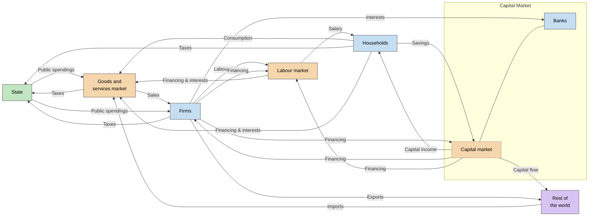

# 🏦 State’s intervention and exchanges with the rest of the world

## The consequences of public intervention on neoclassical markets

### The notion of surplus

Marshall explain that the **surplus** is the **difference between the customer is willing to pay and the market price**. It resolve around the *utility* notion. For a producer, it would be a higher price than the one he was *willing* to sell. At a graphic level, this would be the *area* under the Equilibrium (for producers) and after the Equilibrium (for consumers). Surplus is maximum at Equilibrium. 

### The question of intervention on the goods and services market: the example of the tax

We now saw with Marshall the notion of surplus. What append when the state make an intervention. You have lower consumption and so lower production

On the end, you **loose** surplus. Political implication : neoclassical follows Liberalism.

### On the labour market: the State’s intervention causes unemployment

On the labor market, in the neoclassical analysis, applying a minimum wages will create unemployment : firms are the one demanding offer, so a higher wage mean less worker demand. 

*Nothing append if the minimum wage is under the equilibrium wages.*

## International trade

### Principles of international trade

We already saw what are exports. Net exports = Value of country's exports − Value of country's imports. We also says that net export is **trade balance**. If net exports are positive, you have a **trade surplus**. Else, you have a **trade deficit**. *Mercantilit's goal is to get a trade surplus*. If it's around 0, it's a **trade balance** (but that would be a perfect scenario my lord). 

### Exchanges with the rest of the world

Ricardo say that you always have an interest to trade internationally. Taking an example with two countries, producing the same products but with a different time : for the same hours of works, you produce more pears/apple and so should look Howard it. If you produce more one thing, the price will be lower, and so other countries have interest into buying it from you. 

Same productivity & same demand lead to same price. Here, exchanges benefits from everywhere and one apple equals one pear. **They couldn't get these benefits with a closed economy.**

*What append if a country sucks at everything?* For neoclassical, countries should also opened themselves in theses situations : the better country will still specialize imself and so buy more pears. 

### The flow of financial resources with the rest of the world

In an open economy, they can not only take place in labor and goods market but also in financial markets. Let's take an example of a US resident, with a revenue of $30.000. They could use this money to buy a Toyota car or even **stock** (financial product like **shares**) from Toyota's corporation. An open economy not only open to the import and exports of goods, but also *of capital flows*. The net capital outflow is purchase of *foreign assets* by domestic residents minus the purchase of *domestic assets* by foreigners. We difference these, **Foreign Portfolio Investment** from **Foreign Direct Investment** — which could be a french company that will invest himself in another country (Louis Vuiton Singapore example.)

## The circular flow of income

### Building the circular flow of income

We are still following neoclassical ideas. Here, the Financement is the Investment, which are new capital minus existing ones. Without the capital market, you can only improve production by having more population. By collecting the ÉPARGNE from the households, more money can be injected in the economy. 

State can exist as It's the one which have the monopoly on taxation : **taxes** on products,**impositions** on salaries and **social cotisations** for social security systems such as assurances. Second condition : military monopoly, which are needed to not be overtaken (logic). Sometimes, States don't have enough money to assure their policies : you can buy state's debt to get interest. 
### Practicing: exercises

> DOC 7

