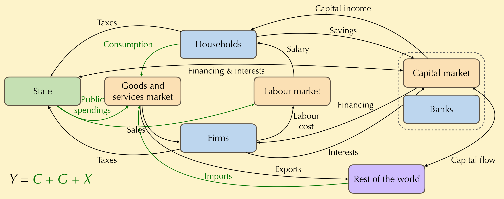
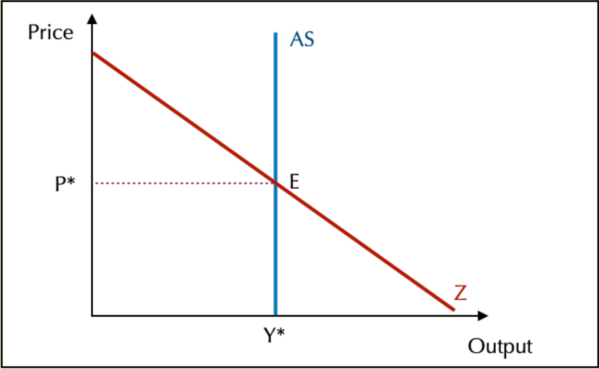
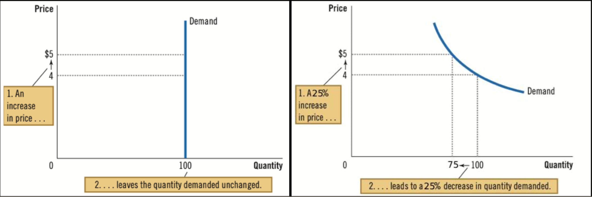
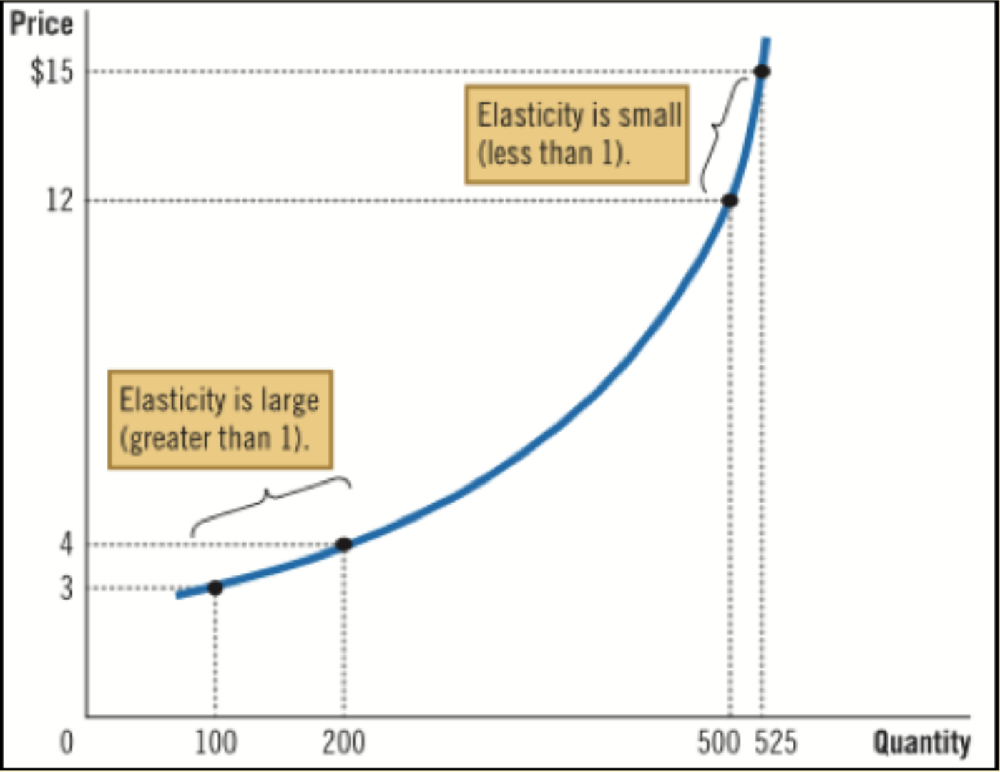
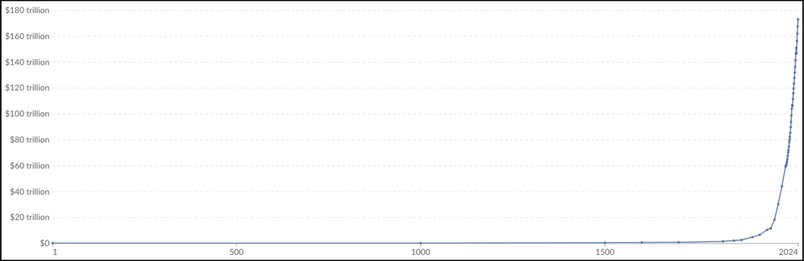
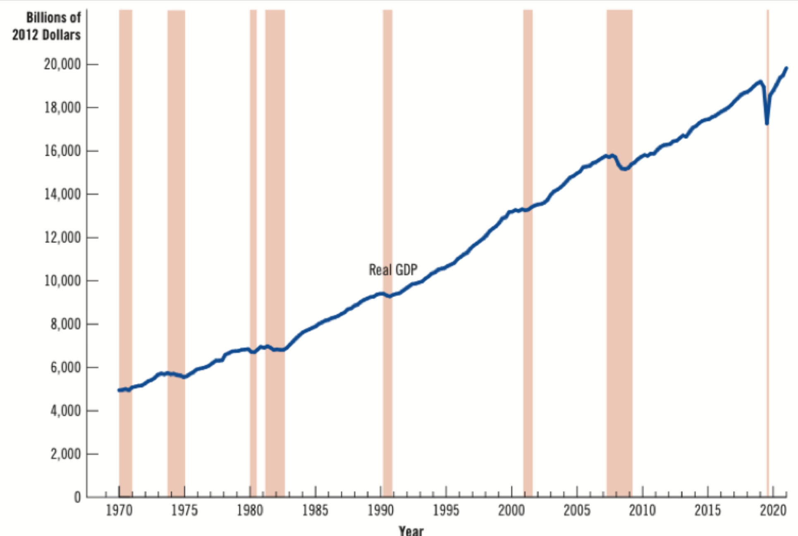

# ⚖️ The equilibrium and its fluctuations

## Economic fluctuations

### Aggregated demand and supply and the equilibrium

**What are Economic fluctuations and what are their impacts?**
We can compute the equilibrium by using the circular flow of income — on the last graph, no money is lost. You have four markets here. 

#### Time in economy

Here is some time 

- TCT : < 1 years
- CT (Short Run) : <2 - 3 years
- MT (Medium Run) : 5 ~ 8 yeas
- LT (Lon Run): 10 ~ 30 years
  TLT : ~ 50 ans (no models possibles)

#### Short Run Equilibrium

Here, we will start by the aggregated demand using the circular flaw of incomes. It comes directly from the goods and services market (all the requested goods & services), which are all the arrows going *to* the Goods & Services market. But firms also demands for investments and labour. Finally, State reduce the demand with taxes and importations reduce the demand Here, it's $Z = \gamma = C + I + G + (X - M)$

For the supply, the only arrow interesting here is the sales (because of Say's Law, little neoclassical reminder :).

The idea is that the demand will be higher as the price go lower. The aggregated supply only depend on saves (in the short run) and so is static (again, because of Say's Law).

AS stands for **Aggregated Supply** and AD for **Aggregated Demand**. Output is the GDP

*Contablement*, Aggregated Demand is the same as $\gamma$, which is the Consumption (C), but also the needs of the firms (Capital, Work, Biens intermédiaires). G is also demand, X is also demand. See Z.

> [!TIP] Furthemore...
> Depending on the trade's balance, the Z axes will be more or less sharp.

### Variety of supply and demand curves: the notion of elasticity

> [!DEFINITION]
> Elasticity is the mesure of reactions of an event on economy, how much buyers and sellers respond to changes to market conditions.

Let's imagine that price of gasoline completely blew up (cause of a random oil crises or a booming Chinea economy that wants *a lot* of it. Or taxes because it's fun). *How to respond to this shit?*  The easy answer is to says that less gasoline will be bough. But *how much* the demand will fall by? **Elasticity will help us answer this question.**

#### Elasticity for Demand (Price Elasticity)

> 🇫🇷 Élasticité prix

Since the quantities adapts to the prices levels, we will look on prices variations. If the demand dose not move that much after a price change, the product is said **inelastic**. On the opposite, it will be called **elastic**. This means that the demand's *courbe* will not have the same shape depending on psychological/sociological/tensions on consumers. Some pasterns are recognizable:

- Close substitues (bien plutôt substituables), if you can switch from apples to pears (*Competition*) -> **very elastic**. 
- Necessity goods (bien de 1ère nécessité) -> **inelastic**.
- Time horizon (horizon temporel) -> elasticity rise with times, as individuals adapt their habits.

Here is the example of graphs, with inelastic/elastic goods:

> [!TIP] Memory Tip
> The demand curve for inelastic goods looks like an **I**, like **I**nelastic!

For the flowing curves, here is the elasticity factor:
1. $\epsilon_p (d) = \frac{\Delta Q/Q}{\Delta P/P} = \frac{50/100}{1/4} = 1/2 = 0$
2. $\epsilon = \frac{\Delta Q/Q}{\Delta P/P} = \frac{25/100}{1/4} = 1$
When the proportion of quantity moves more over price, the elasticity is > 1. If's it a perfect 1, then it's a perfect (unit) elasticity. *The flatter the curve is at a given point, the greater the elasticity will be. The steeper the curve is, the less elastic the demand/supply will be.*

#### Elasticity of supply

It's the same rules as above, but with a different symbol. More quantity you bought, less impact the price change will have on you. Opposite for small quantities.

The curve is inelastic at the start as even with not so many workers, they will prefer to use capital and so not be impacted that much. At the opposite, if the cost of labour decrease, they will use it even more, to spend even less capital.

Sale thing for the worker; if you are rich, being a bit more rich isn't that much. But if you're poor, then even a little change could make a lot.

On the goods & services market, a lot of substitutions are possible, and so a lot of elasticity is possible everywhere, 

#### Document 8 (Correction)

A tax on production (**Corporate Income Tax**) means that corporations will have to sell less, as demand is lower (as price is higher) and so will resolve to less work force & capital and so, at the end, in a decrease of worker's salary/licensing. But if the equilibrium salary decrease, then the number of workers did. With the graphs, more workers where working in the first place, more the hit from the decrease of the labor needed will be HUGE.

A cut in the corporate tax would be a good idea — according to our graphs — but it doesn't mean it will work *for sure*. The benefits could be invested in Capital and not Work Forces, or not invested at all. If we take a look at the graphs we built earlier, if the demand is more impacted that the supply, then corporate owners win more than workers.

#### Perte de surplus

La taxe impacte une perte de surplus des producteurs et des consommateurs (voir [le cours précédent](g2.md#The%20question%20of%20intervention%20on%20the%20goods%20and%20services%20market%20the%20example%20of%20the%20tax)). Plus l'offre est élastique, la perte sèche (du surplus) est plus élevé. Si elle est inélastique, la perte est moindre (car le producteur prend cher)

(here, the variations are on the curb of demand)
## Global trends on growth and unemployment

### Growth over time

General *tendances* to keep in mind.

Growth is a quite recent phenomenal. And it is exponential. The first effects on growth by the industrial evolution is 1820. 

*But if we take a closer look...*

**SOMETIME THE GDP DECREASES !** And guess what: it always match with crises:

- 1970: first oil crises with war in middle east
- 1974: second one
- 1980: third one
- 2001: internet bulle
- 2007: sub primes
- 2019: Covid (my beloved)

This growth in **unstable**. We analyse growth **over time**. We need an increase **on the long term** (and so we look around on the long term).

Smith starts to look on growth ~ so it's a long time economics object.

Economists will not look at the nominal GDP but as the **real GDP** which take accounting of the inflation.

### Measuring the cost of living

*How could we mesure the cost of living?* We note $CPI$, (IPC, indice du prix à la consommation) a mesure of how much goods *types* are bought by a "*typical consumer*" and more importantly the evolution over time, and the impact of inflation. Here is an example on how it could goes :

1. We create a basket (2 hamburger and 4 hot-dogs)
2. We make survey around the country to check the price
3. We make a small little juicy delta to see how much it evolved

Real GDP = $\frac{Nominal GDP}{CPI}$

Real GDP will so decrease if CPI increase of Nominal PIB decrease (like any fractions).
### What link between growth and unemployment?

> [!WARNING]
> For all of this chapter, keeps in mind that it's **neoclassical** and so **deeply politically engaged**. They stands for No-State-Intervention