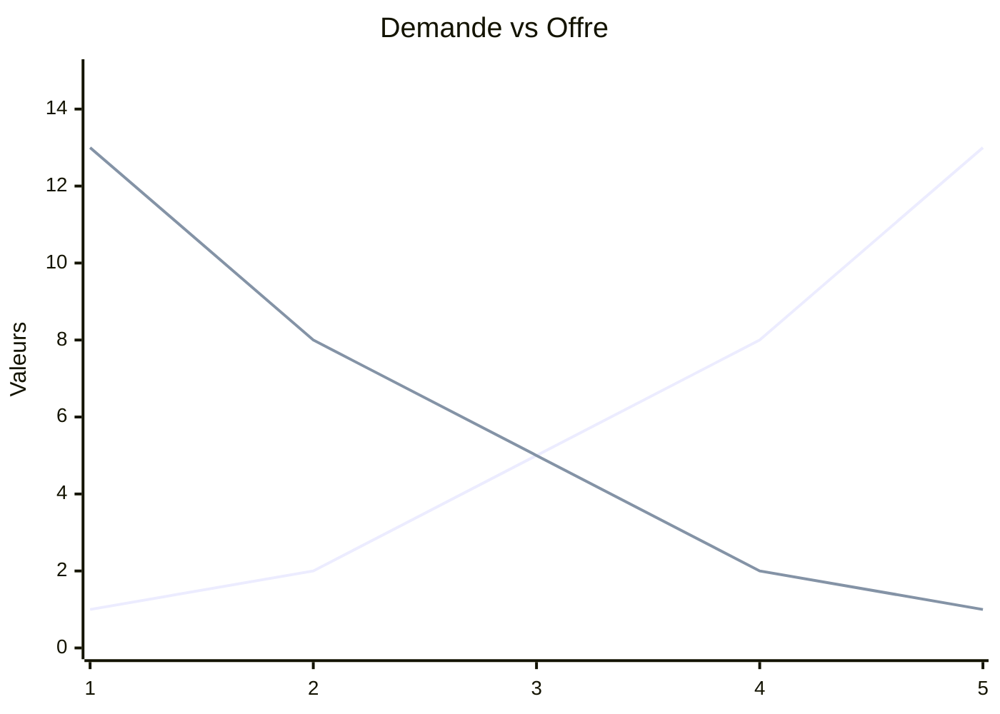

# 📘 Introduction

> [!TIP] English in sight !
> This class is in English (as the flag may indicate). All the courses and fishes will also be in english.

Economics try to understand how wealth is distributed.  It need simplifications, that's where models come in. Three approaches with a justification for modeling:

- **Inductive reasoning** : large empirical datas to build laws
- **Deductive reasoning** : build laws to create empirical datas
- **Constructivism** : scientific knowledge is always an interpretation of reality, which mean that no static truth exists (like [Montaigne's doubt](https://kerna.fiches.me/philo/ch1/g2)). No model can never fully reflect reality.

Neoclassicals have a more deductive approach. Heterodoxes are more on inductives reasoning.

Here is an example of a simple economic model (jittery because of fiches.me's code).

