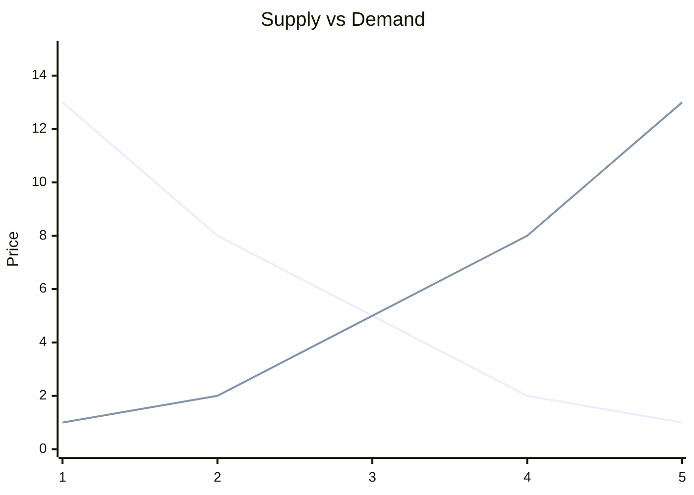

# 📘 Introduction

> [!TIP] English in sight !
> This class is in English. All the courses and notes will also be in English.

Economics tries to understand how wealth is distributed. It needs simplifications, that's where models come in. There are three approaches with a justification for modeling:

- **Inductive reasoning**: Using large empirical data to build laws.
- **Deductive reasoning**: Building laws to create empirical data (or predictions).
- **Constructivism**: Scientific knowledge is always an interpretation of reality. No model can fully reflect reality (similar to [Montaigne's doubt](https://kerna.fiches.me/philo/ch1/g2)).

Neoclassicals have a more deductive approach. Heterodox economists rely more on inductive reasoning.

Here is an example of a simple economic model:

