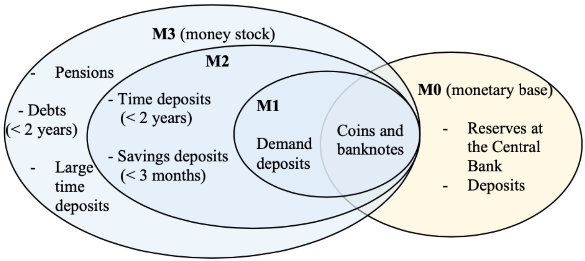

# 🤯 A new analysis of economic crises

## A new vision of global demand

### The effective demand

According to Keynes, the main driver of the economy is Investment. We already says that investment is mainly driven by anticipated demand, he will only inest if if thinks if his production is sold.

According to Keynes, the main driver of employment  is the factor cost, which can be or capital (user costs) or labor (wages). The *entrepreneur* will only employed if he thinks the proceeds of that employment will be effected to be worth it. 

The effective demand is a synonym of the anticipated demand, it's the one that should be realized if the *entrepreneur* wasn't wrong with his expectations. **It's the one that determine the level of production**, *not the observed one*.

Bad or unstable effective demand lead to unemployment.

Effective demand is finally lead by c, the **marginal propensity to consume**. 

Z = C + I, and as Investment is unstable, so effective demand become unstable too
*Z stands for Effective Demand.*

### The automatic stabilizers

Automatic stabilizers are a way to smooth the fluctuations (chocks) of an economy. Theses works with **proportional fiscality** : having T = tY

#### Document 6

1. 
    1. $Y = \frac{1}{1 - c} - cT + \overline{C} + \overline{I} + \overline{G}$. The Keynesian multiplier is $k = \frac{1}{1 - c}$
    2. $Y = \frac{1}{1 - 3/4} (1000 + 3000 + 4000 - 3000)$ = 20,000,
       $k = \frac{1}{1 - 3/4} = 4$
    3. $\Delta Y = k \times \Delta \overline{I} = 4 \times -300 = -1200$. The fiscal balance isn't changed.
2. 
    1. $Y = \frac{1}{1 - c (1 - t)} + \overline{C} + \overline{I} + \overline{G}$
    2. $k = \frac{1}{1/4 - (1/4 \times 1/5)} = 2,5$
    3. $\Delta Y = k \times \Delta \overline{I} = 4 \times -300 = -1200$. The fiscal balance is changed.

|                                                 | Y      | C      | I     | G     | T or tY | Fiscal Balance |
| ----------------------------------------------- | ------ | ------ | ----- | ----- | ------- | -------------- |
| ***Initial situation with fix taxes***          | 20,000 | 13,000 | 3,000 | 4,000 | 4,000   | 0              |
| ***New equilibrium with fix taxes***            | 18,800 | 12,100 | 2,700 | 4,000 | 4,000   | 0              |
| ***Initial situation with proportional taxes*** | 20,000 | 13,000 | 3,000 | 4,000 | 4,000   | 0              |
| ***New equilibrium with proportional taxes***   | 19,250 | 12,550 | 2,700 | 4,000 | 3,850   | -150           |

## How to regulate the economy

### Principles of the monetary policy

Sometimes, the economy is *really* in crisis. State **has** to do something: It's the Keynes Policies.

A monetary policy have 2 aims:
1. Have prices be stable and confident money inside the country — *Internal*
2. Have money stocks be stable (outside the country) — *External*

One of the solution is **money creation**. You can have 2 different money types, such as:
- Central Bank Moneys (Central Banks to Second Tier Banks)
- Current Money (banks to everyone else)

The way money creation work is trough scriptural money (in opposition as fiat money, physical money where the value granted by one asset is less than the production cost).

*L'Euro est la seule monnaie autorisé en France.*

Central bank accord money to sencond tier bank with a fixed interest rate *directeur*. Then, banks needs to fix their interest rate (*commercial*) to something at least equals to the ird, so it's not in deficit.

Monetary policy  is based on the fact that banks, even if their are capable of creating money, need central bank money to allow the withdraw of banknotes. Deposit interest rate enables commercial banks to honor money transfers.
To destroy money, second tier bank can... reimbourse their depts.

*But do money stock comes from money base or the opposite?*
#### Neoclassical approach: monetary multiplicator
Central money determines money mass ($k \times M0 = M3$). Friedman. Money is exogenous
#### Keynesian approach: monetary divider
Contrary, M3 -> M0, $M3 = \frac{M0}{k}$, money is endogenous

Keynes thinks that in this situation, i you make something in the money market, this will not have impact on M3, as they think the opposite. Global interest rate can have an impact on investment, but for him it's not sure, for 3 main reasons:

1. *Context of his time:* at the time (Great Depression), the interest rate was already low. If you reduce it even more, you risk to make your money not valuable.
2. Contrary to a popular belief, monetary policy could worsen inflation, even deflation.
3. Liquidity trap (trappe à liquidité

The idea of monetary policy is to increase investment. You can stimulate investment, but sometime it will not work, so you need to be carefull. You can also stabalize economy. But it's always not sure.
### The superiority of the fiscal policy

Keynes consider it as superior as it's way stable and predictable than monetary policies. It also acts on the poorest, so the ones that consume the most/
It's simply changing how states spent money or borrow taxes

Investment should be **socialized**. It must maintain a level of investment to not impact the production. It's kind of an idea of nationalization, while not being definitive (no communism here).

If we thing with the Keynesian cross, a fiscal policy will increase production and so employments 

Haavelmo says that an increase of public spending by taxes will lead to a k = 1. But, if the taxes can *épargner* the poorest, you can stimulate the economy and have a k > 1. 