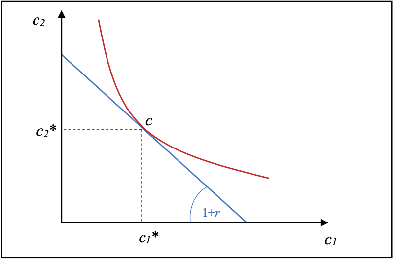
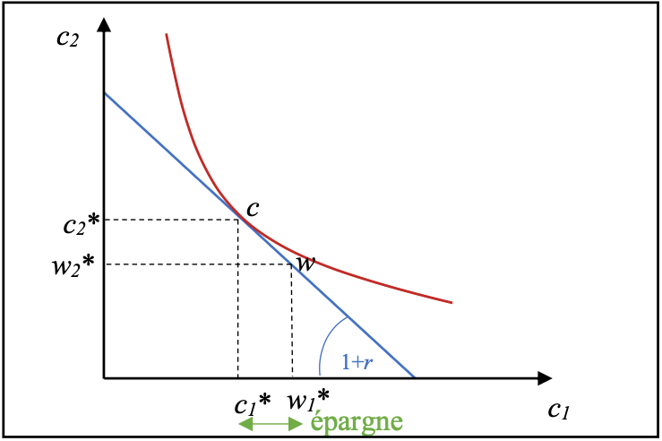
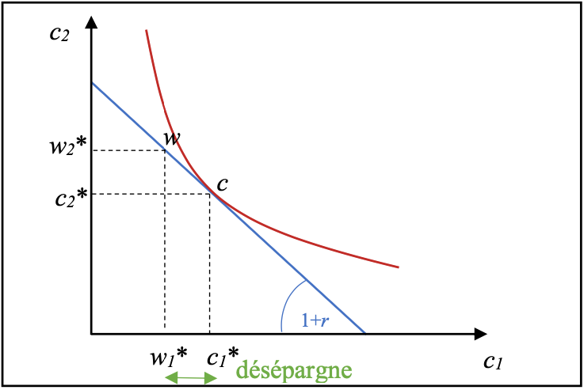

# Analyses néoclassiques et keynésiennes de l'arbitrage consommation/épargne

## L'Analyse néoclassique intertemporelle

En 1930, Fisher publie un ouvrage, <u class="red-underline"><strong>Théorie de l'intérêt</strong></u>, qui réfléchit sur le taux d'intérêt, lequel symbolise en quelque sorte le prix du temps. Il introduit l'idée d'épargner et de désépargner. C'est un modèle très important car c'est **le premier à lier la consommation et l'épargne.**

Comme tous les néoclassiques, il part de S = I. Il n'y a donc aucun excès d'épargne, **aucune sur-épargne** dans le modèle de Fisher. Une forme d'épargne est improductive : la thésaurisation. Les néoclassiques tendent à exclure ce cas de leurs analyses (argument de Say) et considèrent donc une épargne « équilibrée » qui trouve toujours un investissement correspondant. Il cherche à comprendre les **préférences individuelles d'épargne**. Les consommateurs sont majoritairement contraints par le temps : il n'est pas possible de consommer excessivement aujourd'hui sans disposer des ressources nécessaires. Il propose alors l'équation de Fisher :

$$ i = r + \pi^e$$

où $i$ est le taux d'intérêt <u class="wrong-underline">nominal</u>, $r$ est le taux d'intérêt <u class="wrong-underline">réel</u> et $\pi^e$ l'inflation espérée (**anticipée**).

### Consommation présente et consommation future

La contrainte temporelle est ici abordée d'un point de vue **monétaire**. Il considère que les consommateurs préfèrent **consommer aujourd'hui** : la consommation procure en général plus d'utilité dans le présent que dans le futur. Le consommateur décide donc quand et quoi consommer en comparant coûts et avantages. Si la désutilité engendrée est plus faible que l'utilité attendue, il achète ; sinon il attend.

### L'effet de substitution et la contrainte budgétaire

On peut alors tracer des courbes d’indifférence, qui relate du choix entre des-utilité/utilité, et il faut donc être le plus éloigné du 0 (saturer la contrainte budgétaire) et un niveau de satisfaction élevé. C'est donc l'unique jonction entre la courbe d'indifférence et la courbe de consommation qui montre la consommation parfaite.
Prenons comme exemple un ménage qui consomme à deux moments différents. Le revenu total vaut $w_1 + w_2$ et la consommation aux périodes 1 et 2 est $c_1$ et $c_2$. À la fin de la période 2, il peut épargner le reste ($w - c$). Si $c_1 > w_1$, il s'endette et devra rembourser cet emprunt à la période 2 ; si $c_1 < w_1$, il épargne. Il peut théoriquement emprunter une somme équivalente à

$W = \frac{w_1 + w_2}{1 + r},$

qui traduit le budget total actualisé à la période 1. C'est le principe de l'**actualisation** : la valeur actuelle dépend du **taux d'intérêt**.

On peut alors tracer des courbes d’indifférence qui rendent compte du choix intertemporel entre désutilité et utilité. L'équilibre de consommation est le point de tangence entre une courbe d'indifférence et la contrainte budgétaire.

Plus on est éloigné de l'origine, plus la courbe représente un niveau d'utilité élevé. La courbe qui touche une seule fois la droite budgétaire correspond à l'équilibre de consommation.

Cela nécessite un ajustement : il est très rare que la consommation à une période soit exactement égale au revenu.

	
	

Sur la figure 1, $w_1 > c_1$, on crée une épargne qui sera dépensé à la période 2.
Sur la figure 2, $w_1 < c_1$, on désépargne (emprunte) puis on rembourse à la période 2.

*Mais ce n'est pas fini !* Et si le taux d'intérêt augmente ? La contrainte budgétaire se modifie (la valeur actualisée diminue). La variation du taux d'intérêt implique un effet de substitution entre la consommation présente et la consommation future : si le taux augmente, la consommation présente tend à diminuer au profit de la consommation future, et inversement. **C'est l'effet de substitution.**

La consommation est ici analysée pour comprendre l'offre et non la demande (dans la logique néoclassique). **Dans tous les cas, les consommateurs consomment.** À la fin de la deuxième période, tout est consommé.

## Le modèle keynésien et ses reformulations

### Des énigmes empiriques sur la fonction de consommation

La fonction de consommation keynésienne semble instable. Jan Tinbergen travaille en 1938 pour la Société des Nations (ancêtre de l'ONU) et a eu accès à des séries de données plus fiables, notamment pour les États-Unis. Il se lance alors dans de **l'économétrie**, l'application des méthodes statistiques à l'économie.

Lors de certains épisodes (par exemple autour de la guerre de Corée), on observe des anomalies empiriques : la relation entre revenu et consommation n'est pas toujours claire.

Petite précision : il existe deux types d'études en économétrie :

1. Les **séries temporelles/chronologiques**, qui regardent les fluctuations au cours du temps ;
2. Les **coupes instantanées**, qui s'intéressent à un moment donné (par exemple : comment le PIB varie entre les États-Unis à un instant donné).

Les séries courtes suggèrent que la fonction de consommation de Keynes peut être raisonnable, tandis que les séries longues montrent davantage de variations. C'est problématique car le multiplicateur keynésien dépend de $c$ et ses estimations peuvent être peu fiables.

Le modèle prévoit trop d'épargne. Chaque année, les fonctions de consommation sont différentes. **On ne peut donc pas bien prédire l'avenir.** 

Dans les séries longues, Kuznets (créateur du PIB), estime la fonction de consommation moyenne depuis 1869. Il trouve $C_t = 0.86 Y_t$. Elle permet d'avoir une idée de la valeur du multiplicateur. Cependant, c va tout de même varier au fil du temps. Or, on devrait alors consommer moins et épargner plus. On trouve donc une décroissance de la propension moyenne à consommer.

Pour les coupes instantanées, Milton Friedman et Dorothy S. Brady réalisent des études (NBER). La propension moyenne à consommer $c$ se situe entre 0 et 1, mais son évolution dans le temps montre des déplacements et une certaine instabilité. **C'est ce qui justifie de nouvelles théories pour améliorer l'explication empirique.**

La consommation correspond à environ 60 % du PIB et contribue à une part importante de la croissance (autour de 30 %). De plus, la composition de la consommation permet d'identifier les secteurs dynamiques. L'épargne est ici souvent considérée comme le résidu, c'est-à-dire la part du revenu qui n'est pas consommée. Cette épargne est appelée épargne brute ; une partie de l'épargne investie se retrouve dans la formation brute de capital fixe (FBCF), notée $I$.

### Les reformulations keynésiennes

**James Duesenberry** va proposer des reformulations pour corriger certaines imperfections de la fonction de consommation de Keynes. Une partie de l'effet s'explique par un mécanisme de cliquet : dans des phases de dépression, la baisse de la consommation est limitée. D'autres auteurs proposent des versions plus souples de l'équation, par exemple :

$$C_t = c \times \large{y}\normalsize_t + a \times C_{t - 1} + \bar{C}$$

Où $0 \le a < 1$. À long terme, c'est le petit a qui augmente, car on apporte plus d'importance aux consommations passées. À long terme, on revient à $C = c \times \large{y}\normalsize + a \times C + b$.

Les ménages ne regardent pas seulement leur propre revenu : chaque individu compare sa situation à celle d'un membre d'une classe supérieure. La propension à consommer peut varier selon le type d'étude (coupes instantanées vs séries temporelles). La mixité sociale renforce cet effet.

**Les biens ne sont pas uniquement consommés pour leur usage, mais aussi pour leur symbole (grand exemple : Starbucks).** C'est très proche de l'analyse de Thorstein Veblen.

 
