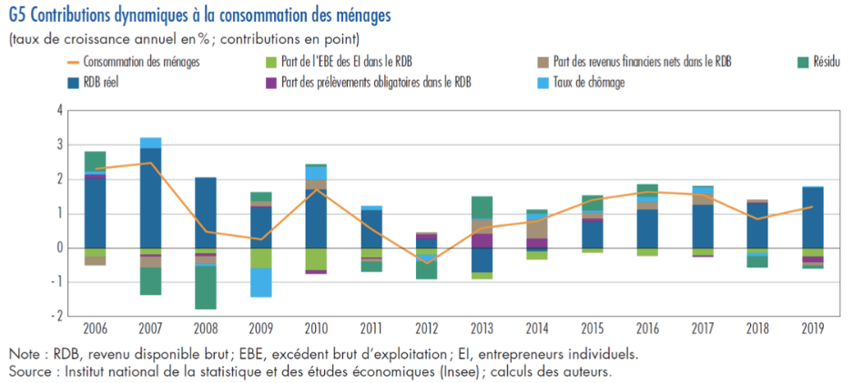
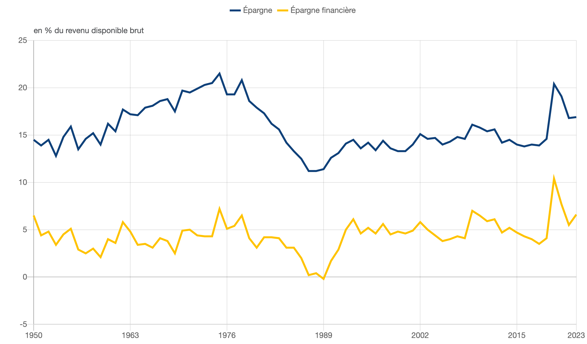
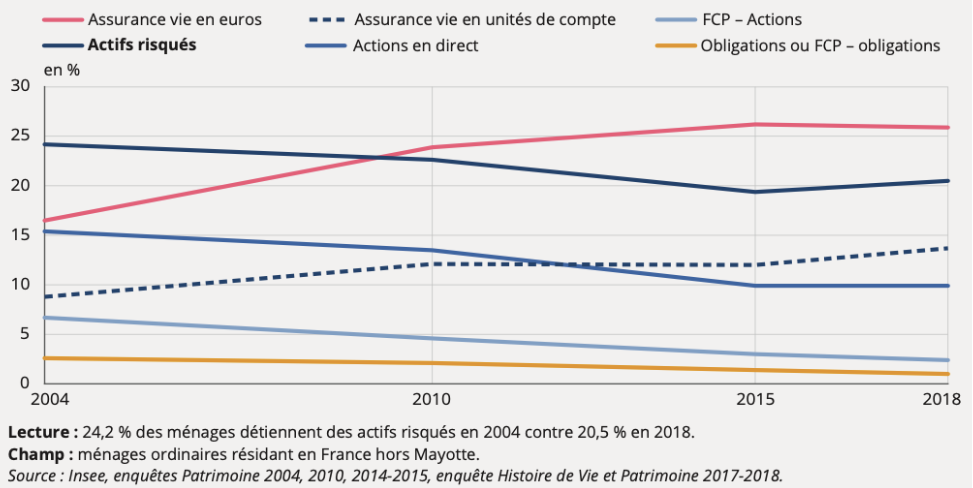

# Les grandes évolutions de la consommation et de l’épargne

Après beaucoup de théories empiriques, nous allons observer l'évolution de la consommation et de l'épargne au fil du temps.

## Les « lois » de l’évolution de la consommation

### Les lois d’Engel

Adolphe Quételet publie des travaux dès 1835 sur la possibilité de lois sociales générales. Il dirigeait le bureau de statistique générale, l'ancêtre des administrations statistiques modernes. Engel, en Prusse, entreprend une étude similaire pour le royaume de Saxe : il analyse le budget des ménages et la façon dont ceux-ci gèrent leur argent. Il utilise à l'époque la **statistique morale** pour classer et catégoriser les dépenses.

Cependant, la statistique publique était alors peu développée. Engel s'appuie sur des données d'autres auteurs et cherchait notamment à vérifier ou infirmer les thèses malthusiennes.

> « Pour maximiser la quantité de produit sur un territoire donné, il faut que la répartition de la population active entre les divers secteurs économiques ne soit pas laissée au hasard mais s’inspire du budget des ménages. Si 70 % du budget moyen sont consacrés à l’alimentation, 70 % de la population active doivent se trouver dans l’ensemble des secteurs qui produisent et distribuent la nourriture et la boisson. »

La loi de Malthus n'est vérifiée que si les individus s'enrichissent sans produire.

Carroll Wright reprend et prolonge les travaux d'Engel et formule d'autres lois empiriques sur l'évolution de la consommation selon le revenu :

1. La part du revenu dépensée pour les vêtements reste à peu près constante, quelle que soit la richesse.
2. La part du revenu consacrée au logement varie peu en fonction du niveau de revenu.
3. Les dépenses non essentielles (loisirs, voyages, éducation, santé) augmentent avec le revenu.

Maurice Halbwachs observe des régularités similaires en France au XXe siècle.

### Consommation et élasticité

Quand on observe l'évolution d'une variable par rapport à une autre, **on peut étudier une élasticité !** Ici, on appellera cette élasticité **élasticité-revenu**. 

King observe que lorsque la quantité de blé diminue, les prix augmentent, parfois de façon plus que proportionnelle.

La formule de l'élasticité-revenu est la suivante :

$$e_r = \frac{\Delta Q / Q}{\Delta R / R} = \frac{\Delta Q}{\Delta R} \times \frac{R}{Q}$$

> [!INFO]
> La formule est la même que l'élasticité-prix, mais avec un indice *r* (pour *revenu*).

Si $e_r < 0$, la demande décroît avec le revenu (biens inférieurs). Si $e_r = 0$, il n'y a pas de relation entre revenu et consommation pour ce produit. Si $e_r > 0$, la consommation augmente avec le revenu ; si $e_r \to +\infty$, la demande est très élastique.

| Loi d’Engel               | Principe                                                                                             | Élasticité-revenu |
| ------------------------- | ---------------------------------------------------------------------------------------------------- | ----------------- |
| 1ère loi d’Engel          | La part du revenu de l’alimentaire diminue lorsque le revenu augmente.                               | < 1               |
| 2ème loi d’Engel (Wright) | La part des dépenses consacrée aux vêtements augmente conjointement avec le revenu.                  | 1                 |
| 3ème loi d’Engel (Wright) | La part des dépenses liée au logement est indépendante du niveau et de la variation du revenu.       | 0                 |
| 4ème loi d’Engel (Wright) | La part des dépenses en services accessoires et non primaires augmente avec l’augmentation du revenu | > 1               |

Quand $e_p > 0$, on a :
- Les **biens de Giffen** (de première nécessités, "biens inférieurs") où on substitue les autres biens à ceux-ci lorsque le prix augmente
- Les **biens de Veblen** (de luxe, "biens supérieurs")

On peut également calculer une **élasticité prix croisée** : dans le cas des biens de Giffen, il faut bien observer deux bien pour comprendre l'évolution des élasticité : 

$$e_{A/B} = \frac{\Delta Q_A / Q_A}{\Delta P_B / P_B} = \frac{\Delta Q_A}{\Delta P_B} \times \frac{P_B}{Q_A}$$

À noter que $e_{A/B} \ne e_{B/A}$. Avec deux variables, on distingue plusieurs cas :
1. Si $e_{A/B} < 0$, quand le prix de B augmente, la quantité demandée de A diminue : **biens complémentaires** (ex. voiture [A] et essence [B]).
2. Si $e_{A/B} > 0$, quand le prix de B augmente, la quantité demandée de A augmente : **biens substituables** (ex. pommes [A] et poires [B]).
3. Si $e_{A/B} = 0$, pas de corrélation : les biens sont **indépendants** (ex. ordinateur [A] et jouet pour chien [B]).
4. Si $e_{A/B} = e_{B/A}$ et $e < 0$, les biens sont **parfaitement complémentaires**.
5. Si $e_{A/B} = e_{B/A}$ et $e > 0$, les biens sont **parfaitement substituables**.

La qualité des données influence énormément ces calculs. Le choix du modèle est également important : il existe plusieurs méthodes pour estimer l'élasticité (regression linéaires/géométriques). Enfin, la temporalité compte : à court terme, l'élasticité est très peu importante.

Exemple : pendant l'inflation, des études de l'élasticité de la demande d'électricité montrent une élasticité faible sur le court terme, mais plus importante sur le long terme.

Il y a également des hypothèses importantes : tous les agents économiques sont supposés rationnels et avoir des comportements similaires.

Très souvent, les élasticités sont utilisées par les économistes d'institutions pour formuler des recommandations. Si la fonction de demande est plus précise, il est plus facile de calculer un multiplicateur keynésien. Dans les secteurs privés (bancaire), l'élasticité est aussi un enjeu. *La crise des subprimes illustre des erreurs d'estimation.*

## L’exemple français

### L’évolution de la consommation

On peut tout d'abord analyser la consommation des ménages en fonction de différents facteurs

RDB: Revenu disponible brut *réel* donc indexé à l'inflation
EBE: exédent brut d'exploitation, bénéfice des entreprises
EBE des EI: exédents des entrepreneurs (freelance, artisan), réinvesti donc ne contribue pas à la consommation des ménages (d'où le négatif)

On peut également étudier les parts de la consommation (Insee)

On se place sur un horizon plus long que le graphique précédent. Les produits alimentaires sont presque divisés par deux : [première loi d'Engel](#Les%20lois%20d’Engel). Mais, contrairement à la 3e loi, les dépenses liées au logement augmentent.

### L’évolution de l’épargne

Les chocs correspondent au crises financières.

### L’hétérogénéité des comportements d’épargne

D'après le document 3, la possession d'actifs financiers est liée au revenu (âge/position). L'acceptation du risque varie également selon le genre.

On observe une régularité des grands agrégats dans la statistique publique. Il nous manque cependant une analyse microéconomique plus détaillée.
