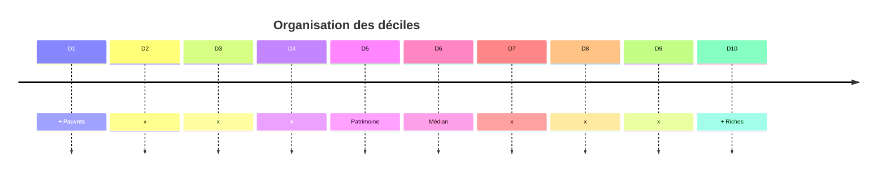
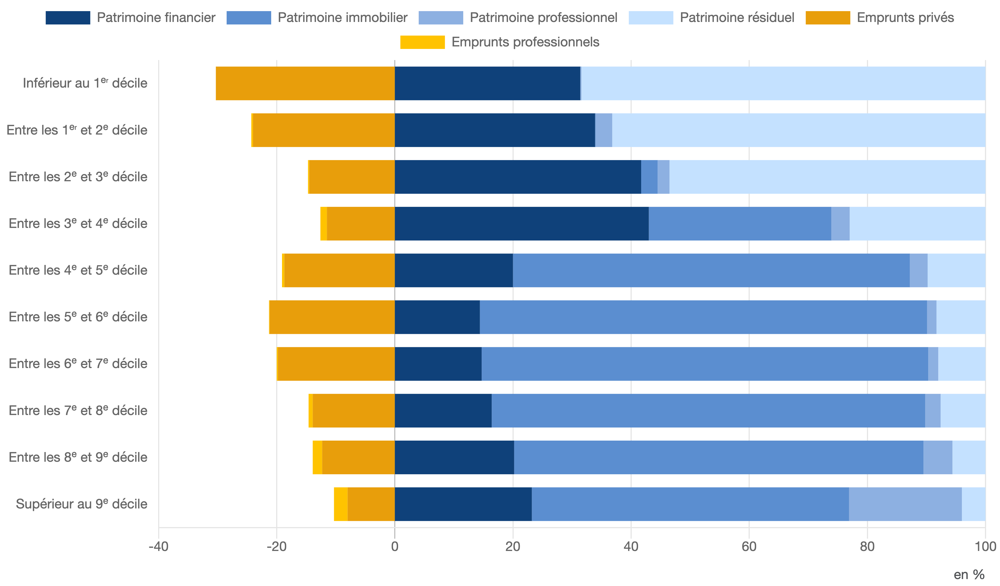

# 📘 Introduction

L'épargne et l'investissement sont des objets beaucoup plus complexes que ce que nous avons étudié précédemment. C'est un véritable enjeu à mesurer : *mais comment le mesurer ?*

La consommation et l'épargne *des ménages* sont au centre des problématiques économiques contemporaines. Elles sont souvent liées au pouvoir d'achat et à la sous-consommation.

C'est un débat clivant qui oppose souvent les keynésiens et les néoclassiques (partisans de Say).

Généralement, la part du PIB consacrée à la consommation est d'environ 60 %, assez stable, mais on observe parfois des ruptures inexpliquées.

**Comprendre la consommation, c'est comprendre comment concevoir des politiques économiques efficaces : faut-il relancer la consommation ?**

Il s'agit de comprendre **l'arbitrage consommation/épargne**.

Nous avons déjà vu, de manière sommaire, la consommation : la variable Y et la fonction de consommation de Keynes, mais rien de plus précis.

=> Document 1

La consommation comporte plusieurs sous-définitions :

## Consommation **durable / non durable**

La consommation **durable / non durable** est définie en fonction de la longévité des biens. Les biens sont classés dans les catégories suivantes :
- Biens durables importants : voiture, meubles
- Biens semi-durables : vêtements
- Biens non durables : aliments, énergie

## Consommation **marchande / non marchande**

Un bien est dit marchand si un profit est généré par sa production (les prestations non marchandes sont fournies sans but lucratif, comme certaines écoles publiques, ou correspondent à de l'auto-consommation, comme un potager).

## Consommation **intermédiaire**

Tous les biens et services utilisés lors d'un processus de production (exemple : du papier pour faire un journal). On oppose cette consommation à la **consommation finale**, calculée à la fin du processus de production.

## Consommation **effective** des ménages

C'est la consommation de tous les biens *et services* achetés par les ménages pour satisfaire leurs besoins. *C'est le principal agrégat utilisé en statistique publique.*

## Épargne

Il convient de distinguer dépense de consommation et consommation corrigée de l'inflation.

L'épargne est une variable de flux : on considère que l'épargne accumulée chaque mois s'ajoute au total détenu en banque. La sur-épargne est une variable de stock : c'est l'épargne déjà accumulée et non utilisée.

Une économie en bonne santé **dispose généralement de peu de sur-épargne**. En France, après 2020, on observe l'apparition d'une **épargne de précaution**. Il existe de nombreuses formes d'épargne : actifs financiers, immobilier, plans d'épargne (retraite), etc. C'est le **patrimoine des individus**. On analyse ici les **stratégies patrimoniales**.

## Déciles

Pour classer les personnes en fonction de leur richesse, on utilise les déciles.

Les plus défavorisés (les trois premiers déciles) n'ont généralement pas accès au patrimoine immobilier et empruntent davantage. On observe que, plus on monte dans l'échelle des revenus, plus l'épargne est optimisée.

La différence dans la quantité de patrimoine est importante. Le patrimoine des déciles supérieurs est beaucoup plus élevé que celui des déciles inférieurs (le patrimoine médian en France est d'environ 200 000 €). **Comment appréhender les choix d'épargne ?**
