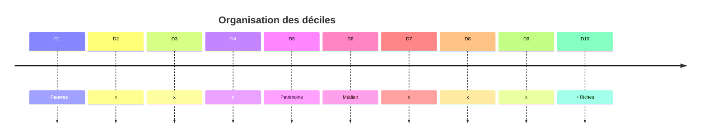

# 📘 Introduction

L'épargne et l'investissement sont des objets beaucoup plus complexes que ce que nous avons étudié précédemment. C'est un vrai enjeu à mesurer : *mais comment le mesurer ?*

La consommation et l'épargne *des ménages* sont au centre des problématiques économiques contemporaines. Elles sont souvent liés au pouvoir d'achat et à la sous-consommation.

C'est un débat clivant qui oppose toujours les keynésiens et les néoclassiques de Say. 

Généralement, la proportion du PIB consommé est comprise vers 60% du PIB, assez stable, mais on trouve quand même quelques ruptures qui restent inexpliqués. 

**Comprendre la consommation, c'est comprendre comment faire des politiques économiques efficaces: faut-il relancer la consommation ?**

On est dans l'enjeu de la comprehension de **l'arbitrage consommation/épargne**.

Nous avons déjà vu vaguement à quoi resemble la consommation : d'abord Y, puis la formule de consommation de Keynes, mais rien de plus précis

=> Document 1

La consommation a plusieurs sous-définitions :
## Consommation **durable/non-durable**

La consommation **durable/non-durable** est calculé en fonction de la longévité des biens. Les biens sont triés dans les catégories suivantes :
- Bien durables importants : voiture, meubles
- Bien semi-durables : vêtements
- Bien non-durables : aliments, énergie

## Consommation **marchande/non-marchande**

Un bien est dit marchand si un profit est généré par un produit (les productions non-marchandes produisent à perte, comme des écoles, où sans bénéfices, comme l'auto-consommation, les potagers). 
## Consommation **intermédiaire**

Touts les biens/services utilisés lors d'un processus de production (exemple : du papier pour faire un journal). On oppose cette consommation à la **consommation finale**, calculé à la fin du processus de production.
## Consommation **effective** des ménages

C'est la consommation de tout les biens *et services* achetés par les ménages pour satisfaire leurs besoins. *C'est le gros agrégea utilisé en statistique publiques.*

## Épargne

Il y a également une différence à faire entre la dépense de consommation et la consommation, qui prend alors en compte l'inflation. 

L'épargne est une variable de flux : on considère que l'épargne, chaque mois, est ajouté au total d'épargne en banque. La sur-épargne est une variable de stock : c'est l'épargne déjà stocké qui n'est pas utilisée.  

Une économie qui va bien **possède peu de sur-épargne**. On peut voir qu'en France, après 2020, on observe l'apparition d'**épargne de précaution**. Il existe également beaucoup de forme d’épargne, avec des actifs (boursiers, immobiliers), des plans d'épargnes (retraite), etc. 
C'est le **patrimoine des individus**.
On analyse ici donc les **stratégies patrimoniales**.

## Déciles
Pour classer les personnes en fonction de leurs richesses, on utilise les déciles. On coupe la quantité 

Les plus défavorisés (30%, D1, D2, D3) n'ont pas accès au patrimoine immobilier. Il emprunte également beaucoup. On observe également que plus on monte dans la richesse, plus l'épargne est optimisée. 

La différence de quantité de patrimoine est également clivante. Le patrimoine des D10 est d'environ 1.500.00€, contre 15.000 pour le D1 (le patrimoine médian en France est de 200.000€). **Comment appréhender les choix d'épargne ?**