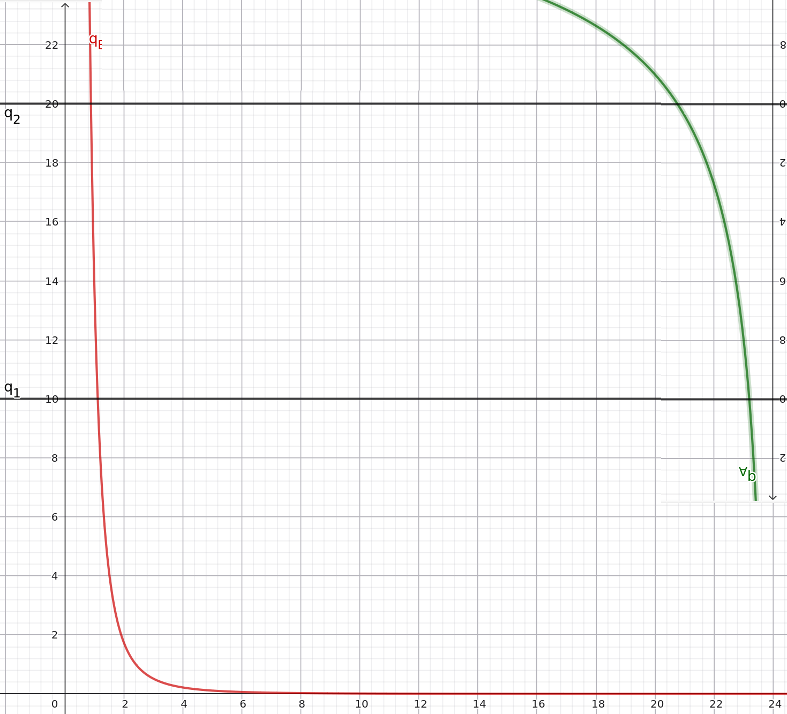

# La coordination des décisions individuelles dans une économie d'échanges purs

## Le modèle de concurrence parfaite, une solution possible au problème de l'échange

### Le problème de l'échange

Le modèle précédent est **basé sur l'échange**. Mais *comment émergent les prix* et *comment le gain à l'échange est partagé ?* 

Reprenons nos individus A et B de notre exemple. Ils possèdent tout les deux une fonction d'utilité et des dotations initiales, $u_A (q_1, q_2) = \sqrt{q_1} \times q_2$ ; $u_B (q_1, q_2) = q_1^3 \times q_2$ ; $Q_{0A} = (9 ; 6)$  et $Q_{0B} = (1 ; 14)$. $CI_A : q_2 = \frac{18}{q_1 ^ {\frac{1}{2}}}$ et $CI_B : q_2 = \frac{14}{q_1^3}$ 

On va regarder la quantité totale des biens A et B : $\bar{q_1} = q_1^{0A} + q_1^{0B}$ et  $\bar{q_2} = q_2^{0A} + q_2^{0B}$. **Comment A et B vont se coordonnées pour avoir un maximum d'utilité ?**

> [!NOTE]
> Contrairement aux stations parisiennes du RER, ce modèle set un monde de Bisounours ou il n'y a ni vol et ni violence. 

Nous allons utiliser le **diagramme d'Edgeworth** pour  représenter graphiquement deux courbes d’indifférences

> Imaginez le graphique complet, j'ai fait ce que j'ai pu

Chaque point naturel est un état réalisable de l'économie. Toutes les parties à l’extérieur (sous la courbe rouge/sur la courbe verte) sont désavantageuses et donc ne seront pas préférés. Toutes les parties entre les deux courbes (la **lentille**) sont des états **mutuellement avantageux** par rapport *au panier de dotation initial.*. 

$$\text{TMS}_A (Q_{01}) < \text{TEP} < \text{TMS}_B (Q_{0B})$$

Nous n'avons pas encore exploré une autre condition du modèle : **les agents n'échangeront tant que leur utilité peut être amélioré**. Les TMS vont se rapprocher jusqu’à $\text{TMS}_A (Q_{01}) = \text{TMS}_B (Q_{0B})$. *Cette équation forme la courbe des contrats.*

### Hypothèses du modèle de concurrence parfaite.

Mais il y a bien d'autres hypothèses sur ce modèle. Ce modèle utilise le **commissaire priseur**, il annonce les prix de tout les biens (et les prix sont tous connus). On appelle ce type de système **un système complet de marché** (*transparence de l'information*). C'est une hypothèse importante pour vérifier l'hypothèse d'un marché. Les agents sont également **price-taker**, ils pensent que le prix donné par le commissaire priseur ne peut pas être changé (*atomicité du marché*). Enfin, les agents économiques doivent croire que la quantitée de biens **est illimité** et qu'il n'y a donc **pas d’insuffisances**. Toutes les offres sont donc envoyé au commissaire priseur, qui annonce un prix qui annonce un prix. La demande revient vers lui : si la demande correspond à l'offre, il y a échange. Sinon, il n'y a aucun échange et un nouveau prix est annoncé

**=> Dans ce système, on se retrouve dans une 
CPP : Concurrence pure et parfaite** 

## Le choix du consommateur en concurrence parfaite

### Ensemble des consommations possibles.

Le consommateur envisage un panier de consommation $(q_1, q_2)$. Il tire son revenue de sa dotation initiale : $R = p_1 \times q_1^0 + p_2 \times q_2^0$ ou $P = \begin{pmatrix} p_1 \\ p_2\end{pmatrix}$. Le consommateur veux donc acheter pour $v(q_1, q_2) = p_1 \times q_1 + p_2 \times q_2$. L'ensemble des xx de consommation possible sont donc :
     $C = { (q_1, q_2) | v(q_1, q_2) \le R }$
$\Leftrightarrow C = { (q_1, q_2) | p_1 \times q_1 + p_2 \times q_2 \le R = p_1 \times q_1^0 + p_2 \times q_2^0 }$
$\Leftrightarrow C = { (q_1, q_2) | q_2 \le \frac{p_1 qu_1^0 + p_2 q_2^0}{p_2} - \frac{p_1}{p_2}q_1 }$

> Réparer les | et {}

Appliquons les formules précédentes à cet exemple $A$ :

$R_A = 9 \times 2 + 6 \times 1 = 24$
$v_A (q_1, q_2) = 2 q_1 + q_2$. $CP = \begin{pmatrix} 2 \\ 1\end{pmatrix}$
       $C_A = { (q_1, q_2) | 2q_1 + q_2 \le 24}$
  $\Leftrightarrow C_A = { (q_1, q_2) | q_2 \le 24 - 2q_1}$

On peut maintenant analyser le cas usuel

### Cas usuel (préférences du consommateur).

On peut calculer la préférence du consommateur avec $\begin{cases}TMS(q_1, q_2) = \frac{p_1}{p_2}  \\ p_1q_1 + p_2q_2 = R\end{cases}$ 

> [!EXAMPLE]
> Avec A, on a :
> $Q_{0A} = (9, 6)$,
> $TMS_A (q_1, q_2) = \frac{q_2}{2q_1}$ et
> $(q_1^*, q_2^*)$ solution du système
>
> $$\begin{cases}\frac{q_2}{2q_1} = \frac{p_1}{p_2}  \\ p_1q_1 + p_2q_2 = 9p_1 + 6p_2\end{cases} \Longleftrightarrow \begin{cases} p_2q_2 = 2 p_1 q_1 \\ 3p_1q_1 = 9p_1 + 6p_2\end{cases} \Longleftrightarrow \begin{cases}q_1^* = 3 + 2\frac{p_2}{p_1}  \\ q_2^* = 6 4 + 6\frac{p_1}{p_2}\end{cases}$$
>
> ---
>
> $bien(1): 3 + 2 \times \frac{1}{2} = 4$
> 
> $bien(2): 4 + 6 \times \frac{2}{1} = 16$
> 
> $A$ demande $(q_1^*, q_2^*) = (4, 16)$
> 
> $A$ offre $9 \times 2 = 18$  biens 1 et $6 \times 1 = 6$  biens 2.
> => $A$ offre $(q_1, q_2) = (18, 6)$

> [!NOTE]
> $f(x, y)$ est homogène de degré k si et seulement si $\forall \lambda \in R, f(\lambda x, \lambda y) = \lambda^0 f(x, y)$

Toutes les fonctions de ce modèle sont homogène de degré 0, elles dépendent du prix. Donc $d(\lambda x, \lambda y) = d(x, y)$

**Le consommateur n'a pas de préférence pour la diversité.**

*Rappel:
- la courbe doit être décroissante, car le consommateur préfère plus à moins.
- la courbe est convexe : (non) préférence pour la diversité
- la courbe est continue : divisibilité des biens
- la courbe présente des asymptotes aux axes : non saturation des préférences (toujours plus)

## Équilibre général de concurrence parfaite (en économie d’échanges purs)

### Demande nette et contrainte budgétaire.

> Rappel : [Loi de Walras](../ch3/conclusion.md), tout les marchés sont équilibrés si tous -1 sont.

| $A : d_{1A}(p_1, p_2) = 3 + 2 \frac{p_2}{p_1}$       $d2_{2A}(p_1, p_2) = 4 + \frac{6p_1}{p_2}$   $DI_A = (9, 6)$ | $B : d_{1B}(p_1, p_2) = \frac{3}{4} + \frac{21p_2}{2p_1}$       $d2_{2B}(p_1, p_2) = \frac{7}{2} + \frac{p_1}{'p_2}$   $DI_A = (1, 14)$ |
| ----------------------------------------------------------------------------------------------------------------------- | ----------------------------------------------------------------------------------------------------------------------- |

Une demande nette est la demande excédentaire d'un bien i.

  $e_{1A} (p_1, p_2) = 3 + \frac{2 p_2}{p_1} - 9 =  \frac{2 p_2}{p_1} - 6 \color{green} \longrightarrow \frac{2 \times 3}{2} = 6$
  
$e_{2A} (p_1, p_2) = 4 + \frac{6 p_1}{p_2} - 6 =  \frac{6 p_1}{p_2} - 2 \color{green}  \longrightarrow \frac{6 \times 3}{4} = 2$

$e_{1B} (p_1, p_2) = \frac{3}{4} + \frac{21 p_2}{2p_1} - 1 =  \frac{21 p_2}{2p_1} - \frac{1}{4}$
  
$e_{2B} (p_1, p_2) = \frac{7}{2} + \frac{p_1}{4 p_2} - \frac{28}{2} =  \frac{p_1}{4 p_2} - \frac{21}{2}$

Le commissaire priseur peut donc annoncer le prix CP: (2, 3), ce qui correspond à ce que nous avons trouvé.

Ici, l'application de la loi de Walras est que $e_2 = - \frac{p_1}{p_2} e_1$ Pour que le marché soit équilibré, il faut aucune demande excédentaire, donc demande nette, donc résoudre $\begin{cases} e_1 (p_1, p_2) = 0  \\ e_2 (p_1, p_2) = 0 \end{cases}$. 

$ER^* = (3; 16) , (6 ; 4)$

Idée : si on a n marchés, on a alors n prix. On a donc un système de n équations à n inconnues. L'idée de Walras est de prouver l'existence d'une solution à ce système sans forcément la trouver. Il faut donc que les fonctions de demandes (donc d’utilités) soient continues. 

**Ce modèle fait une genre de liste de course d'une quantité d'hypothèses impossible pour qu'un marché soit parfait. Aucun marché réel ne peut donc vraiment être équilibré.**
### Existence d’un équilibre général
Avant d'arriver au rapport demande = offre, le commissaire priseur propose *au hasard* n vecteurs de prix. 
### Stabilité de l’équilibre
