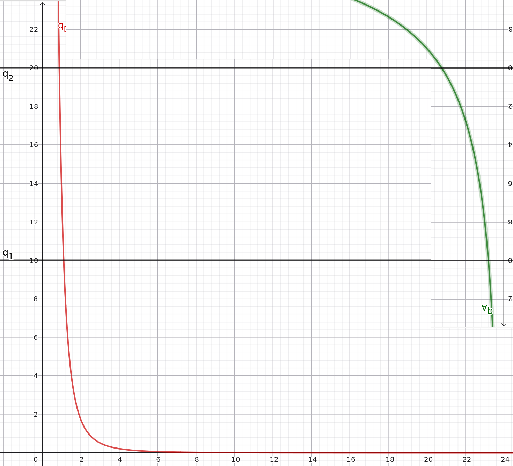

# La coordination des décisions individuelles dans une économie d'échanges purs

## Le modèle de concurrence parfaite, une solution possible au problème de l'échange

### Le problème de l'échange

Le modèle précédent est **basé sur l'échange**. Mais *comment émergent les prix* et *comment le gain à l'échange est partagé ?* 

Reprenons nos individus A et B de notre exemple. Ils possèdent tous les deux une fonction d'utilité et des dotations initiales, $u_A (q_1, q_2) = \sqrt{q_1} \times q_2$ ; $u_B (q_1, q_2) = q_1^3 \times q_2$ ; $Q_{0A} = (9 ; 6)$  et $Q_{0B} = (1 ; 14)$. $CI_A : q_2 = \frac{18}{q_1 ^ {\frac{1}{2}}}$ et $CI_B : q_2 = \frac{14}{q_1^3}$ 

> [!NOTE] $CI$ signifie courbe d’indifférence 

On va regarder la quantité totale des biens A et B : $\bar{q_1} = q_1^{0A} + q_1^{0B}$ et  $\bar{q_2} = q_2^{0A} + q_2^{0B}$. **Comment A et B vont se coordonner pour avoir un maximum d'utilité ?**

Nous allons utiliser le **diagramme d'Edgeworth** pour  représenter graphiquement deux courbes d’indifférences

> Imaginez le graphique complet, j'ai fait ce que j'ai pu

Chaque point naturel est un état réalisable de l'économie. Tous les paniers à l’extérieur (au dessous de la courbe rouge/au dessus de la courbe verte) sont désavantageuses *pour l'un des agents* et donc ne seront pas préférés. Tous les paniers entre les deux courbes (la **lentille *de l'économie****) sont des états **mutuellement avantageux** par rapport au panier de dotations initiales*. On appel ces possibilités les **taux d’échange possibles (TEP)**.

$$\text{TMS}_A (Q_{0A}) < \text{TEP} < \text{TMS}_B (Q_{0B})$$

Nous n'avons pas encore exploré une autre condition du modèle : **les agents échangeront tant que leur utilité peut être améliorée**. Les TMS vont alors se rapprocher jusqu’à ce que $\text{TMS}_A (Q_{01}) = \text{TMS}_B (Q_{0B})$. Il existe plusieurs états de l'économie pour lesquels $\text{TMS}_A (Q_{01}) = \text{TMS}_B (Q_{0B})$. L'ensemble de ces points forment une courbe, appelée **courbe des contrats**.

### Hypothèses du modèle de concurrence parfaite.

Mais il y a bien d'autres hypothèses sur ce modèle. Ce modèle utilise le **commissaire priseur**, il annonce les prix de tout les biens (et les prix sont tous connus). On appelle ce type de système **un système complet de marché** (*transparence de l'information*). C'est une hypothèse importante pour que le marché puisse être équilibré. Les agents sont également **price-taker**, ils pensent que le prix donné par le commissaire priseur ne peut pas être changé (*atomicité du marché*). Enfin, les agents économiques doivent croire que la quantité de biens **est illimitée** et qu'il n'y a donc **pas d’insuffisances**. Toutes les offres sont donc envoyées au commissaire priseur, qui annonce un prix. La demande revient vers lui : si la demande correspond à l'offre, il y a échange. Sinon, il n'y a aucun échange et un nouveau prix est annoncé.

**=> Dans ce système, on se retrouve dans une CPP : Concurrence pure et parfaite** 

## Le choix du consommateur en concurrence parfaite

### Ensemble des consommations possibles.

Le consommateur envisage un panier de consommation $(q_1, q_2)$. Il tire son revenu de sa dotation initiale : $R = p_1 \times q_1^0 + p_2 \times q_2^0$ où $P = \begin{pmatrix} p_1 \\ p_2\end{pmatrix}$. Le consommateur veut donc acheter pour $v(q_1, q_2) = p_1 \times q_1 + p_2 \times q_2$ (fonction de dépense). L'ensemble des paniers de consommation possibles est donc :
     $C = \{ (q_1, q_2) | v(q_1, q_2) \le R \}$
$\Leftrightarrow C = \{ (q_1, q_2) | p_1 \times q_1 + p_2 \times q_2 \le R = p_1 \times q_1^0 + p_2 \times q_2^0 \}$
$\Leftrightarrow C = \{ (q_1, q_2) | q_2 \le \frac{p_1 qu_1^0 + p_2 q_2^0}{p_2} - \frac{p_1}{p_2}q_1 \}$

> Réparer les | et {}

Appliquons les formules précédentes à cet exemple $A$ :

$R_A = 9 \times 2 + 6 \times 1 = 24$
$v_A (q_1, q_2) = 2 q_1 + q_2$. $CP = \begin{pmatrix} 2 \\ 1\end{pmatrix}$
       $C_A = \{ (q_1, q_2) | 2q_1 + q_2 \le 24 \}$
  $\Leftrightarrow C_A = \{ (q_1, q_2) | q_2 \le 24 - 2q_1 \}$

On peut maintenant analyser le cas usuel

### Cas usuel (préférences du consommateur).

On peut calculer la préférence du consommateur avec $\begin{cases}TMS(q_1, q_2) = \frac{p_1}{p_2}  \\ p_1q_1 + p_2q_2 = R\end{cases}$ 

> [!EXAMPLE]
> Avec A, on a :
> $Q_{0A} = (9, 6)$,
> $TMS_A (q_1, q_2) = \frac{q_2}{2q_1}$ et
> $(q_1^*, q_2^*)$ solution du système
>
> $$\begin{cases}\frac{q_2}{2q_1} = \frac{p_1}{p_2}  \\ p_1q_1 + p_2q_2 = 9p_1 + 6p_2\end{cases} \Longleftrightarrow \begin{cases} p_2q_2 = 2 p_1 q_1 \\ 3p_1q_1 = 9p_1 + 6p_2\end{cases} \Longleftrightarrow \begin{cases}q_1^* = 3 + 2\frac{p_2}{p_1}  \\ q_2^* = 6 4 + 6\frac{p_1}{p_2}\end{cases}$$
>
> ---
>
> $bien(1): 3 + 2 \times \frac{1}{2} = 4$
> 
> $bien(2): 4 + 6 \times \frac{2}{1} = 16$
> 
> $A$ demande $(q_1^*, q_2^*) = (4, 16)$
> 
> $A$ offre $9$  biens 1 et $6$  biens 2.

> [!NOTE]
> $f(x, y)$ est homogène de degré k si et seulement si $\forall \lambda \in R, f(\lambda x, \lambda y) = \lambda^k f(x, y)$

Toutes les fonctions de ce modèle sont homogène de degré 0, elles dépendent du prix. Donc $d(\lambda x, \lambda y) = d(x, y)$

> Si les courbes d'indifférence sont convexes, **le consommateur a une préférence pour la diversité.**

*Rappel:
- la courbe doit être décroissante, car le consommateur préfère plus à moins.
- la courbe est convexe : préférence pour la diversité
- la courbe est continue : divisibilité des biens
- la courbe présente des asymptotes aux axes : non saturation des préférences (toujours plus)

## Équilibre général de concurrence parfaite (en économie d’échanges purs)

### Demande nette et contrainte budgétaire.

> Rappel : [Loi de Walras](../ch3/conclusion.md), tous les marchés sont équilibrés si $n-1$ le sont.

| $DI_A = (9, 6)$ $A : d_{1A}(p_1, p_2) = 3 + 2 \frac{p_2}{p_1}$          $d_{2A}(p_1, p_2) = 4 + \frac{6p_1}{p_2}$ | $DI_A = (1, 14)$ $B : d_{1B}(p_1, p_2) = \frac{3}{4} + \frac{21p_2}{2p_1}$         $d_{2B}(p_1, p_2) = \frac{7}{2} + \frac{p_1}{4p_2}$ |
| ----------------------------------------------------------------------------------------------------------------------- | -------------------------------------------------------------------------------------------------------------------------------------------- |

> $d$ pour fonction de Douglas

Une demande nette est la demande excédentaire d'un bien i.

$e_{1A} (p_1, p_2) = 3 + \frac{2 p_2}{p_1} - 9 =  \frac{2 p_2}{p_1} - 6 \color{red} \longrightarrow \frac{2 \times 3}{2} - 6 = - 3$
  
$e_{2A} (p_1, p_2) = 4 + \frac{6 p_1}{p_2} - 6 =  \frac{6 p_1}{p_2} - 2 \color{red}  \longrightarrow \frac{6 \times 3}{4} - 2 = 7$

$e_{1B} (p_1, p_2) = \frac{3}{4} + \frac{21 p_2}{2p_1} - 1 =  \frac{21 p_2}{2p_1} - \frac{1}{4}$
  
$e_{2B} (p_1, p_2) = \frac{7}{2} + \frac{p_1}{4 p_2} - \frac{28}{2} =  \frac{p_1}{4 p_2} - \frac{21}{2}$

Le commissaire priseur peut donc annoncer le prix CP: (2, 3), ce qui correspond à ce que nous avons trouvé.

Ici, l'application de la loi de Walras est que $e_2 = - \frac{p_1}{p_2} e_1$ Pour que le marché soit équilibré, il faut aucune demande excédentaire, donc demande nette, donc résoudre $\begin{cases} e_1 (p_1, p_2) = 0  \\ e_2 (p_1, p_2) = 0 \end{cases}$. 

Le prix relatif qui équilibre l'économie est $\frac {p_1}{p_2} = 2$ . Il vérifie que la somme des demandes nettes est bien nulle sur le marché du bien 1. 
À l'équilibre, $ER^* = (q_{1A}^*, q_{2A}^*) ; (q_{1B}^*, q_{1B}^*) = (4; 16) ; (6 ; 4)$

Idée : si on a n marchés, on a alors n prix. On a donc un système de n équations à n inconnues. L'idée de Walras est de prouver l'existence d'une solution à ce système sans forcément la trouver. Il faut donc que les fonctions de demandes (donc d’utilités) soient continues. 

**Ce modèle fait une genre de liste de course d'une quantité d'hypothèses impossible pour qu'un marché soit parfait. Aucun marché réel ne peut donc vraiment être équilibré.**

### Existence d’un équilibre général

Avant d'arriver au rapport demande = offre, le commissaire priseur propose *au hasard* n vecteurs de prix. *Loi de Walras*.

### Stabilité de l’équilibre

Il y a un équilibre général qui existe lorsqu'un vecteur de prix de longueur n annule toute les demandes nets. Selon Walras, si les fonctions d'offre et de demande sont continues, alors il existe une solution. Selon Sonnenschein, Mantel et Debreu, cet équilibre ne peut pas être atteins. Il explique ceci avec l'**effet revenu**. Si le commiseur priseur vois une demande net positive, il va auguementer le prix. Or, si c'est un bien supérieurs (like luxe), alors la demande va encore auguementer.
