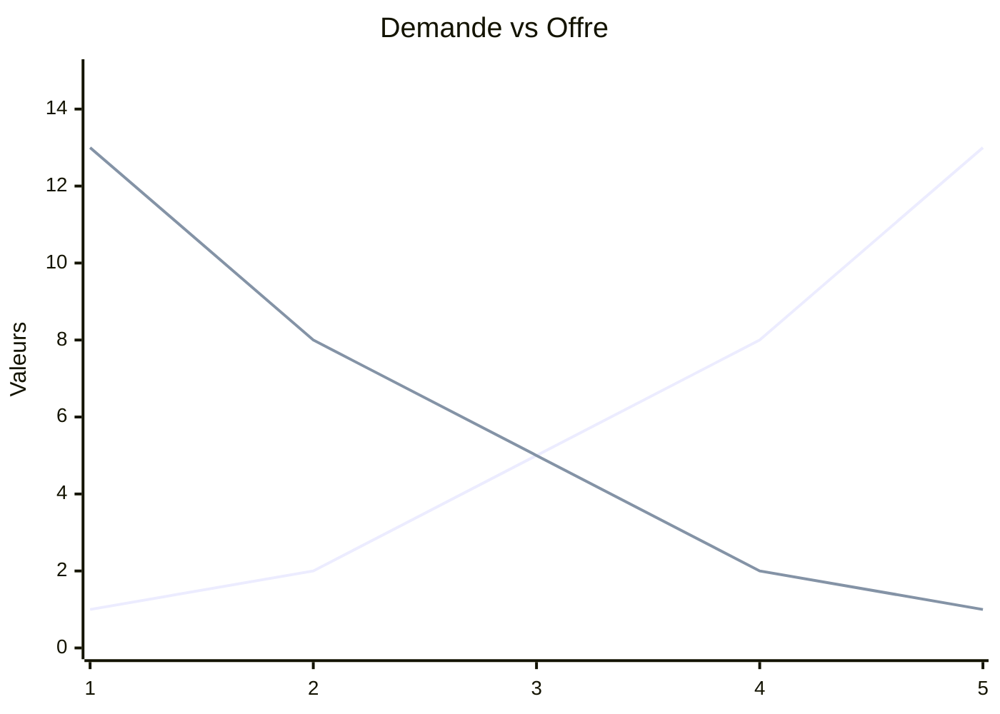
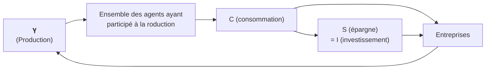

# 🐟 Fish — Économie

## 🤔 Qu'es ce que l'Économie ?

Une science dont l'objet est l'étude de la relation entre les fins et les moyens (Robbins), la valeur, la production et la répartition (Samuelson) ainsi que la distribution, la consommation et les institutions (Malinvaud).

Il y a globalement 2 grande méthodes : le courant **Historique** qui utilise les observations pour former des théories, et le courant **Marginaliste** qui utilise les mathématiques et les modèles en dépit de leur perfection.

Les premiers économistes sont **normatifs** (Aristote et St. Thomas d'Aquin) et condamne l'usure. Elle a donc une porté politique. *Comment va t-elle s'en débarrasser ?*

## 📈 L'essor de l'économie politique

Le premier mouvement à s'émanciper du caractère religieux de l'économie est le **mercantilisme** guidé par **Antoine de Montcrestien**. Ils considèrent que l'activité des marchands permettent de créer des richesses, des **métaux précieux**, *de l'argent*.

Ils vont êtres suivi par les **physiocrates**, un autre mouvement de pensée qui privilégie la **nature**. Il propose une division en 3 classes : les *paysans*, les *rentiers*, et les *capitalistes*.

## 🏗 La construction du paradigme classique

Adam Smith, un philosophe, va proposer une nouvelle vision de l'économie éclairé par la révolution industrielle qui a lieu en Angleterre. Au delà d'avoir développé le concept de **sympathie**, il développe l'idée (*politique*) de système de libertés naturelles qui explique comment les prix évoluent au fil du temps dans le livre <u>La richesse des nations</u> (RDN). 

Il considère 3 classes similaires aux physiocrates, mais remplace les paysans par les **travailleurs**. Chacun nécessite d'être payé : les travailleurs on besoin d'un salaire, les rentiers d'une rente et les capitalistes d'un profit. **Ces trois coûts représente le prix.**

Il propose une idée proche de la **main invisible** : trop de production entraîne, par le jeu des prix, l'équilibre vase rétablir, puisque quand le prix va baisser la demande va augmenter.

Smith n'est pas le père du libéralisme. **C'est Ricardo, son successeur, qui va le devenir.**

Ricardo est largement politisé. Il considère 3 classes comme Smith et critique les rentiers qui abusent oisivement de leur héritages. 

Il fait une distinction entre la **valeur d'échange** et la **valeur d'usage**. **La valeur des marchandises dépendent du travail.** Une marchandise sera plus chère si beaucoup d'heures de travaille sont nécessaires pour la produire. 

**David & Ricardo s'opposent à leur prédécesseurs. Mais ce n'est pas un paradigme pour autant.**

## 🤝 La relative unité du paradigme classique

Le classicisme économique comment à Smith (classique) et va jusqu'à Léon Walras (néoclassique). C'est un courant de pensées qui dure ~ 1 siècle.  

Il y a un débat entre Malthus et Ricardo sur la *loi de Say*. Selon Jean-Baptise Say (français), **toute offre crée sa demande**, et il ne peut donc pas avoir de sur-production. Malthus est contre, Ricardo pour. Malthus explique que face à augmentation de l'accumulation des richesses, il faut anticiper la demande, car seuls les rentiers pourraient consommer plus. Or, ils **épargnent**. Donc aucune raison que l'offre crée la demande. Il était en faveur des corn laws pour limiter les rentiers.A l'inverse, pour Ricardo, seul l'intervention de l'État peut créer un déséquilibre. Première opposition : **le rôle de l'État**.

La valeur est également une opposition fondamentale. Certain auront une vision **Objective** (ceux qui réfléchissent à la valeur travail, tel que Mill, Smith, Ricardo) ou **Subjective** (la valeur est conféré par l'individu, et elle est donc subjective, selon Say et Condillac).

Marx considère que l'économie classique est définie par **la réflexion sur la valeur travail** et que tout les économistes en accord avec la loi de Say sont **vulgaires**. A l'inverse, Keynes considère les classiques comme  **adhèrent à la loi de Say**.

Le néoclassicisme va vouloir poursuivre le travail des classiques et essayer de rendre l'économie politique une science par un basculement de la philosophie morale à la science via la formalisation mathématique.

## 🔥 La loi des débouchés et sa critique

Say propose le système de cicle économique suivant :

Marx est farouchement opposé aux écrits de Say. Marx critique le manque d'historicité des économistes classiques. Il faut regarder la réalité matérielle contrairement aux adhérents de la loi de Say. Contrairement à Say, il pense que la Monaie est **active**, qu'elle peut être désirée. *Le travail est aussi une marchandise.*

## 💞 Filiations classiques / néoclassiques

C'est l'apparition des néoclassiques. Ils adhèrent à la loi de Say et sont "protectionistes".

Avec ces bases, Fisher développe la **Théorie Quantitative de la Monnaie** (**TQM**). Par ses affiliations avec Say, il considère que la monnaie est neutre. Donc, dans l'équation suivante, V, la vitesse d'échange, ne change pas (on consomme ce qui est produit) et le volume de transaction T est donc toujours à son maximum.

$$M×V=P×T$$

Donc, si la masse monétaire M augmente, le niveau des prix P le fera aussi.

La valeur a une grande importante : selon Say, elle est **subjective**, elle dépend de l'acheteur. Elle va perdurer chez les néoclassiques.

**Les oppositions des classiques se cristallisent, et prépare les futurs oppositions des néoclassiques.** 

## 🌄 Un nouveau paradigme néoclassique

On observe un vrai changement de paradigme. L'idée d'économie politique est progressivement abandonnée vers celle de la science économique, accompagné des outils mathématiques qui la "justifie".  3 écoles importantes accompagne ce changement : **Lausanne**, **Cambridge** et **Vienne**. Les premières lois économiques *mathématiques* sont formés : la **loi  de prolongation** (1) et la **loi de répétition** (2)

$$(1) : \lim\limits_{x \to +\infty} Um = 0$$

$$(2) : \frac{UmX}{pX} = \frac{UmY}{pY} \Longleftrightarrow \frac{pX}{pY} = \frac{UmX}{UmY}$$

|                              | Classiques                                                                                                              | Néoclassiques                                                                                                                                                     |
| ---------------------------- | ----------------------------------------------------------------------------------------------------------------------- | ----------------------------------------------------------------------------------------------------------------------------------------------------------------- |
| Classes sociales             | Approche en trois classes sociales.                                                                                     | Oubli des classes sociales au pro t de l’étude de l’individu.                                                                                                  |
| Focalisation                 | Vision principalement macroéconomique, avec l’étude de grands agrégats (production, distribution, consommation…). | Fondement microéconomique (quitte à considérer que la macroéconomie n’est qu’une simple agrégation de comportements individuels).                        |
| Analyse du con it            | Opposition des intérêts entre les différentes classes sociales.                                                      | Pas de con it : chacun doit poursuivre son intérêt personnel (vision subjective  de la valeur de Say). On est même dans la théorie de la sympathie de Smith |
| Analyse de la répartition    | Il y a des problèmes dans la répartition des richesses (Smith, Ricardo et surtout Mill).                             | Analyse statique qui n’étudie pas l’évolution de la répartition des richesses. C’est une analyse d’allocation des ressources à un moment donné.          |
| Grand objet d’analyse commun | La croissance (accumulation de richesses).                                                                              | L’échange                                                                                                                                                         |

## 📌 Conclusion

L'utilisation de terme science économique **montre le vrais tournant qu'apporte le néoclassicisme** . On passe de l'utilisation de la morale et le l'éthique au subjectif. Certaines idées néoclassiques sont toujours utilisés, les raisonnements marginalistes sont toujours utilisés. L'orthodoxie en sera le successeur.

Aujourd'hui, la NEC (Nouvelle École Classique) lead par Robert Lucs et la NEK (Nouvelle École Keynésienne) lead par Gregory Markiw et Joseph Stiglitz continuent le même débat que les classiques/néoclassiques.
