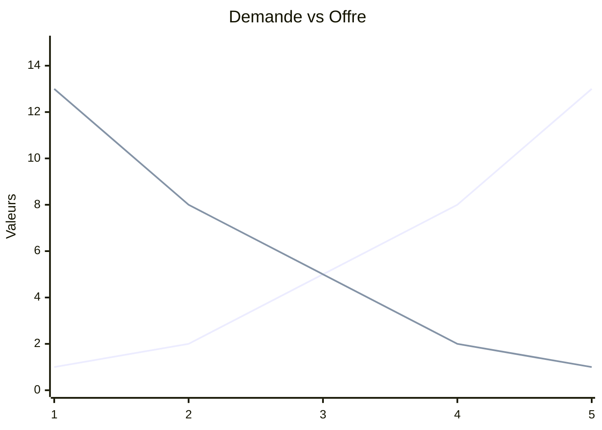

# 🐟 Fish — Économie
## 🤔 Qu'es ce que l'Économie ?
Une science dont l'objet est l'étude de la relation entre les fins et les moyens (Robbins), la valeur, la production et la répartition (Samuelson) ainsi que la distribution, la consommation et les institutions (Malinvaud).

Il y a globalement 2 grande méthodes : le courant **Historique** qui utilise les observations pour former des théories, et le courant **Marginaliste** qui utilise les mathématiques et les modèles en dépit de leur perfection.

Les premiers économistes sont **normatifs** (Aristote et St. Thomas d'Aquin) et condamne l'usure. Elle a donc une porté politique. *Comment va t-elle s'en débarrasser ?*

## 📈 L'essor de l'économie politique

Le premier mouvement à s'émanciper du caractère religieux de l'économie est le **mercantilisme** guidé par **Antoine de Montcrestien**. Ils considèrent que l'activité des marchands permettent de créer des richesses, des **métaux précieux**, *de l'argent*.

Ils vont êtres suivi par les **physiocrates**, un autre mouvement de pensée qui privilégie la **nature**. Il propose une division en 3 classes : les *paysans*, les *rentiers*, et les *capitalistes*.

## 🏗 La construction du paradigme classique

Adam Smith, un philosophe, va proposer une nouvelle vision de l'économie éclairé par la révolution industrielle qui a lieu en Angleterre. Au delà d'avoir développé le concept de **sympathie**, il développe l'idée (*politique*) de système de libertés naturelles qui explique comment les prix évoluent au fil du temps dans le livre <u>La richesse des nations</u> (RDN). 

Il considère 3 classes similaires aux physiocrates, mais remplace les paysans par les **travailleurs**. Chacun nécessite d'être payé : les travailleurs on besoin d'un salaire, les rentiers d'une rente et les capitalistes d'un profit. **Ces trois coûts représente le prix.**

Il propose une idée proche de la **main invisible** : trop de production entraîne, par le jeu des prix, l'équilibre vase rétablir, puisque quand le prix va baisser la demande va augmenter.

Smith n'est pas le père du libéralisme. **C'est Ricardo, son successeur, qui va le devenir.**

Ricardo est largement politisé. Il considère 3 classes comme Smith et critique les rentiers qui abusent oisivement de leur héritages. 

Il fait une distinction entre la **valeur d'échange** et la **valeur d'usage**. **La valeur des marchandises dépendent du travail.** Une marchandise sera plus chère si beaucoup d'heures de travaille sont nécessaires pour la produire. 

**David & Ricardo s'opposent à leur prédécesseurs. Mais ce n'est pas un paradigme pour autant.**
## 🤝 La relative unité du paradigme classique

Le classicisme économique comment à Smith (classique) et va jusqu'à Léon Walras (néoclassique). C'est un courant de pensées qui dure ~ 1 siècle.  

Il y a un débat entre Malthus et Ricardo sur la *loi de Say*. Selon Jean-Baptise Say (français), **toute offre crée sa demande**, et il ne peut donc pas avoir de sur-production. Malthus est contre, Ricardo pour. Malthus explique que face à augmentation de l'accumulation des richesses, il faut anticiper la demande, car seuls les rentiers pourraient consommer plus. Or, ils **épargnent**. Donc aucune raison que l'offre crée la demande. Il était en faveur des corn laws pour limiter les rentiers.A l'inverse, pour Ricardo, seul l'intervention de l'État peut créer un déséquilibre. Première opposition : **le rôle de l'État**.

Le néoclassicisme va vouloir poursuivre le travail des classiques et essayer de rendre l'économie politique une science, par la formalisation mathématique. 
## 🔥 La loi des débouchés et sa critique
## 💞 Filiations classiques / néoclassiques
## 🌄 Un nouveau paradigme néoclassique