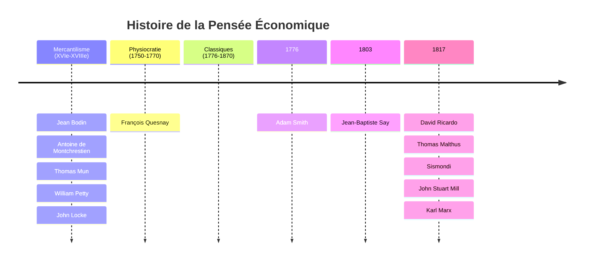
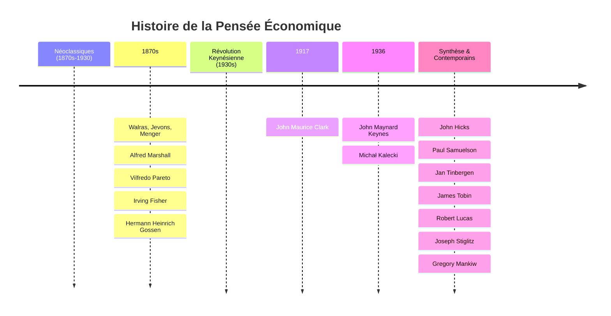

# Qu'est-ce que l'Économie ?

## Analyse Épistémologique

L'épistémologie est l'étude critique des sciences, de leur formation et de leurs conditions de validité. Nous nous baserons sur trois définitions classiques pour cerner l'objet de la science économique.

### 1. Lionel Robbins (1932)

> « L'économie est la science qui étudie le comportement humain comme une relation entre des fins et des moyens rares à usages alternatifs. »

➡ **Objet** : La gestion de la **rareté**. L'économie est la science des choix sous contrainte.

### 2. Paul Samuelson (1948)

> « L'économie est l'étude de la manière dont les sociétés utilisent des ressources rares pour produire des marchandises ayant une valeur et pour les répartir entre une multitude d’individus. »

➡ **Ajouts** : Notions de **Production**, **Valeur** et **Répartition**.
*   **Microéconomie** : Comportement des agents individuels (ménages, entreprises).
*   **Macroéconomie** : Étude des agrégats économiques à l'échelle nationale ou mondiale (État, inflation, chômage).

### 3. Edmond Malinvaud (1975)

> « L'économie est la science qui étudie comment des ressources rares sont employées pour la satisfaction des besoins des hommes vivant en société ; elle s’intéresse, d’une part, aux opérations essentielles que sont la production, la distribution et la consommation des biens, d’autre part, aux institutions et aux activités ayant pour objet de faciliter ces opérations. »

➡ **Ajouts** : **Consommation**, **Distribution** et rôle des **Institutions**.

---

## Méthode : Comment faire de l'économie ?

Il existe deux grandes approches méthodologiques qui s'opposent souvent :

### L'Approche Historique (Inductive)
Représentée par des économistes comme Pierre Cahuc.
*   **Méthode** : Observation des faits historiques et empiriques pour en tirer des lois générales.
*   **Critique des modèles** : Rejet des modèles mathématiques abstraits jugés trop éloignés de la réalité complexe.

### L'Approche Hypothético-Déductive (Marginaliste)
Représentée par des économistes comme Dani Rodrik.
*   **Méthode** : Construction de modèles théoriques simplifiés (mathématiques) pour isoler des mécanismes et faire des prédictions.
*   **Défense des modèles** : Même imparfaits, les modèles sont des outils nécessaires pour comprendre des mécanismes spécifiques.

> [!QUOTE] Dani Rodrik (2017)
> « Chaque modèle est comparable à une pièce de puzzle qui révèle un fragment du tableau. Pris ensemble, les modèles des économistes sont notre meilleur guide cognitif pour parcourir par monts et par vaux l’expérience sociale. »
> — *Peut-on faire confiance aux économistes ?*

## Les 10 commandements de l'économiste (selon Rodrik)

Dani Rodrik propose des règles pour une pratique humble et rigoureuse de l'économie, mettant en garde contre l'application aveugle des modèles.

Voir aussi : [Introduction à la méthode](../eco/methodo.md)

| **Dix commandements pour les non-économistes**                                                                                                                                         | **Dix commandements pour les économistes**                                                                                                                                                 |
| -------------------------------------------------------------------------------------------------------------------------------------------------------------------------------------- | ------------------------------------------------------------------------------------------------------------------------------------------------------------------------------------------ |
| 1. La science économique est une construction de modèles dénués de conclusions prédéterminées ; rejetez tout argument contraire.                                                       | 1. La science économique est une collection de modèles ; chérissez leur diversité.                                                                                                         |
| 2. Ne critiquez pas le modèle d’un économiste en raison de ses hypothèses ; demandez en quoi les résultats changeraient si certaines hypothèses problématiques étaient plus réalistes. | 2. Un modèle est un modèle, pas *le* modèle.                                                                                                                                               |
| 3. L’analyse exige de la simplicité. Gare à l’incohérence qui se fait passer pour de la complexité.                                                                                    | 3. Rendez votre modèle assez simple pour isoler les causes spécifiques et leur mode de fonctionnement, mais pas à ce point simple qu’il ignorerait des interactions clés entre ces causes. |
| 4. Ne craignez pas la formalisation mathématique ; les économistes l’utilisent non parce qu’ils sont intelligents, mais parce qu’ils ne le sont pas assez.                             | 4. Les hypothèses non réalistes ne sont pas un mal ; les hypothèses critiques non réalistes sont à proscrire.                                                                              |
| 5. Lorsqu’un économiste fait une recommandation, demandez ce qui lui assure que le modèle sous-jacent s’applique au cas étudié.                                                        | 5. Le monde est (presque) toujours un optimum de second rang.                                                                                                                              |
| 6. Lorsqu’un économiste utilise l’expression « bien-être économique », demandez-lui ce qu’il entend par là.                                                                            | 6. Pour faire correspondre un modèle au monde réel, il faut des diagnostics empiriques clairs, lesquels relèvent davantage du savoir-faire que de la science.                              |
| 7. Sachez qu’un économiste peut tenir un discours différent en public et en salle de séminaire.                                                                                        | 7. Consensus entre économistes n’est pas synonyme de certitude quant au mode de fonctionnement du monde.                                                                                   |
| 8. Les économistes ne vénèrent pas (tous) les marchés, mais ils en connaissent mieux que vous le fonctionnement.                                                                       | 8. Il n’y a rien de mal à répondre « je ne sais pas » à une question portant sur l’économie ou la politique.                                                                               |
| 9. Si vous croyez que tous les économistes pensent la même chose, allez les voir en séminaire.                                                                                         | 9. Tout n’est pas une question d’efficience.                                                                                                                                               |
| 10. Si vous croyez que les économistes sont particulièrement grossiers avec les non-économistes, allez les voir en séminaire.                                                          | 10. Remplacer les valeurs du public par les vôtres est un abus de votre expertise.                                                                                                         |

